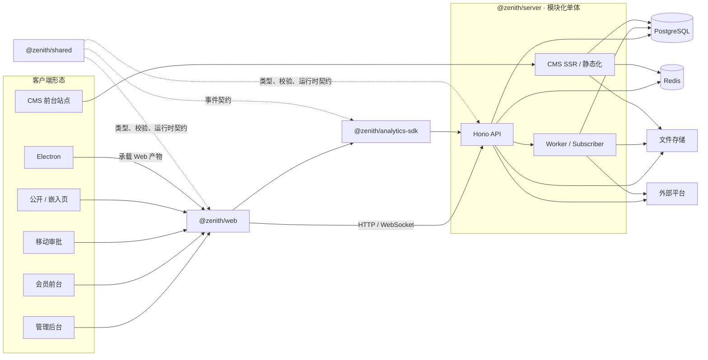

# Zenith Admin — 项目架构导航

Zenith Admin 是一个基于 **Hono + React + Drizzle ORM** 的模块化全栈后台系统，采用 npm monorepo 管理。
后端是模块化单体，提供 API、后台运行时和 CMS 前台渲染；前端提供多个应用入口，共享层统一前后端契约。

## 文档定位

本文件只维护稳定的架构事实：系统边界、工作区职责、依赖方向、运行时链路和文档入口。
字段约定、代码模板、组件用法、运行参数与验收步骤不在这里重复维护。

开始任何代码改动前，必须阅读核心规范约束：后端与全局看
[constraints.md](.agents/skills/zenith/references/constraints.md)，前端看
[constraints-frontend.md](.agents/skills/zenith/references/constraints-frontend.md)。
CRUD、模块修改、异步任务和版本发布等场景，按
[Zenith Skill](.agents/skills/zenith/SKILL.md) 进入对应流程。

---

## 系统上下文



### 核心边界

- **Web 是交互边界**：负责界面、路由、客户端状态和 API 调用，不直接访问基础设施。
- **Server 是业务权威边界**：负责认证授权、业务规则、事务、任务编排、CMS 渲染和外部集成。
- **Shared 是契约边界**：每个业务域的 API 契约（实体 schema、操作的方法 / 路径 / 入参 / 响应）定义在
  `shared/src/{domain}/contracts/`，服务端路由、前端数据访问、MSW Mock 与 OpenAPI 文档都由它派生；
  另提供校验、常量和无基础设施依赖的工具，不承载应用级 I/O。
- **PostgreSQL 是主数据源**；Redis 承载会话、限流等运行时状态；文件存储保存二进制对象。
- **Worker 与 Subscriber 是后端运行时的一部分**：处理异步、可重试、调度和跨域副作用。

---

## 主要目录职责与依赖

| 目录 | 架构职责 |
| --- | --- |
| `packages/server` | Hono API、CMS SSR/静态化、领域服务、持久化、后台任务、事件订阅与基础设施适配 |
| `packages/web` | React 多入口应用、页面与组件、查询缓存、请求适配和 Demo 模式 |
| `packages/shared` | 领域类型、Zod schema、常量、跨运行时工具和 seed |
| `packages/analytics-sdk` | 浏览器行为、性能与错误采集 |
| `packages/electron` | 桌面容器、主进程与 preload，封装 Web 构建产物 |
| `docs` | 架构、产品、开发与部署文档 |

依赖保持单向：

- `shared` 位于依赖图底部，不依赖 `server` 或 `web`；
- `server`、`web` 和 `analytics-sdk` 复用 `shared` 契约；
- `web` 与 `server` 不直接导入彼此代码，只通过网络协议协作；
- `electron` 复用 Web 产物，不承载后端业务逻辑。

---

## 业务域组织

系统按业务域纵向切分，而不是按技术层形成彼此割裂的功能。一项完整能力通常贯穿：

```text
packages/shared/src/{domain}/contracts/ # API 契约：实体 schema + 操作（唯一真相）
packages/shared/src/{domain}/           # 校验、常量
packages/server/src/routes/{domain}/   # HTTP 协议边界
packages/server/src/services/{domain}/ # 业务规则
packages/server/src/db/schema/          # 持久化模型
packages/web/src/hooks/queries/         # 服务端状态访问（由契约派生）
packages/web/src/pages/                 # 用户界面
packages/shared/src/seed/               # 初始配置与演示数据
packages/web/src/mocks/                 # 可选的 Demo API 替身（handler 绑定契约操作）
```

主要能力群包括：

- **基础治理**：`core`、`identity`、`platform`、`ops`、`licensing`
- **协作与内容**：`messaging`、`chat`、`mp`、`cms`、`wiki`、`drive`
- **流程与自动化**：`workflow`、`rules`、`tasks`
- **用户与交易**：`member`、`payment`、`biz`
- **数据与智能**：`report`、`analytics`、`ai`
- **开放生态**：`open-platform`

这些领域共享部署单元和数据库，不是独立微服务。修改一个领域时，应评估其契约、服务端、
前端、权限/seed 和 Mock 等所有相关表面。

---

## 后端分层与运行时

| 层次 | 主要位置 | 职责 |
| --- | --- | --- |
| 进程编排 | `src/index.ts`、`src/bootstrap/` | 服务监听、worker、subscriber、遥测与优雅停机 |
| 应用装配 | `src/app.ts`、`src/middleware/` | 中间件、领域路由、CMS 兜底路由、Mastra 标准 API 挂载、OpenAPI 与全局错误处理 |
| 协议边界 | `src/routes/` | 输入输出协议与参数校验；常规业务委托 Service |
| 业务层 | `src/services/` | 业务规则、数据映射、事务和前置校验 |
| 共享内核与基础设施 | `src/db/`、`src/lib/`、领域适配器 | 契约路由适配、上下文、数据库、缓存、任务、存储与第三方平台适配 |

常规业务 API 的主链路按以下方向流动：

```text
Client → Middleware → Route（契约）→ Service → Database / Adapter → 契约实体
```

`createApp()` 只负责应用装配，不启动进程级副作用。跨域后续动作通过事件订阅解耦；
耗时、批量、可重试或需要进度的工作进入统一任务运行时。

---

## 前端运行时

`packages/web` 构建管理后台、会员前台和移动审批三个入口；主入口同时承载公开与嵌入页面，
Electron 复用 Web 构建产物。可缓存服务端状态的主链路是：

```text
Page / Feature → Domain Query Hooks → Contract Query Layer（api / createResourceQueries）→ Request Adapter → Server API
```

TanStack Query 主要管理可缓存的服务端状态；页面保留交互状态以及流式会话、设计器等非缓存本地状态。
流式请求、上传下载、终端和部分命令式操作会直接使用 Request Adapter 或专用传输。
管理员与会员使用独立的认证上下文、请求实例和会话语义，不能互换。
Demo 模式通过 MSW 替换 API 边界，但继续复用真实接口契约，不是第二套业务模型。

---

## 跨领域架构

| 关注点 | 架构策略 |
| --- | --- |
| 契约一致性 | 每个操作的路径、入参与响应 schema 在 `shared` 契约中定义一次：Server 用 `defineContractRoute` 生成路由与 OpenAPI，Web 用 `api()` / `createResourceQueries()` 发起调用，Mock 用 `mock(op)` 绑定 handler；仍以字面量书写的 URL 由 web 的路径契约测试对照服务端路由快照校验 |
| 身份与隔离 | 管理员和会员认证隔离；租户与数据范围在服务端执行 |
| 数据一致性 | 多步业务写入的事务边界主要位于 Service，数据库约束提供最终保护 |
| 异步处理 | 任务中心与 worker 负责调度、重试、进度和批量处理 |
| 通知触达 | 事件目录（shared 代码定义）+ 统一派发层收口全部通知：`notify()` 唯一入口，渠道、偏好、免打扰与投递留痕由派发层负责 |
| 跨域协作 | 同步协作复用服务函数，需解耦的后续副作用使用领域事件与 subscriber，不走内部 HTTP |
| AI 运行时 | AI 域由 Mastra 框架承载（模型目录、Memory、RAG、评测），运行数据落同库独立 `mastra` schema，Studio 经 `/api/mastra` 标准 API 接入 |
| 外部集成 | 文件、消息、OAuth、支付、AI 等能力通过服务端适配层接入 |
| 可观测性 | 浏览器采集、请求追踪、日志、指标和审计共同构成观测面 |

---

## 权威入口

| 内容 | 位置 |
| --- | --- |
| 后端与全局代码改动的硬约束 | [`.agents/skills/zenith/references/constraints.md`](.agents/skills/zenith/references/constraints.md) |
| 前端代码改动的硬约束 | [`.agents/skills/zenith/references/constraints-frontend.md`](.agents/skills/zenith/references/constraints-frontend.md) |
| CRUD、模块修改、异步任务、发布流程 | [`.agents/skills/zenith/SKILL.md`](.agents/skills/zenith/SKILL.md) |
| 目录与实现位置 | [`docs/guide/project-structure.md`](docs/guide/project-structure.md) |
| API、安全、多租户与数据库 | [`docs/backend/`](docs/backend/) |
| 前端数据获取与缓存 | [`docs/frontend/data-fetching.md`](docs/frontend/data-fetching.md) |
| 产品与领域说明 | [`docs/product/`](docs/product/) 及各领域专题目录 |
| 部署与运维 | [`docs/guide/`](docs/guide/) 与 [`docker/`](docker/) |

## 常用命令

```bash
npm run dev          # 启动 Server 与 Web
npm run build        # 构建核心工作区
npm run lint         # 检查 Shared、Server、SDK 与 Web
npm test             # 运行 Server 与 Web 测试
npm run db:generate  # 生成数据库迁移
npm run db:migrate   # 执行数据库迁移
npm run db:seed      # 填充初始数据
npm run docs:dev     # 启动文档站
```

当本文与实现出现偏差时，以当前代码、测试和迁移为可执行事实，并同步修正文档；
不要把具体实现规则复制回本文件。
