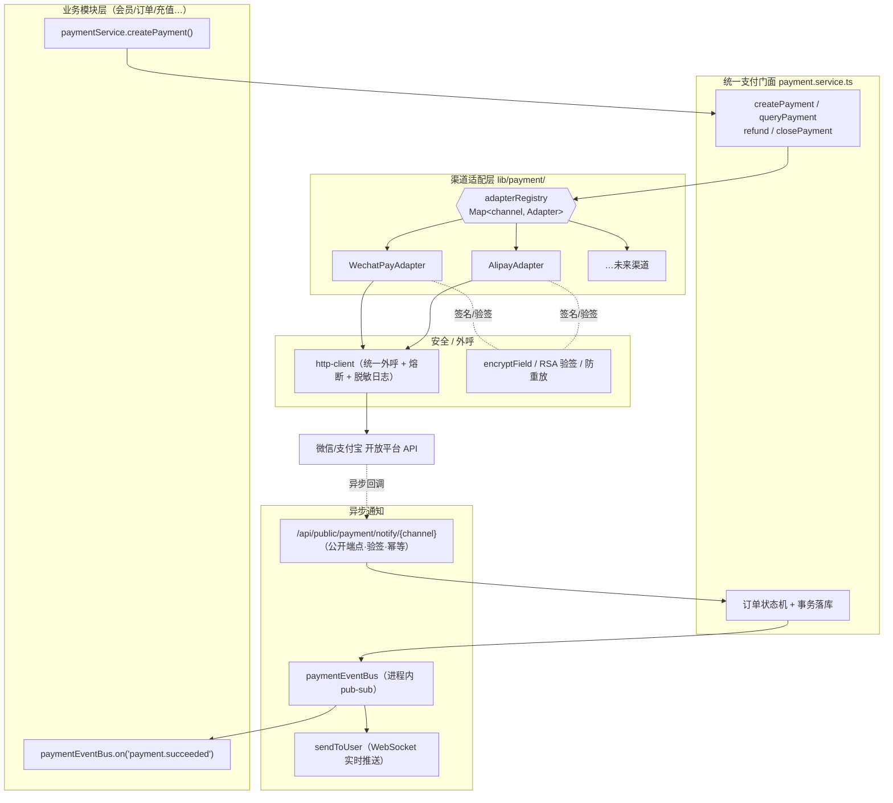
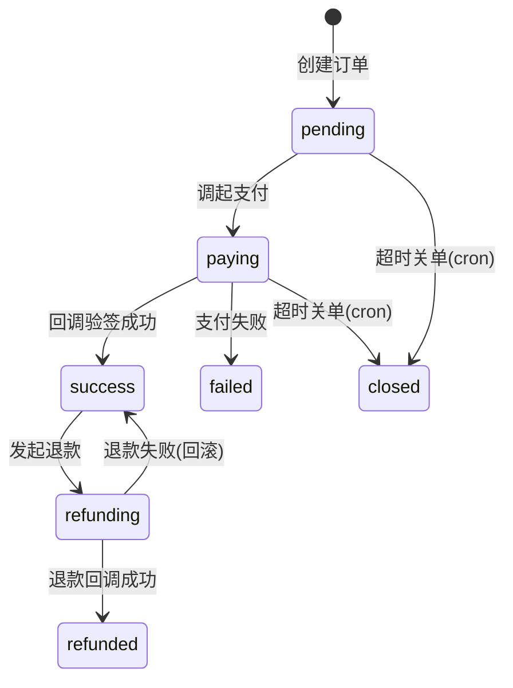
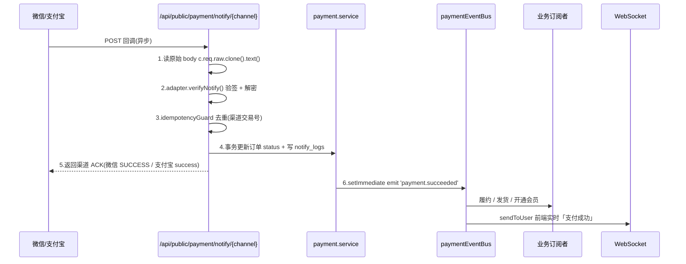

# 支付中心（Payment Center）

支付中心是 Zenith Admin 的统一支付基础设施。它向上为各业务模块（会员、订单、充值等）提供一套**与渠道无关**的统一接口，向下通过**渠道适配器**对接微信支付、支付宝等开放平台。业务模块只需关心「下单 / 退款 / 监听结果」，无需感知任何渠道差异、签名算法与回调细节。

> 设计目标：新增一个业务接入点 ≈ 调用 1 个函数；新增一个支付渠道 ≈ 实现 1 个接口。

---

## 1. 架构总览



### 需求映射

| 需求 | 设计落点 |
| --- | --- |
| ① 多渠道 | `payment_channel` 枚举 + `adapterRegistry` 注册表 + 每渠道独立 Adapter |
| ② 统一接口 | `payment.service.ts` 门面，业务侧仅调 4 个方法 |
| ③ 异步通知 | 公开回调端点验签落库 → `paymentEventBus` → 业务订阅者 + WebSocket |
| ④ 退款 | 门面 `refund()` 统一入口，Adapter 各自实现 `refund / queryRefund` |
| ⑤ 扩展性 | 新增渠道 = 加枚举 + 实现接口 + 注册，**零改动**业务层与门面 |
| ⑥ 安全 | `encryptField` 存密钥、响应掩码、RSA 验签、幂等、金额整数分、全程 http-client |

---

## 2. 关键工程决策

1. **不引入官方 SDK**。项目硬性约定「所有外呼必须走 `http-client`，禁止裸 `fetch()`」。`alipay-sdk` / `wechatpay-node-v3` 会用各自的 HTTP 客户端绕过该约定（同时绕过熔断、Header 脱敏、结构化日志）。因此用 Node 原生 `crypto` 实现真实签名/验签，HTTP 调用统一走 `lib/http-client.ts`：
   - **支付宝**：RSA2（`SHA256withRSA`）`crypto.createSign` 生成签名、`crypto.createVerify` 验签。
   - **微信支付 v3**：`RSA-SHA256` 请求签名（Authorization 头）+ `AES-256-GCM` 解密回调 `resource` + 平台证书验签。
2. **适配层用接口 + 注册表**，而非 `file-storage.ts` 的平铺 if-else——支付每渠道有约 6 个操作，接口更清晰、扩展更稳。配置表则沿用 `file_storage_configs` 的「大平铺」风格保持一致。
3. **进程内事件总线**，照搬 `lib/workflow-event-bus.ts`。若未来需要跨进程可靠投递，可平滑替换为 pg-boss 队列。
4. **回调 + 主动查单双保险**：不盲信回调，cron 兜底查单，保证状态最终一致。
5. **金额全链路整数分**（`integer`），杜绝浮点误差。

---

## 3. 数据模型

| 表 | 用途 | 审计列 | 多租户 |
| --- | --- | --- | --- |
| `payment_channel_configs` | 渠道配置（密钥 `encryptField` 加密） | ✅ | ✅ |
| `payment_orders` | 支付单（核心交易表） | ✅ | ✅ + `department_id`(dataScope) |
| `payment_refunds` | 退款单 | ✅ | ✅ |
| `payment_notify_logs` | 回调日志（追加型，取证用） | ❌ | ✅ |

### 订单状态机



### 枚举

| 枚举 | 值 |
| --- | --- |
| `payment_channel` | `wechat` / `alipay` |
| `payment_method` | `wechat_native` / `wechat_jsapi` / `wechat_h5` / `alipay_page` / `alipay_wap` / `alipay_app` |
| `payment_order_status` | `pending` / `paying` / `success` / `closed` / `refunding` / `refunded` / `failed` |
| `payment_refund_status` | `pending` / `processing` / `success` / `failed` |

---

## 4. 渠道适配层（需求 ①⑤）

```ts
// lib/payment/types.ts
export interface PaymentChannelAdapter {
  readonly channel: PaymentChannel;
  /** 下单：返回前端可直接使用的支付参数（二维码 URL / JSAPI 参数 / 跳转链接） */
  createPayment(ctx: AdapterContext, order: PaymentOrderRow): Promise<CreatePaymentResult>;
  queryPayment(ctx: AdapterContext, order: PaymentOrderRow): Promise<PaymentQueryResult>;
  closePayment(ctx: AdapterContext, order: PaymentOrderRow): Promise<void>;
  refund(ctx: AdapterContext, order: PaymentOrderRow, refund: PaymentRefundRow): Promise<RefundResult>;
  queryRefund(ctx: AdapterContext, refund: PaymentRefundRow): Promise<RefundQueryResult>;
  /** 验签 + 解析回调，返回标准化结果 */
  verifyNotify(ctx: AdapterContext, rawBody: string, headers: Headers): Promise<NotifyResult>;
}
```

`AdapterContext` 持有**已解密**的渠道配置（私钥、API V3 Key 等）。适配器内部所有外呼走 `httpGet` / `httpPost`，签名/验签封装在适配器内，门面与业务层完全不可见。

**➕ 新增渠道步骤**：① 给 `paymentChannelEnum` 加值 → ② `payment_channel_configs` 加该渠道字段 → ③ 新建 `xxx.adapter.ts` 实现接口 → ④ 启动时 `registerAdapter()`。门面、业务模块、前端订阅者**全部零改动**。

---

## 5. 统一支付门面（需求 ②④）

```ts
// services/payment.service.ts —— 业务模块唯一入口
createPayment(input: {
  bizType: string; bizId: string; amount: number; subject: string;
  payMethod: PayMethod; channel?: PaymentChannel;   // 不传则用 isDefault 渠道
  userId?: number; openId?: string; clientIp: string; expireMinutes?: number;
}): Promise<{ orderNo: string; payParams: CreatePaymentResult }>;

queryPayment(orderNo: string): Promise<PaymentOrder>;
refund(input: { orderNo: string; refundAmount: number; reason: string; operatorId?: number }): Promise<{ refundNo: string; status: string }>;
closePayment(orderNo: string): Promise<void>;
```

- 业务模块直接 `import { createPayment } from '../services/payment.service'`，无需 HTTP 往返；
- 同时提供后台 HTTP 路由 `/api/payment/*`（发起、查询、手动退款）；
- 下单接口挂 `idempotencyGuard`，用 `bizType + bizId` 防重复下单。

---

## 6. 异步通知（需求 ③）



- 端点挂 `/api/public/payment/notify/{channel}`，`security: []`、无 `authMiddleware`（参照 `routes/workflow-external-callback.ts`）；
- **先验签再处理**，验签失败立即拒绝并记 `payment_notify_logs`；
- 业务模块通过 `paymentEventBus.on('payment.succeeded', handler)` 订阅。

---

## 7. 安全设计（需求 ⑥）

| 维度 | 措施 |
| --- | --- |
| 密钥存储 | API V3 Key / 商户私钥 / 支付宝应用私钥一律 `encryptField()` 存密文，字段名 `xxxEncrypted` |
| 响应脱敏 | 列表/详情 DTO 用 `'******'` 掩码 + 哨兵检测（仿 `mapOauthConfig`），**永不返回明文** |
| 回调验签 | 微信:按 `Wechatpay-Serial` 自动下载平台证书(12h 缓存,应对轮换) RSA-SHA256 验签;支付宝:RSA2 验签 + 同步响应验签。处理幂等+原子，重放无害 |
| 幂等 | 下单 + 回调均挂 `idempotencyGuard`，回调以渠道交易号为 key |
| 金额 | 全链路整数分；退款金额 ≤ 原单金额校验 |
| 外呼 | 全部走 `http-client`（熔断 + Header 脱敏 + 结构化日志） |
| 权限/审计 | `payment:channel:*` / `payment:order:*` / `payment:refund:*` 权限码；写操作经 `guard({ audit })` 进操作日志；退款为高危操作需二次确认 |
| 取证 | `payment_notify_logs` 留存回调原文，争议时可复核 |

---

## 8. 对账与定时任务

在 `lib/pg-boss-scheduler.ts` 的 `handlerRegistry` 追加：

- `closeExpiredOrders` — 关闭超 `expiredAt` 的 `pending` / `paying` 订单；
- `paymentReconciliation` — 对 N 分钟内仍 `paying` 的订单主动查单，纠正状态（回调兜底）。

后台「系统管理 → 定时任务」UI 即可配置 Cron 表达式，无需改调度框架。

---

## 9. 后台管理页面

| 页面 | 路径 | 功能 |
| --- | --- | --- |
| 支付渠道配置 | `/payment/channels` | CRUD + 密钥掩码 + 沙箱开关 |
| 支付订单 | `/payment/orders` | 列表/详情/查单/手动退款，状态筛选 |
| 退款记录 | `/payment/refunds` | 列表/详情/退款查询 |
| 回调日志 | `/payment/logs` | 排查回调与验签问题 |

---

## 10. 业务模块接入示例

```ts
import { createPayment } from '../services/payment.service';
import { paymentEventBus } from '../lib/payment-event-bus';

// 1) 下单（拿到二维码/跳转链接给前端）
const { orderNo, payParams } = await createPayment({
  bizType: 'membership',
  bizId: String(membershipOrder.id),
  amount: 9900,                 // 99.00 元
  subject: '会员充值-年度套餐',
  payMethod: 'wechat_native',
  clientIp: c.req.header('x-forwarded-for') ?? '',
});

// 2) 监听支付成功，履约
paymentEventBus.on('payment.succeeded', async (e) => {
  if (e.bizType === 'membership') {
    await activateMembership(e.bizId);
  }
});
```
