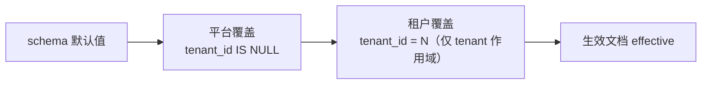

# 运行时设置

运行时设置是「不重启即可修改、影响系统行为」的轻量配置：登录验证码、密码策略、上传限制、页面水印、AI 配额、网盘配额等。
它以**模块**为单位组织：每个模块是一份带默认值的 Zod 文档 schema 加治理元数据，服务端按模块读取整份类型化文档，
前端按模块整体保存。默认值只在 schema 出现一次：没有「配置键 → 字符串值」的 KV 表，也没有逐项种子。

> 与运行时设置无关的两类配置不要混入：进程级 / 基础设施参数（数据库、Redis、多租户开关、端口）来自环境变量
> `packages/server/src/config.ts`；用户可见的业务数据（字典、地区、标签、限流规则）各有自己的表与接口。

## 单一真相：模块注册表

模块定义位于 `packages/shared/src/settings/modules/{module}.ts`，由 `packages/shared/src/settings/registry.ts` 的
`SETTINGS_MODULES` 汇总。一个模块的定义包含：

| 字段 | 含义 |
| --- | --- |
| `schema` | 读取 schema。**每个叶子字段必须带 `.default()`，嵌套对象必须 `.prefault({})`**，保证 `schema.parse({})` 即完整默认文档；字段的表单标签 / 说明写在 `.meta({ title, description })` |
| `scope` | `platform`（全局一行）或 `tenant`（允许租户覆盖平台值）。被无请求上下文的后台任务读取的模块必须是 `platform` |
| `feature` | License 特性门控，与同名业务域路由挂载的 `{ feature }` 保持一致；`/me` 与模块清单按租户套餐过滤带门控的模块 |
| `readPermission` / `writePermission` | 读 / 写权限码；读为 `null` 表示任意登录用户可读整模块 |
| `visibility` | 顶层字段的投影级别：`public`（匿名可见）/ `authenticated`（登录用户可见）/ 缺省 `admin` |
| `page` | 已有专用页面的模块在通用设置页只给跳转链接 |
| `sort` | 通用设置页导航顺序 |

服务进程启动时执行 `validateSettingsRegistry()`，任一校验失败直接退出：`parse({})` 必须幂等；模块路径（kebab-case）唯一且不与
`public` / `me` 冲突；`visibility` 只能指向真实字段；**字符串 / 数组叶子的字段名禁止包含 `password` / `secret` / `token` / `apiKey` /
`credential`**——设置文档会原样进入审计快照与前端缓存，密钥类数据必须走各自的加密存储（AI 服务商、存储配置、身份源等）。

### 内置模块

| 模块 | 路径 | 作用域 | License | 权限（读 / 写） | 内容 | 专用页面 |
| --- | --- | --- | --- | --- | --- | --- |
| `auth` 登录与注册 | `/auth` | platform | — | `system:setting:view` / `system:setting:update` | 登录验证码及复杂度、开放注册、忘记密码（全部 `public`） | 通用设置页 |
| `identitySecurity` 身份安全 | `/identity-security` | **tenant** | — | `system:identity-security:manage` | 密码策略（`public`）、登录锁定、MFA、登录风险 | `/system/identity-security` |
| `ui` 界面与体验 | `/ui` | platform | — | `system:setting:view` / `system:setting:update` | 水印、快捷聊天按钮、意见反馈入口（全部 `authenticated`） | 通用设置页 |
| `files` 文件上传 | `/files` | platform | — | `system:setting:view` / `system:setting:update` | 真实类型校验、允许的 MIME 类型、单文件大小上限 | 通用设置页 |
| `terminal` Web 终端 | `/terminal` | platform | `ops` | `system:setting:view` / `system:setting:update` | 录屏开关（`authenticated`）、保留天数、容量上限、文件上传上限 | 通用设置页 |
| `member` 会员权益 | `/member` | platform | `member` | `system:setting:view` / `system:setting:update` | 积分过期天数、生日礼积分 / 优惠券、邀请奖励 | 通用设置页 |
| `ai` AI 助手 | `/ai` | platform | `ai` | `system:setting:view` / `system:setting:update` | 每日 Token 配额、敏感词过滤、向量模型、图片模型 | 通用设置页 |
| `rules` 规则引擎 | `/rules` | platform | `rules` | `system:setting:view` / `system:setting:update` | 决策表发布审批（`authenticated`） | 通用设置页 |
| `payment` 支付风控 | `/payment` | **tenant** | `payment` | `system:setting:view` / `system:setting:update` | 退款 / 转账四眼审批阈值 | 通用设置页 |
| `workflow` 工作流引擎 | `/workflow` | platform | `workflow` | `system:setting:view` / `system:setting:update` | 引擎健康度诊断阈值 | 通用设置页 |
| `ipAccess` IP 访问控制 | `/ip-access` | platform | — | `system:ip-access:view` / `system:ip-access:update` | 黑白名单开关与名单（IP / CIDR） | `/system/ip-access` |
| `drive` 企业网盘 | `/drive` | platform | `drive` | `drive:setting:view` / `drive:setting:edit` | 空间配额、版本保留、外链策略、禁止扩展名、缩略图 / 全文索引 | `/drive/admin/settings` |
| `wiki` 知识中心 | `/wiki` | platform | `wiki` | `wiki:setting:view` / `wiki:setting:edit` | 发布审核、默认可见性、评论、AI 同步、回收站保留、审核提醒 | `/wiki/settings` |

各字段的默认值与取值范围以模块 schema 为准（`/api/docs` 中的 `Settings{Module}Envelope` 组件即其 JSON Schema），本文不重复维护字段表。

## 存储与解析



表 `system_settings`：

| 列 | 说明 |
| --- | --- |
| `module` | 模块 key |
| `tenant_id` | `NULL` = 平台行；租户行仅 `tenant` 作用域模块会写 |
| `data` (jsonb) | **稀疏覆盖文档**：只存与上一层不同的叶子 |
| `version` | 行版本，每次保存 +1，写接口做乐观锁 |
| 审计列 | `created_at` / `updated_at` / `created_by` / `updated_by` |

唯一约束 `(module, tenant_id)` 使用 `NULLS NOT DISTINCT`（PostgreSQL ≥ 15），平台行不会重复。

解析函数 `resolveSettings(module, layers)`（`@zenith/shared/settings`，服务端与 Demo Mock 共用）逐层深合并后 `schema.parse`；
解析失败时**逐路径降级**：先丢弃校验失败的叶子再解析，仍失败则回落到完整默认值并记录 `error` 日志——
一条坏数据只影响它自己，不会让登录或上传整体失效。

保存时前端提交完整生效文档，服务端与上一层（租户 → 平台生效值；平台 → schema 默认值）做叶级 `diffSettings`，只落库差异；
把某字段改回与上一层相同即视为「恢复继承」。`system_runtime_state` 表另存机器状态（如 CMS 主题指纹），不属于设置，也不进入本接口。

## 服务端读取

```ts
import { getSettings } from '../../lib/settings';

const auth = await getSettings('auth');                                   // 平台作用域
const policy = await getSettings('identitySecurity', { tenantId });       // 租户作用域，未覆盖则继承平台
```

`lib/settings/index.ts` 提供：

| 函数 | 用途 |
| --- | --- |
| `getSettings(module, { tenantId? })` | 类型化生效文档 `SettingsOf<M>`；`tenantId` 缺省时从请求上下文推导（后台任务无上下文即平台值）。进程内 `TtlCache` 按 `module + 作用域` 缓存，TTL `SETTINGS_CACHE_TTL_MS`（默认 30 s，SWR） |
| `getSettingsEnvelope(module)` | 管理界面读取信封：`effective` / `inherited` / `overriddenPaths` / `version`；作用域取「当前用户保存时会写到哪一行」 |
| `saveSettings(module, user, { version, data })` | 作用域与权限判定、`version` 乐观锁（不一致 409）、diff 落库、失效缓存 |
| `getPublicSettings(tenantCode?)` / `getMySettings()` | 匿名 / 登录用户（管理员或会员）投影，按 `visibility` 与租户套餐特性过滤 |
| `listSettingsModules(user)` | 当前用户可读的模块清单（通用设置页导航） |
| `invalidateSettings(module)` / `resetSettingsCache()` | 失效某模块全部作用域副本 / 清空（总线回调与测试使用） |

**事务内禁止调用 `getSettings*`**：它使用全局连接池，在 `db.transaction()` 回调里调用会占用第二个连接，并发事务达到池上限时互相等待直到超时。
需要设置的事务逻辑先在事务外读取，再以参数传入（网盘上传 / 复制 / 版本裁剪即按此实现，
`services/drive/drive-transactions.test.ts` 做静态扫描守住）。

### 多实例失效

设置写入触发数据库触发器 `system_settings_cache_invalidate`，通过 `pg_notify('cache_invalidate', { topic: 'system_settings', key: module })`
广播；每个服务进程在 `src/index.ts` 启动 `startInvalidationBus()`（`lib/invalidation-bus.ts`）以独立连接 `LISTEN`，收到后清除对应模块缓存，
（重）连接时整体清空。监听失败进入 `degraded` 并每 60 s 重试；此时 30 s TTL 兜底保证最终一致。总线状态暴露在 `GET /api/health` 的
`checks.invalidationBus`。任何走全局池写库、又被进程内缓存的表都可以复用这条总线（`onInvalidate(topic, fn)`），无需再开第二条通道。

预热 worker 等只导入 `app.ts` 的进程不会启动监听——监听是进程级副作用，只属于服务入口。

## API

挂载在 `/api/settings`（契约 `settingsContract`，`@zenith/shared/settings`）：

| 方法 | 路径 | 鉴权 / 权限 | 说明 |
| --- | --- | --- | --- |
| `GET` | `/public?tenantCode=` | 无 | 匿名投影（登录 / 注册页）：`auth` 开关与密码规则；多租户模式下按租户编码解析租户覆盖 |
| `GET` | `/me` | 登录 | 登录用户投影：`ui` 布局开关、密码规则、终端录屏开关、规则审批开关（带 License 门控的模块套餐未含时省略） |
| `GET` | `/` | 登录 | 当前用户可读的模块清单：作用域、License、`canWrite`、版本、覆盖数 |
| `GET` | `/{module-path}` | 模块 `readPermission` | 读取信封 `{ module, scope, tenantId, version, effective, inherited, overriddenPaths, updatedAt }` |
| `PUT` | `/{module-path}` | 模块 `writePermission`，记录审计 | 整体替换：`{ version, data }`；`data` 全字段必填、未知键 400；`version` 与当前行不一致返回 409 |

写入作用域规则：`platform` 模块在多租户模式下只有平台管理员可写；`tenant` 模块由平台管理员按当前租户范围写、租户管理员写本租户。
公开投影只暴露 `visibility: 'public'` 的字段，新增公开字段前评估敏感性。

## 前端

- 域 hooks 在 `packages/web/src/hooks/queries/settings.ts`：`useSettings(module)` / `useSaveSettings(module)` /
  `useMySettings()` / `usePublicSettings(tenantCode)` / `useSettingsModules()`。布局与页面读开关一律走 `useMySettings()`（一次请求共享缓存），
  登录 / 注册页走 `usePublicSettings()`；保存后写回本模块信封并失效三个投影。
- 通用设置页 `/system/settings`（`pages/system/settings/SettingsPage.tsx`）左侧为模块清单，右侧由 `components/settings/SchemaForm.tsx`
  按模块 schema 自动渲染：布尔 → 开关、数值 → 数字输入（范围与整数约束取自 schema）、枚举 → 下拉、字符串数组 → 标签输入、嵌套对象 → 分组，
  并显示「已覆盖」标记与「恢复继承」。**新增设置项只改 shared schema，无需改页面。**
- 有专用页面的模块（身份安全、IP 访问控制、网盘、知识库）同样读写信封，保存携带 `version`，409 时提示并重载。
- Demo 模式（MSW）由 `mocks/handlers/settings.ts` 提供同一套接口，复用 shared 的解析 / diff / 投影函数。

## 新增设置项 / 新增模块

1. **加字段**：在模块 schema 上加一个带 `.default()` 与 `.meta({ title, description })` 的叶子；需要匿名 / 登录可见时补 `visibility`
   与 `publicSettingsSchema` / `mySettingsSchema` 的显式投影（`settings.test.ts` 断言两处一致）。
2. **新模块**：新建 `shared/src/settings/modules/{module}.ts`（`defineSettingsModule`），在 `registry.ts` 的 `SETTINGS_MODULES` 与
   `SETTINGS_MODULE_PATHS` 各加一行，在 `contracts.ts` 用 `moduleOps()` 登记读写操作；服务端路由循环注册表，无需改路由。
   决定作用域时先确认读者：后台任务 / 无租户上下文的中间件读取的必须是 `platform`。
3. **读取**：服务端 `getSettings('{module}')`；前端按需通过 `useSettings` 或投影 hooks。
4. 不要新增环境变量兜底、不要把默认值复制到调用点或种子。

