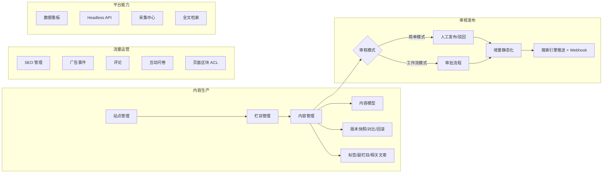

# CMS 内容管理

Zenith Admin 内置企业级 CMS 内容管理模块，支持**多站点（站群）、内容模型自定义字段、审核工作流、SSR 静态化发布、SEO 工具链、PostgreSQL 中文全文检索**，功能对标主流内容管理系统。

## 功能地图



## 模块清单

| 菜单 | 路径 | 说明 | 文档 |
|------|------|------|------|
| 数据看板 | `/cms/dashboard` | 状态分布、发布趋势、热文 TOP、栏目分布 | 本页 |
| 站点管理 | `/cms/sites` | 站群、域名路由、主题、审核模式、Webhook | [内容管线](./content-pipeline) |
| 栏目管理 | `/cms/channels` | 树形栏目（列表/单页/外链），级联 path | [内容管线](./content-pipeline) |
| 内容管理 | `/cms/contents` | 5 态状态机、多形态内容（图文/图集/音视频/外链）、批量操作、导入导出、回收站 | [内容管线](./content-pipeline) |
| 内容模型 | `/cms/models` | 12 种自定义字段类型（EAV via JSONB） | [内容管线](./content-pipeline) |
| 标签管理 | `/cms/tags` | 站点级标签 + 前台聚合页 | [内容管线](./content-pipeline) |
| 碎片管理 | `/cms/fragments` | 模板可引用的后台可编辑区块 | [互动与运营](./interaction) |
| 友情链接 | `/cms/friend-links` | 前台页脚友链 | [互动与运营](./interaction) |
| 素材中心 | `/cms/resources` | 文件夹树、完整引用扫描、孤立素材治理任务与报告导出 | [内容管线](./content-pipeline) |
| 站点静态化 | `/cms/sites` | 站点管理操作中提交全站静态化任务 | [渲染与静态化](./static-and-render) |
| 检索管理 | `/cms/search` | 分词测试、词典、热词、死链检测 | [全文检索](./search) |
| SEO 管理 | `/cms/seo` | 301 重定向、内链词、推送日志 | [SEO 与流量](./seo) |
| 评论管理 | `/cms/comments` | 树形回复、点赞、批量审核 | [互动与运营](./interaction) |
| 广告管理 | `/cms/ads` | 广告投放、事件明细、统计、保留期任务与导出 | [互动与运营](./interaction) |
| 表单管理 | `/cms/forms` | 自定义表单、提交数据导出、邮件通知 | [互动与运营](./interaction) |
| 敏感词库 | `/cms/sensitive-words` | Aho-Corasick 引擎，评论/表单提交拦截 | [互动与运营](./interaction) |
| 易错词库 | `/cms/error-prone-words` | 编辑辅助：错误词→正确词，内容检查一键替换 | [内容管线](./content-pipeline) |
| 互动问卷 | `/cms/interactions` | survey/poll 统一设计、发布/关闭、答卷、结果与导出 | [互动与运营](./interaction) |
| 访问统计 | `/cms/stats` | PV/UV 趋势、内容 TOP、来源/设备/通道分布、搜索分析 | [全文检索](./search) |
| 采集中心 | `/cms/collect` | CSS 选择器采集 + 图片本地化 | [互动与运营](./interaction) |
| 页面搭建 | `/cms/pages` | 区块拖拽、用户/角色 ACL、公开展示条件与实时预览 | [互动与运营](./interaction) |
| 会员订阅 | `/cms/subscriptions` | 站点/栏目/作者订阅聚合、脱敏明细与导出 | [互动与运营](./interaction) |
| 模板与主题 | `/cms/themes` | 安全声明式 DSL、签名主题包、版本/影响分析 | [模板与发布](./templates-themes-publishing) |
| 发布中心 | `/cms/publishing` | 通用任务队列投影、产物、失败恢复与导出 | [模板与发布](./templates-themes-publishing) |

## 架构总览

```text
浏览器（前台访客）
   │ Host 匹配 / __cms/{code} 预览前缀
   ▼
CMS 前台路由（Hono 兜底路由）
   ├─ 301/302 重定向 → 草稿预览（签名链接）→ robots/sitemap/RSS
   ├─ 静态文件命中（hybrid/static 模式）
   ├─ Redis 页面缓存（dynamic 模式，按页面类型分级 TTL）
   └─ React SSR 渲染 → ETag/Cache-Control 协商缓存
后台管理（React SPA /cms/*）
   └─ /api/cms/* REST 接口（权限 cms:*，站点数据权限 cms_site_users）
开放平台
   └─ /api/open/v1/cms/*（Headless 只读 API，scope cms:read）
```

## 数据表

核心表：`cms_sites` / `cms_models` / `cms_model_fields` / `cms_channels` / `cms_contents` / `cms_tags` / `cms_content_tags` / `cms_content_channels`（副栏目）/ `cms_content_relations`（相关文章）/ `cms_content_versions` / `cms_content_op_logs`（操作日志时间线）

运营表：`cms_comments` / `cms_ad_slots` / `cms_ads` / `cms_ad_events` / `cms_forms` / `cms_form_submissions` / `cms_sensitive_words` / `cms_error_prone_words`（易错词）/ `cms_fragments` / `cms_friend_links` / `cms_pages` / `cms_page_block_acls`

模板与发布：`cms_templates` / `cms_template_versions` / `cms_theme_packages` / `cms_theme_deployments` / `cms_publish_artifacts`；发布任务与逐路径日志复用 `async_tasks` / `async_task_items`。

会员互动表：`cms_content_likes` / `cms_content_favorites` / `cms_member_view_history` / `cms_member_subscriptions` / `cms_interactions` / `cms_interaction_questions` / `cms_interaction_responses` / `cms_interaction_answers`

统计表：`cms_visit_logs`（前台访问原始日志，90 天保留）/ `cms_ad_stats`（广告曝光/点击日聚合）/ `cms_ad_events`（追加型事件，配置化保留期）/ `cms_search_logs`（搜索日志，90 天保留）

> 访问统计为**服务端响应路径埋点**（静态命中同样统计，无需前端 JS），UV 按 ip+ua 哈希去重，爬虫流量单独归类不计入 PV/UV 卡片；报表基于原始日志实时聚合，原始日志由周期任务保留 90 天。

SEO 与采集：`cms_redirects` / `cms_link_words` / `cms_push_logs` / `cms_search_words` / `cms_collect_rules` / `cms_collect_items`

权限：`cms_site_users`（站点数据权限绑定）/ `cms_channel_users`（栏目数据权限绑定）；`cms_contents.dept_id`（创建时快照创建人部门，供部门数据权限过滤）

## 数据看板

「数据看板」页（权限 `cms:dashboard:view`）提供站点内容运营概览：

- **状态卡片**：已发布 / 草稿 / 待审核 / 已下线 / 已驳回 / 回收站数量
- **运营指标**：今日发布、累计浏览量、待审核评论
- **发布趋势**：近 14 天发布数柱状图
- **热门内容 TOP10**：按浏览量排序，点击直达编辑页
- **栏目内容分布 TOP10**

接口：`GET /api/cms/dashboard/stats?siteId=`，60s 自动轮询刷新。

## 权限码

所有权限以 `cms:` 前缀，按资源划分：`cms:site:*`、`cms:channel:*`、`cms:content:list|create|update|delete|publish|audit`、`cms:model:*`、`cms:tag:*`、`cms:fragment:*`、`cms:link:*`、`cms:search:manage`、`cms:seo:manage|push`、`cms:comment:audit|delete`、`cms:ad:manage`、`cms:ad-event:list|export|export-raw|cleanup`、`cms:form:manage`、`cms:sensitive:manage`、`cms:word:list|manage`、`cms:interaction:list|manage|batch|export|export-raw`、`cms:subscription:list|export|export-raw`、`cms:stat:view`、`cms:collect:*`、`cms:page:create|update|delete|acl`、`cms:template:view|manage|activate`、`cms:theme:view|import|activate|export`、`cms:publish:view|build|manage`、`cms:dashboard:view`。

站点级数据权限：非平台超管必须在「站点管理 → 授权用户」中显式绑定后才能访问；未绑定时默认拒绝。平台超管可跨站点管理。

## 企业级治理（P5）

- **栏目级数据权限**：非平台超管必须在「栏目管理 → 授权用户」中显式绑定后，才可管理对应栏目内容（列表、详情、状态流转与批量操作均按主栏目校验）；未绑定默认拒绝，平台超管不受限。表 `cms_channel_users`。
- **部门数据权限**：内容创建时快照创建人 `created_by` 与其部门 `dept_id`；内容列表接入系统数据权限（`getDataScopeCondition`），角色数据范围为 本部门/本部门及以下/指定部门/仅本人 时自动过滤。
- **站点导入导出**：站点操作菜单「导出」下载整站 JSON 包（站点配置、栏目树、标签、内容及关联、碎片、友链、重定向、内链词、广告位/广告、表单定义、搭建页面；不含运行数据与用户绑定）；工具栏「导入」上传导出包创建为新站点，内部 id 全部重映射，站点 code 冲突自动加序号，域名/默认站标记不迁移。为避免导入绕过发布权限，包内内容无论原状态或计划时间均统一导入为草稿，并清除发布时间、计划发布时间与归档状态，需由有 `cms:content:publish` 权限的用户重新发布或排期。接口 `GET /api/cms/sites/{id}/export`、`POST /api/cms/sites/import`。
- **CDN 刷新**：站点设置「CDN 刷新」配置 purge webhook 地址与令牌后，增量静态化/整站重建完成自动 POST 变更路径（`{ siteCode, origin, purgeAll, paths, urls }`，Bearer 鉴权），由接收端转译具体云厂商刷新 API；失败仅记日志不影响静态化。
- **多语言站点关联**：站点设置「多语言站点关联」配置本站语言与关联站点（`语言代码=站点标识` 每行一条）后，前台所有页面输出 `<link rel="alternate" hreflang>` 且页头显示语言切换；关联站点 URL 取绑定域名（无域名回退预览路径）。
