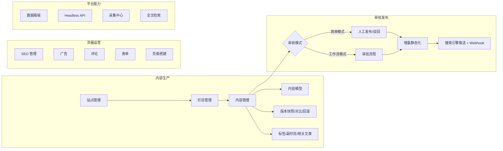

# CMS 内容管理

Zenith Admin 内置企业级 CMS 内容管理模块，支持**多站点（站群）、内容模型自定义字段、审核工作流、SSR 静态化发布、SEO 工具链、PostgreSQL 中文全文检索**，功能对标主流内容管理系统。

## 功能地图



## 模块清单

| 菜单 | 路径 | 说明 | 文档 |
|------|------|------|------|
| 数据看板 | `/cms/dashboard` | 状态分布、发布趋势、热文 TOP、栏目分布 | 本页 |
| 站点管理 | `/cms/sites` | 站群、域名路由、主题、审核模式、Webhook | [内容管线](./content-pipeline) |
| 栏目管理 | `/cms/channels` | 树形栏目（列表/单页/外链），级联 path | [内容管线](./content-pipeline) |
| 内容管理 | `/cms/contents` | 5 态状态机、批量操作、导入导出、回收站 | [内容管线](./content-pipeline) |
| 内容模型 | `/cms/models` | 12 种自定义字段类型（EAV via JSONB） | [内容管线](./content-pipeline) |
| 标签管理 | `/cms/tags` | 站点级标签 + 前台聚合页 | [内容管线](./content-pipeline) |
| 碎片管理 | `/cms/fragments` | 模板可引用的后台可编辑区块 | [互动与运营](./interaction) |
| 友情链接 | `/cms/friend-links` | 前台页脚友链 | [互动与运营](./interaction) |
| 静态化管理 | `/cms/static` | 全站静态化任务 | [渲染与静态化](./static-and-render) |
| 检索管理 | `/cms/search` | 分词测试、词典、热词、死链检测 | [全文检索](./search) |
| SEO 管理 | `/cms/seo` | 301 重定向、内链词、推送日志 | [SEO 与流量](./seo) |
| 评论管理 | `/cms/comments` | 树形回复、点赞、批量审核 | [互动与运营](./interaction) |
| 广告管理 | `/cms/ads` | 广告位 + 投放窗口 + 点击统计 | [互动与运营](./interaction) |
| 表单管理 | `/cms/forms` | 自定义表单、提交数据导出、邮件通知 | [互动与运营](./interaction) |
| 敏感词库 | `/cms/sensitive-words` | Aho-Corasick 引擎，评论/表单提交拦截 | [互动与运营](./interaction) |
| 采集中心 | `/cms/collect` | CSS 选择器采集 + 图片本地化 | [互动与运营](./interaction) |
| 页面搭建 | `/cms/pages` | 区块拖拽装配 + 内嵌实时预览 | [互动与运营](./interaction) |

## 架构总览

```text
浏览器（前台访客）
   │ Host 匹配 / __cms/{code} 预览前缀
   ▼
CMS 前台路由（Hono 兜底路由）
   ├─ 301/302 重定向 → 草稿预览（签名链接）→ robots/sitemap/RSS
   ├─ 静态文件命中（hybrid/static 模式）
   ├─ Redis 页面缓存（dynamic 模式，按页面类型分级 TTL）
   └─ React SSR 渲染 → ETag/Cache-Control 协商缓存
后台管理（React SPA /cms/*）
   └─ /api/cms/* REST 接口（权限 cms:*，站点数据权限 cms_site_users）
开放平台
   └─ /api/open/v1/cms/*（Headless 只读 API，scope cms:read）
```

## 数据表

核心表：`cms_sites` / `cms_models` / `cms_model_fields` / `cms_channels` / `cms_contents` / `cms_tags` / `cms_content_tags` / `cms_content_channels`（副栏目）/ `cms_content_relations`（相关文章）/ `cms_content_versions`

运营表：`cms_comments` / `cms_ad_slots` / `cms_ads` / `cms_forms` / `cms_form_submissions` / `cms_sensitive_words` / `cms_fragments` / `cms_friend_links` / `cms_pages`

SEO 与采集：`cms_redirects` / `cms_link_words` / `cms_push_logs` / `cms_search_words` / `cms_collect_rules` / `cms_collect_items`

权限：`cms_site_users`（站点数据权限绑定）

## 数据看板

「数据看板」页（权限 `cms:dashboard:view`）提供站点内容运营概览：

- **状态卡片**：已发布 / 草稿 / 待审核 / 已下线 / 已驳回 / 回收站数量
- **运营指标**：今日发布、累计浏览量、待审核评论
- **发布趋势**：近 14 天发布数柱状图
- **热门内容 TOP10**：按浏览量排序，点击直达编辑页
- **栏目内容分布 TOP10**

接口：`GET /api/cms/dashboard/stats?siteId=`，60s 自动轮询刷新。

## 权限码

所有权限以 `cms:` 前缀，按资源划分：`cms:site:*`、`cms:channel:*`、`cms:content:list|create|update|delete|publish|audit`、`cms:model:*`、`cms:tag:*`、`cms:fragment:*`、`cms:link:*`、`cms:static:build`、`cms:search:manage`、`cms:seo:manage|push`、`cms:comment:audit|delete`、`cms:ad:manage`、`cms:form:manage`、`cms:sensitive:manage`、`cms:collect:*`、`cms:page:*`、`cms:dashboard:view`。

站点级数据权限：在「站点管理 → 授权用户」绑定后，该用户仅能管理绑定站点；未绑定的非超管用户不受限（兼容策略）。
