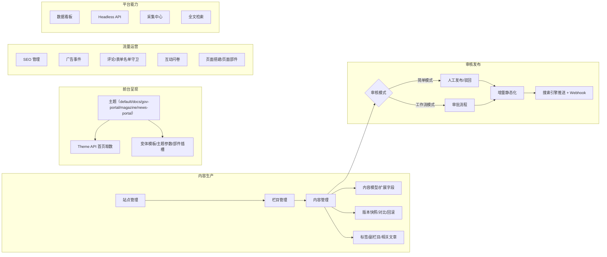

# CMS 内容管理

Zenith Admin 内置企业级 CMS 内容管理模块，支持**多站点（站群）、内容模型自定义字段、审核工作流、多主题 React SSR 静态化发布、SEO 工具链、PostgreSQL 中文全文检索、评论/表单公开提交风控守卫**。Server 是 CMS 业务权威边界：站点/栏目/部门数据范围、版本与发布任务、素材归属和公开 URL 都在服务端统一决定。

## 功能地图


```mermaid
graph LR
    subgraph 内容生产
        A[站点管理] --> B[栏目管理]
        B --> C[内容管理]
        C --> C1[内容模型/扩展字段]
        C --> C2[版本快照/对比/回滚]
        C --> C3[标签/副栏目/相关文章]
    end
    subgraph 审核发布
        C --> D{审核模式}
        D -->|简单模式| D1[人工发布/驳回]
        D -->|工作流模式| D2[审批流程]
        D1 & D2 --> E[增量静态化]
        E --> F[搜索引擎推送 + Webhook]
    end
    subgraph 前台呈现
        T[主题（default/docs/gov-portal/magazine/news-portal）] --> T1[Theme API 首页取数]
        T --> T2[变体模板/主题参数/部件插槽]
    end
    subgraph 流量运营
        G[SEO 管理] & H[广告事件] & I[评论/表单名单守卫] & J[互动问卷] & K[页面搭建/页面部件]
    end
    subgraph 平台能力
        L[数据看板] & M[Headless API] & N[采集中心] & O[全文检索]
    end
```

## 模块清单

| 菜单 | 路径 | 说明 | 文档 |
|------|------|------|------|
| 数据看板 | `/cms/dashboard` | 状态分布、发布趋势、热文 TOP、栏目分布 | 本页 |
| 站点管理 | `/cms/sites` | 父子站群、显式继承、域名路由、主题选择与主题参数、审核模式、Webhook | [站群与分发](./site-groups-and-distribution) · [主题](./themes) |
| 栏目管理 | `/cms/channels` | 左树右编辑，树形栏目（列表/单页/外链），栏目标识 code + 级联 path，批量建栏目 | [内容管线](./content-pipeline) |
| 内容管理 | `/cms/contents` | 5 态状态机、多形态内容（图文/图集/音视频/外链）、批量状态流转、导入导出、回收站 | [内容管线](./content-pipeline) |
| 内容模型 | `/cms/models` | 12 种自定义字段、选项绑字典、默认值、发布必填、列表/详情展示配置、站群归属治理 | [内容模型](./content-models) |
| 标签管理 | `/cms/tags` | 站点级标签（名称自动生成拼音 slug）+ 前台聚合页 | [内容管线](./content-pipeline) |
| 友情链接 | `/cms/friend-links` | 前台页脚友链，支持分组管理与按组渲染 | [互动与运营](./interaction) |
| 素材中心 | `/cms/resources` | 文件夹树、句柄化引用索引、素材替换/裁剪、孤立素材治理与报告导出 | [内容管线](./content-pipeline) |
| 检索管理 | `/cms/search` | 分词测试、自定义词典、搜索热词 | [全文检索](./search) |
| SEO 管理 | `/cms/seo` | 301 重定向、内链词、搜索推送、死链检测 | [SEO 与流量](./seo) |
| 评论管理 | `/cms/comments` | 树形回复、点赞、批量审核、观察主体标注 | [互动与运营](./interaction) |
| 广告管理 | `/cms/ads` | 广告投放、事件明细、统计、保留期任务与导出 | [互动与运营](./interaction) |
| 表单管理 | `/cms/forms` | 自定义表单、提交数据导出、邮件通知、提交名单守卫 | [互动与运营](./interaction) |
| 敏感词库 | `/cms/sensitive-words` | Aho-Corasick 引擎，评论/表单提交拦截 | [互动与运营](./interaction) |
| 易错词库 | `/cms/error-prone-words` | 编辑辅助：错误词→正确词，内容检查一键替换 | [内容管线](./content-pipeline) |
| 互动问卷 | `/cms/interactions` | survey/poll 统一设计、发布/关闭、答卷、结果与导出 | [互动与运营](./interaction) |
| 访问统计 | `/cms/stats` | PV/UV 趋势、内容 TOP、来源/设备分布、搜索分析 | [全文检索](./search) |
| 采集中心 | `/cms/collect` | CSS 选择器采集 + 图片本地化 | [互动与运营](./interaction) |
| 页面部件 | `/cms/widgets` | 手工榜单/实时来源内容块，草稿-发布-下线、主题插槽绑定、引用定向刷新 | [渲染与静态化](./static-and-render) |
| 页面搭建 | `/cms/pages` | 区块拖拽（内容列表支持栏目/标签聚合取数、widget-ref 部件引用）、用户/角色 ACL、展示条件与实时预览 | [互动与运营](./interaction) |
| 会员订阅 | `/cms/subscriptions` | 站点/栏目/作者订阅聚合、脱敏明细与导出 | [互动与运营](./interaction) |
| 发布中心 | `/cms/publishing` | 通用任务队列投影、产物、失败恢复与导出 | [渲染与静态化](./static-and-render) |
| 内容分发 | `/cms/distribution` | 跨站 copy/mapping/定时同步、冲突治理、行级结果与导出 | [站群与分发](./site-groups-and-distribution) |

> **后台交互约定**：CMS 各管理页共用**站点切换器**（树形下拉，展示站群父子层级，支持搜索过滤）。
> 「当前站点」为全 CMS 模块共享上下文——任一页面切换站点即写入 localStorage，其余页面与 F5 刷新后
> 自动恢复同一站点（恢复优先级：已存站点 → 默认站点 → 首个可见站点）。
> 栏目管理 / 内容管理 / 素材中心三页统一为左右两栏（`MasterDetailLayout`）：左栏站点切换器 + 栏目树/文件夹树
> （可拖宽、宽度持久化、窄屏折叠单栏），右栏为编辑区或数据列表。

## 架构总览

```text
浏览器（前台访客）
   │ Host 匹配 / __cms/{code} 预览前缀
   ▼
CMS 前台路由（Hono 兜底路由）
   ├─ 301/302 重定向 → 草稿预览（签名链接）→ robots/sitemap/RSS
   ├─ 静态文件命中（hybrid/static 模式）
   ├─ Redis 页面缓存（dynamic 模式，按页面类型分级 TTL）
   └─ React SSR 渲染（主题注册表 default/docs/gov-portal/magazine/news-portal）→ ETag 协商缓存
后台管理（React SPA /cms/*）
   └─ /api/cms/* REST 接口（权限 cms:*，站点数据权限 cms_site_users）
公开交互
   └─ /api/public/cms/*（评论、表单、互动、广告令牌、浏览计数；无需后台登录）
会员入口
   └─ /api/member/cms/*（投稿、点赞、收藏、订阅、会员评论与互动；独立 member token）
开放平台
   └─ /api/open/v1/cms/*（Headless 双向 API：查询 DSL / 游标翻页 / 增量同步 / 受治理写入，
      scope cms:read|cms:write|cms:publish，写入需站点/栏目级开放授权与独立 open-app scope）
```

## 数据表

核心表：`cms_sites` / `cms_site_inheritances` / `cms_distribution_rules` / `cms_models`（含 `owner_site_id` 站群归属）/ `cms_model_fields`（含列表/详情展示配置与默认值）/ `cms_channels` / `cms_contents` / `cms_tags` / `cms_content_tags` / `cms_content_channels`（副栏目）/ `cms_content_relations`（相关文章）/ `cms_content_versions` / `cms_content_op_logs`（操作日志时间线）

素材表：`cms_resource_folders` / `cms_resources` / `cms_resource_refs`（素材反向引用索引，owner 写事务内维护，供孤立治理与删除保护）

开放能力：`cms_open_app_grants`（开放应用的站点/栏目写入授权，fail-closed）/ `cms_content_tombstones`（硬删除墓碑，供 Headless 增量同步输出 `op=delete`）

运营表：`cms_comments` / `cms_ad_slots` / `cms_ads` / `cms_ad_events` / `cms_forms` / `cms_form_submissions` / `cms_sensitive_words` / `cms_error_prone_words`（易错词）/ `cms_friend_link_groups` / `cms_friend_links` / `cms_pages` / `cms_page_block_acls` / `cms_widgets` / `cms_widget_refs`（部件被页面/主题插槽引用的索引）/ `cms_widget_source_refs`（实时来源→部件反向索引，供内容/栏目变更触发定向刷新）

主题与发布：主题为仓库内置 React TSX 主题（`default` / `docs` / `gov-portal` / `magazine` / `news-portal`，见[主题与模板开发](./themes)），无独立模板表；主题参数存 `cms_sites.settings.themeConfig`；发布产物记录于 `cms_publish_artifacts`，发布任务与逐路径日志复用 `async_tasks` / `async_task_items`。

会员互动表：`cms_content_likes` / `cms_content_favorites` / `cms_member_view_history` / `cms_member_subscriptions` / `cms_interactions` / `cms_interaction_questions` / `cms_interaction_responses` / `cms_interaction_answers`

统计表：`cms_visit_logs`（前台访问原始日志，90 天保留）/ `cms_ad_stats`（广告曝光/点击日聚合）/ `cms_ad_events`（追加型事件，配置化保留期）/ `cms_search_logs`（搜索日志，90 天保留）

> 访问统计为**服务端响应路径埋点**（静态命中同样统计，无需前端 JS），UV 按 ip+ua 哈希去重；趋势、来源和内容排行默认排除 `bot`，设备分布保留 `bot` 作为独立项。报表基于原始日志实时聚合，原始日志由周期任务保留 90 天。

SEO 与采集：`cms_redirects` / `cms_link_words` / `cms_push_logs` / `cms_search_words` / `cms_hotword_groups` / `cms_hotwords`（可管理热词分组与词条）/ `cms_collect_rules` / `cms_collect_items`

权限：`cms_site_users`（站点数据权限绑定）/ `cms_channel_users`（栏目数据权限绑定）；`cms_contents.dept_id`（创建时快照创建人部门，供部门数据权限过滤）

## 数据看板

「数据看板」页（权限 `cms:dashboard:view`）提供站点内容运营概览：

- **状态卡片**：已发布 / 草稿 / 待审核 / 已下线 / 已驳回 / 回收站数量
- **运营指标**：今日发布、累计浏览量、待审核评论
- **发布趋势**：近 14 天发布数柱状图
- **热门内容 TOP10**：按浏览量排序，点击直达编辑页
- **栏目内容分布 TOP10**

接口：`GET /api/cms/dashboard/stats?siteId=`，60s 自动轮询刷新。

## 权限码

所有权限以 `cms:` 前缀，按资源划分：`cms:dashboard:view`、`cms:site:list|create|update|delete|hierarchy`、`cms:channel:list|create|update|delete`、`cms:content:list|create|update|delete|export|publish|audit|lock`、`cms:resource:list|upload|update|delete`、`cms:model:list|create|update|delete`、`cms:tag:list|create|update|delete`、`cms:link:list|create|update|delete`、`cms:search:manage`、`cms:seo:manage|push`、`cms:comment:list|audit|delete`、`cms:ad:list|manage`、`cms:ad-event:list|export|export-raw|cleanup`、`cms:form:list|manage`、`cms:sensitive:list|manage`、`cms:collect:list|create|update|delete|run`、`cms:widget:list|create|update|publish|offline|delete|bind`、`cms:page:list|create|update|delete|acl`、`cms:word:list|manage`、`cms:interaction:list|manage|batch|export|export-raw`、`cms:stat:view`、`cms:publish:view|build|manage|group`、`cms:subscription:list|export|export-raw`、`cms:distribution:list|create|update|delete|run|export`。

站点级数据权限：非平台超管必须在「站点管理 → 授权用户」中显式绑定后才能访问；未绑定时默认拒绝。平台超管可跨站点管理。

## 企业级治理

- **栏目级数据权限**：非平台超管必须在「栏目管理 → 授权用户」中显式绑定后，才可管理对应栏目内容（列表、详情、状态流转与批量操作均按主栏目校验）；未绑定默认拒绝，平台超管不受限。表 `cms_channel_users`。
- **部门数据权限**：内容创建时快照创建人 `created_by` 与其部门 `dept_id`；内容列表接入系统数据权限（`getDataScopeCondition`），角色数据范围为 本部门/本部门及以下/指定部门/仅本人 时自动过滤。
- **模型站群归属**：内容模型分「平台共享 / 站点专属」，专属模型仅归属站点可见可绑定，跨站绑定服务端拦截；详见[内容模型](./content-models#站群归属治理)。
- **站点导入导出**：版本 `2` 的整站 JSON 包包含站点配置、模型及字段、栏目树、标签、素材、内容及关联、友链分组、SEO/广告/表单、互动问卷定义与题目、搭建页面、页面部件和主题插槽引用。导入会恢复模型绑定、栏目静态化与详情归档规则、内容 `staticPath`、页面 `path`/首页标记和全部包内实体引用；内容、页面部件和互动问卷统一落为草稿。域名、默认站点标记、父站继承关系、源站用户绑定、主题插槽绑定及分析/Webhook/CDN/推送/验证码密钥等环境绑定不迁移；非平台管理员仅获得按当前操作者权限创建的目标初始访问绑定，并通过 `skipped`/`warnings` 明确返回。导入数据和整站发布 outbox 在同一事务提交，提交后才入队，因此 `static`/`hybrid` 站点不会长期停留在“数据已存在但从未生成产物”的状态。接口 `GET /api/cms/sites/{id}/export`、`POST /api/cms/sites/import`，详细边界见[站群与分发](./site-groups-and-distribution#站点导入导出)。
- **CDN 刷新**：站点设置「CDN 刷新」配置 purge webhook 地址与令牌后，增量静态化/整站重建完成自动 POST 变更路径（请求体 `{ siteCode, origin, purgeAll, paths, urls }`，配置令牌时通过 `Authorization` 请求头发送），失败仅记日志不影响静态化结果。
- **多语言站点关联**：站点设置「多语言站点关联」配置本站语言与关联站点（`语言代码=站点标识` 每行一条）后，前台所有页面输出 `<link rel="alternate" hreflang>` 且页头显示语言切换；关联站点 URL 取绑定域名（无域名回退预览路径）。
- **公开提交名单守卫**：评论与自定义表单提交复用规则中心统一求值门面 `decide()`。`risk_blacklist` 命中直接返回 403，`cms_watchlist` 命中放行但评论写入 `cms_comments.risk_flag = 'watchlist'`，审核队列展示「观察主体」徽标；名单规则的配置与留痕见 [规则中心](/rules/evaluation)。

### 运行时约定

- 所有公开 URL（栏目、内容、搭建页、标签、互动和资源）由服务端 resolver 生成；内容实体返回 `canonicalUrl`/`previewUrl`，主题和管理端不拼接 `channelPath + slug + 扩展名`。
- HTML 正文、单页正文和富文本区块写入前经过 `sanitizeCmsHtml`；CMS link 字段只接受安全站内路径、`entity:` 引用和 `http(s)`/明确允许的 `mailto`/`tel`。资源句柄按 `siteId` 隔离，跨站句柄拒绝。
- 内容/栏目/页面/部件等公开语义变更通过发布任务中心异步处理；事务 outbox 提交后先清理站点 Redis 页面和 sitemap/RSS 元数据缓存，再异步生成或删除静态文件。整站/主题快照使用 `publicRevision`，路径级增量任务使用对象版本与路径快照；旧任务不能覆盖更新后的产物。
