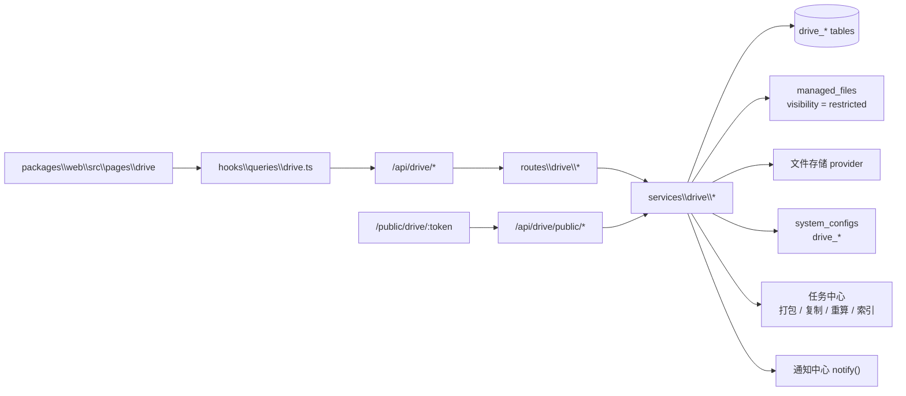

# 企业网盘

企业网盘是面向组织内文件存放、协作共享与治理的领域模块。它以**空间**为容量与权限边界，围绕文件夹树、
四级协作角色、外链分享、版本、回收站、全文检索与治理审计形成完整闭环，并完全复用文件与存储模块的
`managed_files` / 多 provider / 分片上传底座，不另建一套对象存储。

---

## 架构总览



| 层 | 位置 | 职责 |
| --- | --- | --- |
| 共享契约 | `packages\shared\src\drive\` | 实体 schema 与 API 契约（`contracts/`）、空间类型、角色、主体类型、设置键、Zod 入参 |
| 数据模型 | `packages\server\src\db\schema\drive.ts` | 空间、成员、节点树、授权、版本、外链、访问日志、动态、收藏、最近、标签、评论、正文索引 |
| API 路由 | `packages\server\src\routes\drive\` | 由契约派生的 `/api/drive/*` 路由与权限门控；`/api/drive/public/*` 匿名外链 |
| 业务服务 | `packages\server\src\services\drive\` | ACL 解析、目录树操作、上传 / 秒传 / 版本、外链会话、回收站、检索、治理、任务处理器 |
| 前端页面 | `packages\web\src\pages\drive\` | 工作台、共享空间、治理页、公开外链页 |
| 菜单权限 | `packages\shared\src\seed\menus\drive.ts` | `19000` 段企业网盘菜单与 `drive:*` 权限 |
| 演示数据 | `packages\web\src\mocks\{data,handlers}\drive.ts` | Demo 模式内存实现 |

## 能力总览

| 能力 | 当前实现 |
| --- | --- |
| 空间 | `personal` 个人空间（首次访问自动创建）、`department` 部门空间（管理员创建或按设置自动创建）、`team` 协作空间（用户自建）；每个空间有独立配额、版本上限与外链开关 |
| 权限模型 | 有效角色 = 菜单 RBAC ∧ max(空间角色, 节点授权)；四级角色 `viewer` 仅预览 → `downloader` 可下载 → `editor` 可编辑 → `manager` 管理者 |
| 授权主体 | 用户、部门（含子部门成员）、角色、用户组四类主体，空间成员与节点授权共用同一套编辑器 |
| 节点授权继承 | 授权沿目录树向下继承；`inheritPermissions=false` 可在任意文件夹断开继承，重新定义访问边界 |
| 目录浏览 | 列表 / 网格双视图、面包屑、排序、目录内搜索、右键菜单、多选批量、拖拽上传、缩略图 |
| 上传 | ≤ 5MB 简单上传、大文件分片断点续传、SHA-256 秒传、同名冲突策略（保留两者 / 覆盖为新版本 / 跳过）、扩展名黑名单 + 可执行文件头识别、配额原子预留 |
| 版本 | 覆盖上传或手动上传新版本；历史版本可下载、回滚（生成新版本）、删除；超出空间上限自动清理最早版本并释放容量 |
| 外链分享 | 令牌 SHA-256 存储；可选密码、有效期、访问次数、仅预览 / 可下载；公开页密码门 → Redis 访问会话；访问 / 下载留痕；登录用户可转存到自己的网盘 |
| 回收站 | 删除进入回收站，保留期后由治理任务彻底清除；支持还原（原目录不存在回落到空间根）、彻底删除、清空 |
| 个人视图 | 与我共享、我的收藏、最近访问、我的外链、回收站 |
| 检索 | 文件名检索；开启「包含正文」后同时检索文本文件正文（tsvector；CJK 关键词自动改用子串匹配），返回命中片段 |
| 协作 | 签出锁定（防止并发覆盖）、标签、评论、节点动态时间线 |
| 批量与异步 | 打包下载：小于阈值同步返回 zip，超阈值转任务中心并通知；跨空间复制、容量重算、索引补建走任务中心 |
| 通知 | 节点共享、空间加入、配额预警、打包完成通过通知中心触达 |
| 治理 | 统计概览（空间 / 文件 / 占用 / 趋势 / 类型分布）、空间治理（配额 / 状态 / 所有者 / 部门空间）、外链治理与访问记录、动态审计、全局设置 |
| 数据保留 | `drive_activities`、`drive_share_access_logs` 按保留策略清理；`drive_nodes` 回收站超期项目按设置天数彻底清除 |

## 权限模型详解

```text
有效角色(user, node)
  = RBAC(菜单权限码通过)
  ∧ max( 空间角色(user, node.space),
         节点授权(user, node 及其祖先链, 直到 inheritPermissions=false 处) )
```

| 空间类型 | 空间角色来源 |
| --- | --- |
| 个人空间 | 所有者 = `manager`；其他人无空间角色，只能通过节点授权访问 |
| 部门空间 | 部门负责人 = `manager`；部门及子部门成员 = 空间 `defaultMemberRole`；`drive_space_members` 可为个别主体提升角色 |
| 协作空间 | 所有者 = `manager`；`defaultMemberRole` 为全体登录用户的默认角色（为空则仅成员可访问）；成员表按主体授予角色 |

超级管理员与持有 `drive:admin:space:edit` 的管理员对所有空间视为 `manager`。

| 角色 | 允许操作 |
| --- | --- |
| `viewer` | 浏览目录、在线预览（内容接口拒绝 `?download=true`） |
| `downloader` | 预览 + 下载、打包下载 |
| `editor` | 下载 + 上传、新建、重命名、移动、复制、删除到回收站、上传新版本、创建外链、签出锁定 |
| `manager` | 编辑 + 管理协作者授权、断开 / 恢复继承、彻底删除、管理他人外链、成员管理 |

## 存储集成

- 网盘文件是 `managed_files` 记录，`visibility = 'restricted'`：通用的 `GET /api/files/{id}/content` 对其返回 404，
  内容只能经 `GET /api/drive/nodes/{id}/content` 读取，由网盘 ACL 校验后流式代理（支持 Range / ETag）。
- 上传绕过通用 MIME 白名单（`skipTypeCheck`），改由网盘自己的扩展名黑名单与可执行文件头识别把关。
- 秒传按 `(tenant, contentHash, size, restricted)` 复用已存在的对象；版本、节点、缩略图之间共享对象引用，
  只有在没有任何引用时才真正删除存储对象。
- 图片上传后异步生成缩略图，文本类文件异步提取正文建立索引（均可在设置中关闭）。

## 页面入口

| 菜单 | 路径 | 组件 |
| --- | --- | --- |
| 我的网盘 | `/drive` | `drive/DriveWorkbenchPage` |
| 共享空间 | `/drive/spaces` | `drive/spaces/DriveSpacesPage` |
| 空间治理 | `/drive/admin/spaces` | `drive/admin/DriveAdminSpacesPage` |
| 外链治理 | `/drive/admin/share-links` | `drive/admin/DriveAdminShareLinksPage` |
| 动态审计 | `/drive/admin/activities` | `drive/admin/DriveAdminActivitiesPage` |
| 网盘设置 | `/drive/admin/settings` | `drive/admin/DriveAdminSettingsPage` |
| 公开外链页 | `/public/drive/:token` | `drive/public/PublicSharePage`（无需登录） |

工作台 URL 参数：`?space={id}&folder={id}` 定位目录，`?view=shared|starred|recent|links|recycle` 打开个人视图。

## 数据模型

| 表 | 说明 |
| --- | --- |
| `drive_spaces` | 空间；类型、所有者 / 部门、默认成员角色、配额、已用容量、版本上限、外链开关 |
| `drive_space_members` | 空间成员；`(space, subjectType, subjectId)` 唯一 |
| `drive_nodes` | 节点树；`ancestor_ids integer[]`（GIN）、`parent_id`、软删除 `deleted_at / deleted_root_id`、锁定字段；同级同名唯一（忽略大小写、仅未删除） |
| `drive_node_permissions` | 节点直接授权；主体 × 角色，可选过期时间 |
| `drive_file_versions` | 文件历史版本；指向 `managed_files` |
| `drive_share_links` | 外链；`token_hash` 唯一 + 加密副本、密码哈希、权限、有效期、次数、`session_version` |
| `drive_share_access_logs` | 外链访问 / 下载 / 密码错误留痕 |
| `drive_activities` | 节点动态与审计 |
| `drive_node_stars` / `drive_recent_access` | 收藏与最近访问 |
| `drive_upload_bindings` | 分片上传会话与目标目录 / 节点的绑定 |
| `drive_tags` / `drive_node_tags` | 空间级标签及节点关联 |
| `drive_node_comments` | 节点评论 |
| `drive_node_texts` | 正文全文索引（`tsvector`） |

## 设置项（`system_configs`，`drive_` 前缀）

| 键 | 含义 |
| --- | --- |
| `drive_personal_quota_gb` / `drive_department_quota_gb` / `drive_team_quota_gb` | 各类空间默认配额，0 = 不限 |
| `drive_department_space_auto_create` | 用户首次访问时自动创建其部门空间 |
| `drive_recycle_retention_days` | 回收站保留天数，0 = 永久保留 |
| `drive_max_versions` | 默认最多保留版本数 |
| `drive_quota_warning_percent` | 配额预警阈值 |
| `drive_external_share_enabled` / `drive_external_share_max_days` / `drive_external_share_require_password` | 外链总开关、最长有效期、是否强制密码 |
| `drive_blocked_extensions` | 禁止上传的扩展名 |
| `drive_thumbnail_enabled` / `drive_text_index_enabled` | 缩略图与正文索引开关 |

## 接口速查

| 前缀 | 说明 |
| --- | --- |
| `GET/POST/PUT/DELETE /api/drive/spaces*` | 我的空间、空间 CRUD、成员、转让 |
| `GET /api/drive/nodes` | 目录内容（`spaceId` 或 `parentId`） |
| `POST /api/drive/nodes/{folder,move,copy,precheck,upload,upload/init,upload/chunk,upload/complete,batch-download}` | 目录写操作与上传 |
| `DELETE /api/drive/nodes/batch` · `/api/drive/nodes/recycle*` | 删除到回收站、还原、彻底删除、清空 |
| `GET /api/drive/nodes/{starred,recent,shared-with-me,search}` | 个人视图与检索 |
| `/api/drive/nodes/{id}/{content,thumbnail,rename,star,permissions,inherit,versions,activities,comments,tags,lock,share-links}` | 单节点资源 |
| `/api/drive/share-links*` | 我的外链、修改、撤销、访问记录 |
| `/api/drive/public/shares/{token}/*` | 匿名外链：元信息、密码校验、浏览、内容、转存 |
| `/api/drive/tags*` | 空间标签 |
| `/api/drive/admin/*` | 统计、空间治理、部门空间、容量重算、索引补建、外链治理、动态审计、设置 |

完整参数与响应以 `packages\shared\src\drive\contracts\` 中的契约为准（`driveSpaceContract` / `driveNodeContract` / `driveShareLinkContract` /
`driveTagContract` / `driveAdminContract` / `drivePublicShareContract`），服务端路由、前端 hooks、MSW mock 与运行中的 `/api/docs`（`企业网盘-*` 标签）均由其派生。
