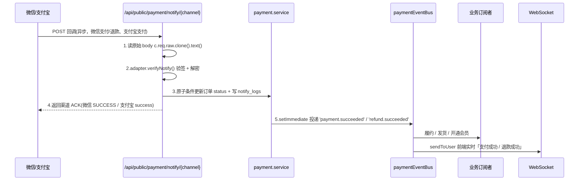
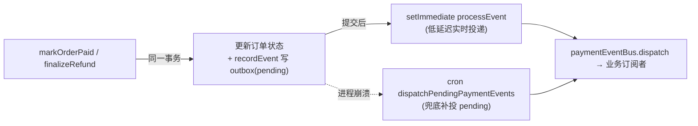

# 异步通知与对账

支付结果以**渠道异步回调**为主、**主动查单**为辅，并通过 **Outbox 事件表**保证支付 / 退款成功事件「崩溃不丢」。三重机制共同保证订单状态最终一致，业务订阅者通过自身幂等完成履约。

## 1. 异步通知流程（需求 ③）

- 端点挂 `/api/public/payment/notify/{channel}`，`security: []`、无 `authMiddleware`（参照 `routes/workflow/workflow-external-callback.ts`）；
- **先验签再处理**，验签失败立即拒绝并记 `payment_notify_logs`；
- 微信：按 `Wechatpay-Serial` 自动下载平台证书（12h 缓存，应对证书轮换）RSA-SHA256 验签 + `AES-256-GCM` 解密 `resource`，根据 `event_type` 区分支付 / 退款；支付宝：`RSA2` / `RSA` 验签支付通知；
- 回调处理**幂等**：靠 `markOrderPaid` / `finalizeRefund` 的**原子条件更新**（仅在订单 / 退款单尚未终态时更新），重放无害；
- **失败 ACK 触发渠道重发**：验签通过但本地落库失败时，返回渠道格式的失败 ACK（微信 `500 {code:'FAIL'}`、支付宝 `failure`），由渠道按其重试策略重发通知，而非静默吞错后仅靠查单兜底。

## 2. Outbox 可靠投递

进程内事件总线在**进程崩溃**时可能丢失履约事件。为此引入 `payment_events` Outbox 表，持久化支付成功与退款成功事件：

- **原子持久化**：支付成功 / 退款成功时，在更新订单状态的**同一事务**内 `recordEvent()` 写入 outbox 事件（`status='pending'`）；
- **低延迟实时投递**：事务提交后 `setImmediate(() => processEvent(id))` 立即投递；
- **崩溃兜底**：cron `dispatchPendingPaymentEvents` 补投所有 `pending` 且未超重试上限（`MAX_ATTEMPTS=5`）的事件；
- **结果**：实时 + 兜底两条路径保证 **at-least-once**，业务订阅者须自身幂等（见 [业务接入 · 幂等要求](./integration#_3-幂等要求-重要)）。

## 3. 对账与定时任务

在 `lib/pg-boss-scheduler.ts` 的 `handlerRegistry` 注册：

| 任务 | 作用 |
| --- | --- |
| `closeExpiredPaymentOrders` | 关闭超 `expiredAt` 仍处于 `pending` / `paying` 的订单 |
| `paymentReconciliation` | 对创建超过 2 分钟且仍 `paying` 的订单主动查单（`queryPayment`），纠正状态（回调兜底） |
| `dispatchPaymentEvents` | 补投 Outbox 中遗留的 `pending` 履约事件 |
| `retryFailedSharing` | 重试渠道调用失败的分账单（渠道未受理且未达重试上限），并同步 `processing` 分账单终态 |
| `generateDailySettlements` | T+1 自动结算：每日为昨日账期按渠道 × 租户生成结算批次（无交易跳过，唯一索引幂等） |
| `syncPaymentTransfers` | 查询渠道转账结果，同步 `processing` 转账单终态（成功自动记台账） |
| `autoPaymentRecon` | 每日拉取昨日渠道账单自动对账（沙箱渠道生成模拟账单；已有批次跳过） |
| `rebuildPaymentReportDaily` | 每日重建近 2 天财务报表日切快照（历史查询走快照降实时聚合压力） |

### 对账自动拉取

「对账中心」支持两种建批方式：手动上传渠道账单 CSV，或**自动拉取**（页面按钮 `POST /api/payment/recon/auto` / 定时任务）：

- **沙箱渠道**（`sandbox=true`）：用本地订单生成模拟账单，演示环境可完整闭环；
- **微信生产渠道**：调 `GET /v3/bill/tradebill` 获取下载链接 → 签名下载交易账单 → 按表头解析（商户订单号 / 微信订单号 / 订单金额 / 交易状态）转换为内部标准 CSV 后比对；
- **支付宝生产渠道**：账单为 zip 压缩包，暂不支持自动拉取，需手动上传。

后台「系统管理 → 定时任务」UI 即可配置 Cron 表达式，无需改调度框架。详见 [定时任务](../backend/cron-jobs)。

## 4. 回调日志取证

每次回调（无论验签成败）都写入 `payment_notify_logs`（追加型表）：

| 字段 | 说明 |
| --- | --- |
| `channel` / `scene` | 渠道 / 场景（`payment` 支付回调、`refund` 退款回调；退款场景由微信退款通知写入） |
| `signatureValid` | 验签是否通过 |
| `result` / `message` | 标准化结果 / 说明 |
| `rawBody` | 回调原始 body（最多 8000 字节） |
| `headers` | 回调请求头（JSON） |
| `ip` | 来源 IP |

后台「回调日志」页可按渠道 / 场景 / 验签结果 / 时间范围筛选，并查看原始 body 与请求头，便于排查验签失败、对账争议；状态修复入口在订单 / 退款主动查单与对账任务。详见 [后台管理页面](./admin)。
