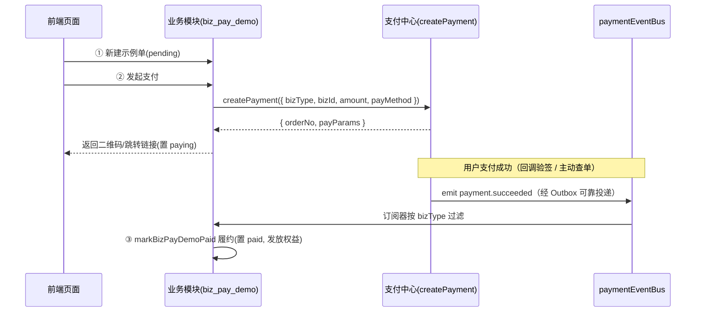

# 业务接入实战示例

[业务接入](./integration) 介绍了支付门面与事件总线的接入规范，本页给出一个**真实可跑的最小完整示例**，演示一个业务模块从「下单 → 发起支付 → 支付成功自动履约」的端到端闭环。

示例模块代码位于后台「业务示例 → 支付接入示例」菜单，对应表 `biz_pay_demos`，业务类型标识 `bizType = 'biz_pay_demo'`。它刻意做得极简（一个商品/事项 + 一笔金额），方便你照搬到真实业务（订单、充值、开通会员等）。

> 与会员钱包充值（`bizType='member_recharge'`）是同一套接入模式，可对照阅读 `services/member-wallet.service.ts` 与 `services/payment-subscribers.ts`。

## 1. 场景与流程



业务状态机：`pending`（待支付）→ `paying`（已发起支付）→ `paid`（支付成功并履约）。

## 2. 数据模型

业务模块维护**自己的实体表**，仅用 `payment_order_no` 关联支付中心订单，不侵入支付表。

| 字段 | 说明 |
| --- | --- |
| `subject` | 示例事项 / 商品名称 |
| `amount` | 金额（**整数分**） |
| `pay_method` | 发起支付时记录的支付方式 |
| `status` | `pending` / `paying` / `paid` / `closed` |
| `payment_order_no` | 关联支付中心订单号（发起支付后回填，用于履约幂等） |
| `paid_at` / `fulfill_remark` | 履约结果（支付成功时回写） |

```ts
// packages/server/src/db/schema/biz.ts
export const bizPayDemoStatusEnum = pgEnum('biz_pay_demo_status', ['pending', 'paying', 'paid', 'closed']);

export const bizPayDemos = pgTable('biz_pay_demos', {
  id: serial('id').primaryKey(),
  subject: varchar('subject', { length: 128 }).notNull(),
  amount: integer('amount').notNull(),               // 分
  payMethod: varchar('pay_method', { length: 32 }),
  status: bizPayDemoStatusEnum('status').notNull().default('pending'),
  paymentOrderNo: varchar('payment_order_no', { length: 64 }),
  paidAt: timestamp('paid_at', { withTimezone: true }),
  fulfillRemark: varchar('fulfill_remark', { length: 255 }),
  tenantId: integer('tenant_id').references(() => tenants.id, { onDelete: 'cascade' }),
  ...auditColumns(),
  createdAt: timestamp('created_at').defaultNow().notNull(),
  updatedAt: timestamp('updated_at').defaultNow().$onUpdate(() => new Date()).notNull(),
});
```

## 3. 后端三步接入

### ① 发起支付（调用统一支付门面）

业务只需提供 `bizType` / `bizId` / 金额 / 支付方式，门面据 `payMethod` 自动选渠道并返回支付参数。

```ts
// services/biz-pay-demo.service.ts
export const BIZ_PAY_DEMO_TYPE = 'biz_pay_demo';

export async function payBizPayDemo(id: number, input: { payMethod: PaymentMethod; openId?: string }, clientIp?: string) {
  const row = await getOwnRow(id);
  if (row.status === 'paid') throw new HTTPException(400, { message: '该示例单已支付，无需重复发起' });

  const { orderNo, payParams } = await createPayment({
    bizType: BIZ_PAY_DEMO_TYPE,
    bizId: String(row.id),
    subject: row.subject,
    amount: row.amount,            // 分
    payMethod: input.payMethod,
    openId: input.openId,
    expireMinutes: 30,
    clientIp,
  });

  await db.update(bizPayDemos)
    .set({ status: 'paying', payMethod: input.payMethod, paymentOrderNo: orderNo })
    .where(eq(bizPayDemos.id, row.id));

  return { demo: mapBizPayDemo({ ...row, status: 'paying', payMethod: input.payMethod, paymentOrderNo: orderNo }), payParams };
}
```

### ② 订阅支付成功并履约（事件总线）

在模块初始化处订阅 `payment.succeeded`，按 `bizType` 过滤后履约。**履约必须幂等**——支付成功事件可能被低延迟投递与 cron 兜底重复投递（at-least-once）。

```ts
// services/biz-pay-demo-subscribers.ts
paymentEventBus.on('payment.succeeded', (e) => {
  if (e.bizType !== BIZ_PAY_DEMO_TYPE) return;
  return markBizPayDemoPaid({ bizId: e.bizId, orderNo: e.orderNo, amount: e.amount }).catch((err) => {
    logger.error('[biz-pay-demo] 履约失败', { orderNo: e.orderNo, err });
    throw err;   // 抛出以触发 Outbox 重试
  });
});

// 履约（幂等）：按「主键 + 状态」原子更新，重复事件只生效一次
export async function markBizPayDemoPaid(event: { bizId: string; orderNo: string; amount: number }) {
  await db.update(bizPayDemos)
    .set({ status: 'paid', paidAt: new Date(), paymentOrderNo: event.orderNo, fulfillRemark: '已自动发放示例权益' })
    .where(and(eq(bizPayDemos.id, Number(event.bizId)), eq(bizPayDemos.status, 'paying')));
}
```

订阅器需在启动时注册（`index.ts` 中 `registerBizPayDemoSubscribers()`），与 `registerPaymentSubscribers()` 并列。

### ③ 路由

| 路由 | 说明 |
| --- | --- |
| `GET /api/biz/pay-demos` | 我的示例单列表（按 `createdBy` 过滤防越权） |
| `POST /api/biz/pay-demos` | 新建示例单（`pending`） |
| `POST /api/biz/pay-demos/{id}/pay` | 发起支付，返回二维码 / 跳转链接（挂 `idempotencyGuard`） |
| `POST /api/biz/pay-demos/{id}/simulate-paid` | **模拟支付成功**（演示专用，见下） |
| `DELETE /api/biz/pay-demos/{id}` | 删除（已支付不可删） |

## 4. 前端发起支付

```tsx
// pages/biz/pay-demo/PayDemoPage.tsx
const res = await request.post(`/api/biz/pay-demos/${id}/pay`, { payMethod: 'wechat_native' });
const { payParams } = res.data;     // { orderNo, codeUrl?, payUrl?, ... }

// 微信 native：渲染二维码供扫码；支付宝 page/wap：跳转 payUrl
<QRCodeSVG value={payParams.codeUrl} size={200} />
```

支付成功后，后端订阅器（`payment-subscribers.ts`）会通过 WebSocket 向付款用户推送 `payment:success`，前端据此刷新列表或主动查单。

## 5. 模拟支付成功（演示专用）

真实环境的履约由支付回调 / 主动查单确认成功后经 Outbox 投递、再由订阅器触发。为便于在**未配置真实微信/支付宝渠道**时演示完整闭环，示例提供「模拟支付成功」：**直接调用与订阅器完全相同的履约函数** `markBizPayDemoPaid`，使「下单 → 支付成功 → 履约」闭环跑通，且**不派发全局支付事件**，避免对支付台账 / 手续费等其它订阅者产生副作用。

```ts
// 仅演示用：直接调用与真实订阅器相同的履约逻辑（不派发全局支付事件）
export async function simulateBizPayDemoPaid(id: number) {
  const row = await getOwnRow(id);
  if (row.status === 'paid') return mapBizPayDemo(row);
  const orderNo = row.paymentOrderNo ?? `PAYDEMO${Date.now()}${row.id}`;
  await markBizPayDemoPaid({ bizId: String(row.id), orderNo, amount: row.amount });
  return getBizPayDemo(id);
}
```

> 生产业务请勿暴露此类「模拟成功」接口；正式履约入口只应由支付回调 / 查单经事件订阅驱动。

## 6. 接入清单

照搬本示例接入新业务时：

1. 选定唯一 `bizType` 字符串；业务表加 `payment_order_no` 等关联字段。
2. 发起支付：调用 `createPayment({ bizType, bizId, amount, subject, payMethod, clientIp })`，回填订单号。
3. 订阅 `payment.succeeded`，按 `bizType` 过滤后**幂等履约**（按业务键去重或让操作天然幂等）。
4. 金额**全链路整数分**；退款监听 `refund.succeeded`。
5. 在 `index.ts` 注册订阅器。

事件投递的可靠性机制详见 [异步通知与对账](./callback)，门面与事件规范详见 [业务接入](./integration)。
