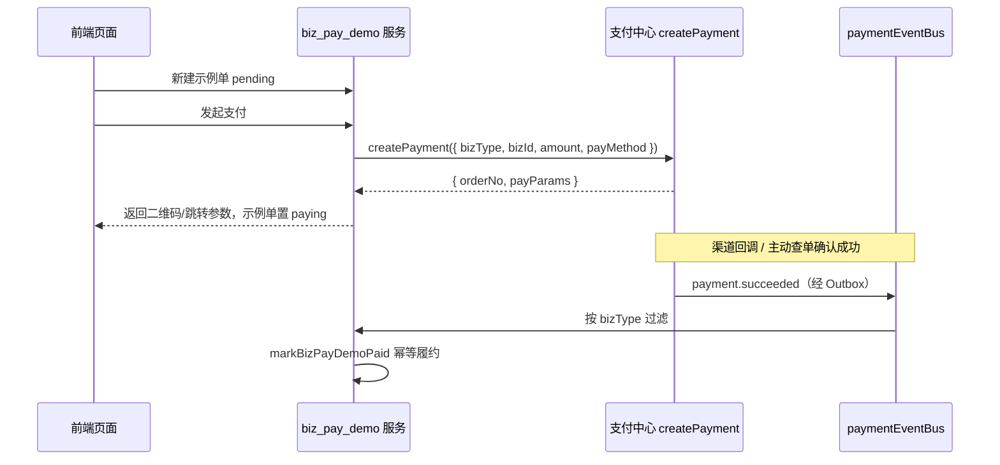

# 业务接入实战示例

[业务接入](./integration.md) 介绍统一门面与事件规范。本页以 `biz_pay_demo` 模块走读一个最小闭环：业务单创建 → 发起支付 → 支付成功事件履约。

示例入口为后台「业务示例 → 支付接入示例」，后端路由挂载在 `/api/biz/pay-demos`，表为 `biz_pay_demos`，业务类型为 `biz_pay_demo`。

## 1. 场景与流程


```mermaid
sequenceDiagram
    participant FE as 前端页面
    participant BIZ as biz_pay_demo 服务
    participant PAY as 支付中心 createPayment
    participant BUS as paymentEventBus
    FE->>BIZ: 新建示例单 pending
    FE->>BIZ: 发起支付
    BIZ->>PAY: createPayment({ bizType, bizId, amount, payMethod })
    PAY-->>BIZ: { orderNo, payParams }
    BIZ-->>FE: 返回二维码/跳转参数，示例单置 paying
    Note over PAY,BUS: 渠道回调 / 主动查单确认成功
    PAY->>BUS: payment.succeeded（经 Outbox）
    BUS->>BIZ: 按 bizType 过滤
    BIZ->>BIZ: markBizPayDemoPaid 幂等履约
```

业务状态机：`pending → paying → paid`，删除操作只允许未支付数据。

## 2. 数据模型

业务模块只维护自己的表，用 `payment_order_no` 记录支付中心订单号，不在支付表上添加业务外键。

| 字段 | 说明 |
| --- | --- |
| `subject` | 示例事项 / 商品名称 |
| `amount` | 金额，整数分 |
| `pay_method` | 发起支付时选择的支付方式 |
| `status` | `pending` / `paying` / `paid` / `closed` |
| `payment_order_no` | 支付中心订单号 |
| `paid_at` / `fulfill_remark` | 履约结果 |

```ts
export const bizPayDemoStatusEnum = pgEnum('biz_pay_demo_status', ['pending', 'paying', 'paid', 'closed']);

export const bizPayDemos = pgTable('biz_pay_demos', {
  id: integer().primaryKey().generatedAlwaysAsIdentity(),
  subject: varchar({ length: 128 }).notNull(),
  amount: integer().notNull(),
  payMethod: varchar({ length: 32 }),
  status: bizPayDemoStatusEnum().notNull().default('pending'),
  paymentOrderNo: varchar({ length: 64 }),
  paidAt: timestamp({ withTimezone: true }),
  fulfillRemark: varchar({ length: 255 }),
  tenantId: integer().references(() => tenants.id, { onDelete: 'cascade' }),
  ...auditColumns(),
  ...timestampColumns(),
});
```

## 3. 后端三步接入

### ① 发起支付

业务服务调用统一支付门面。`createPayment` 内部会完成支付方式启停校验、渠道配置解析、规则中心风控、业务防重、渠道下单与失败事件记录。

```ts
export const BIZ_PAY_DEMO_TYPE = 'biz_pay_demo';

export async function payBizPayDemo(
  id: number,
  input: { payMethod: PaymentCashierMethod; openId?: string },
  clientIp?: string,
) {
  const row = await getOwnRow(id);
  if (row.status === 'paid') throw new HTTPException(400, { message: '该示例单已支付，无需重复发起' });

  const { orderNo, payParams } = await createPayment({
    bizType: BIZ_PAY_DEMO_TYPE,
    bizId: String(row.id),
    subject: row.subject,
    amount: row.amount,
    payMethod: input.payMethod,
    openId: input.openId,
    expireMinutes: 30,
    clientIp,
  });

  await db.update(bizPayDemos)
    .set({ status: 'paying', payMethod: input.payMethod, paymentOrderNo: orderNo })
    .where(eq(bizPayDemos.id, row.id));

  return { demo: await getBizPayDemo(id), payParams };
}
```

`review` 风控命中时，门面会返回明确错误，后台风控审核放行后用户重新发起支付即可复用挂起订单。

### ② 订阅支付成功事件

```ts
paymentEventBus.on('payment.succeeded', (e) => {
  if (e.bizType !== BIZ_PAY_DEMO_TYPE) return;
  return markBizPayDemoPaid({ bizId: e.bizId, orderNo: e.orderNo, amount: e.amount }).catch((err) => {
    logger.error('[biz-pay-demo] 履约失败', { orderNo: e.orderNo, err });
    throw err;
  });
});

export async function markBizPayDemoPaid(event: { bizId: string; orderNo: string; amount: number }) {
  await db.update(bizPayDemos)
    .set({
      status: 'paid',
      paidAt: new Date(),
      paymentOrderNo: event.orderNo,
      fulfillRemark: '支付成功，已自动发放示例权益（演示履约）',
    })
    .where(and(eq(bizPayDemos.id, Number(event.bizId)), inArray(bizPayDemos.status, ['pending', 'paying'])));
}
```

履约必须幂等。Outbox 是至少一次送达，低延迟派发与 cron 补投都可能触发同一事件。

### ③ 注册订阅者与路由

订阅者在 `packages/server/src/bootstrap/subscribers.ts` 的 `registerEventSubscribers()` 中注册。

| 路由 | 说明 |
| --- | --- |
| `GET /api/biz/pay-demos` | 我的示例单列表，按创建人过滤 |
| `GET /api/biz/pay-demos/{id}` | 示例单详情 |
| `POST /api/biz/pay-demos` | 新建示例单 |
| `POST /api/biz/pay-demos/{id}/pay` | 发起支付，带 `idempotencyGuard` |
| `POST /api/biz/pay-demos/{id}/simulate-paid` | 模拟支付成功 |
| `DELETE /api/biz/pay-demos/{id}` | 删除未支付示例单 |

## 4. 前端发起支付

```tsx
const res = await request.post(`/api/biz/pay-demos/${id}/pay`, { payMethod: 'wechat_native' });
const { payParams } = res.data;

<QRCodeSVG value={payParams.codeUrl} size={200} />
```

支付成功后，归属用户会收到 `payment:success` WebSocket 推送；页面可刷新列表或调用查单接口获取最新状态。

## 5. 模拟支付成功

示例模块提供演示接口：直接调用与订阅器相同的 `markBizPayDemoPaid`，不派发全局支付事件，避免影响正式 Journal、手续费与 Open Platform Webhook。

```ts
export async function simulateBizPayDemoPaid(id: number) {
  const row = await getOwnRow(id);
  if (row.status === 'paid') return mapBizPayDemo(row);
  const orderNo = row.paymentOrderNo ?? `PAYDEMO${Date.now()}${row.id}`;
  await markBizPayDemoPaid({ bizId: String(row.id), orderNo, amount: row.amount });
  return getBizPayDemo(id);
}
```

生产业务的履约入口应只由支付回调 / 查单经事件订阅驱动。

## 6. 接入清单

1. 选定唯一 `bizType`；业务表冗余 `payment_order_no` 与业务状态。
2. 发起支付时调用 `createPayment({ bizType, bizId, amount, subject, payMethod, clientIp })` 并回填订单号。
3. 订阅 `payment.succeeded` 并按 `bizType` 过滤，履约逻辑必须幂等。
4. 按需订阅 `payment.closed`、`payment.failed`、`refund.succeeded`、`refund.failed`。
5. 金额全链路使用整数分。
6. 在 `registerEventSubscribers()` 注册订阅者。
7. 涉及跨系统通知时在 Open Platform 配置应用 Webhook 订阅；涉及外部公开收款时优先使用支付链接。
