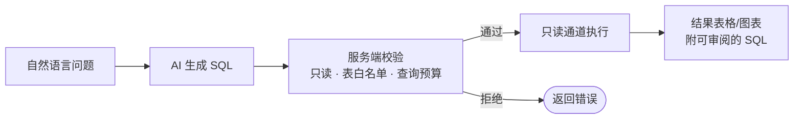

# 智能问数 ChatBI

ChatBI 提供**会话式自然语言问数**：新建会话并圈定数据范围，用业务语言提问，AI 生成只读 SQL 并执行，返回数据结果与图表；满意的回答可一键保存为数据集或仪表盘组件。在「报表中心 → 智能问数」（`/report/chatbi`）使用。

> 与[数据集编辑页的「AI 问数」](./ai-and-alerts#ai-问数-nl2sql)的区别：后者是一次性的「生成 SQL 草稿」辅助；ChatBI 是**多轮对话 + 结果沉淀 + 用量审计**的完整问数工作台。

## 新建会话与冻结上下文

1. 点「新建会话」，填写会话名称；
2. 选择**上下文类型**——绑定一个**数据源**或一个**数据集**；
3. 勾选**表白名单**（1–100 张表）：
   - 绑定数据集时，只能选该数据集 SQL 实际引用的表；
   - 绑定数据源时，只能选数据源元数据中真实存在的表。

会话创建时**冻结元数据上下文**（表结构快照），后续提问都基于冻结范围，数据源后续变化不影响会话，也避免 AI 探索到白名单外的表。

## 提问与结果

- 在输入框描述业务问题（Ctrl / ⌘ + Enter 发送），AI 生成 SQL 并由服务端执行后返回结果表格/图表；
- 每条回答附「查看生成的只读 SQL」，可展开审阅实际执行的语句；
- 会话可**重命名**、**归档**（归档后仅可查看历史，不能继续提问）、**删除**；
- 每个用户**只能访问自己的会话**。

### 安全边界

- 模型**只生成 SQL，不直连数据库**；服务端对生成语句做只读校验（禁止写操作与多语句）、**表白名单校验**与查询预算约束后才执行；
- 提供给 AI 的元数据已剔除敏感表与敏感列；
- 所有执行走与数据集一致的只读取数通道（语句超时、行数上限）。

## 保存为治理资源

对满意的回答点「**保存为治理资源**」：

- **保存为数据集**：把生成的 SQL 固化为新数据集（再次校验资源创建权限与 SQL 白名单）；
- **保存为仪表盘**：追加为**现有仪表盘**的组件，或**新建仪表盘**承载。

## 用量与审计

- **我的用量**：查看个人问数配额消耗（Token、次数）；
- **问数审计**（`report:chatbi:audit`）：管理员可查询全量问数记录，含模型、Token 用量、成本、延迟、返回行数/字节数与失败原因。

## 权限

| 操作 | 权限码 |
|------|--------|
| 会话查看 / 我的用量 | `report:chatbi:list` |
| 创建会话 | `report:chatbi:create` |
| 编辑（重命名 / 归档） | `report:chatbi:update` |
| 删除会话 | `report:chatbi:delete` |
| 提问 | `report:chatbi:ask` |
| 保存为数据集 / 仪表盘 | `report:chatbi:save` |
| 查看问数审计 | `report:chatbi:audit` |
| 管理问数配额 | `report:chatbi:manage`（为全局配额策略预留，当前无对应写接口） |
