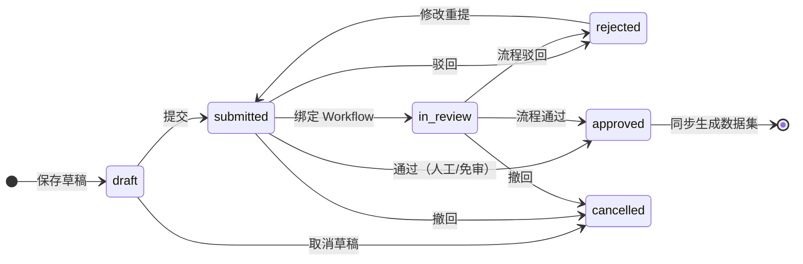

# 数据填报

数据填报解决「报表平台缺一段人工录入的数据」问题：管理员设计填报模板（复用工作流表单设计器）→ 填报人通过填报入口提交 → 人工审核或 Workflow 流程审批 → **批准后自动生成数据集**，直接供仪表盘/打印报表消费。

涉及三个入口：

| 入口 | 路径 | 用途 |
|------|------|------|
| 填报模板 | `/report/fill-templates` | 管理员设计、发布、下线模板 |
| 填报入口 | `/report/fill/{code}` | 填报人按模板编码填写提交（从模板列表「去填报」进入） |
| 填报记录 | `/report/fill-records` | 「我的填报」与「审核管理」两个标签页 |

## 填报模板

模板直接复用工作流的 **表单 Schema（WorkflowFormSchema）**，新建/编辑为两步向导：

1. **基本信息**：模板编码（唯一，发布后作为填报入口地址）、名称、负责人、资源目录、**是否需要审核**、审核流程（可选绑定 Workflow 流程定义）、模板说明。
2. **字段设计**：可视化设计表单字段，右侧标签页可随时**预览**填写效果。

### 模板生命周期

状态为 **`draft（草稿）→ published（已发布）→ disabled（已下线）`**：

- 「**发布**」时固化 schema 与修订号；**已有记录继续使用自己的 schema 快照**，不受后续模板编辑影响；
- 「**下线**」后不再接受新填报；「**克隆**」可复制模板快速建新版；
- 列表提供「**去填报**」直达填报入口。

## 填报与审批

### 记录状态机

- 填报人在「我的填报」点「**发起填报**」选择已发布模板进入填报入口；草稿与被驳回的记录点「**编辑 / 修改重提**」会带着记录 ID 回到填报入口继续填写；
- 「取消草稿 / 撤回」把记录置为已取消；提交携带 `expectedRevision`，防止重复提交与并发覆盖，状态冲突时会提示刷新；
- 记录「详情」可查看**冻结表单快照**（当时的表单结构 + 填写值）与审核轨迹。

### 两种审核方式

| 模板配置 | 审核方式 |
|----------|----------|
| `needReview = false` | 提交即批准 |
| `needReview = true`，未绑定流程 | 由拥有 `report:fill:record:review` 的审核人在「审核管理」人工**通过 / 驳回** |
| 绑定 `workflowDefinitionId` | 提交自动发起 **Workflow 流程实例**，按流程节点审批；**不能再用人工审核接口旁路** |

## 批准后生成数据集

记录批准后自动提交任务中心异步任务 **`report-fill-sync`**，把批准数据**原子写入生成数据集**，并在记录上回填 `generatedDatasetId`、`syncTaskId`、`syncStatus`。生成数据集与普通数据集一样可用于仪表盘、打印报表与预警。

> 金额类字段按表单定义处理，业务金额建议使用**整数分**。

## 导出

填报记录支持导出（接入导出中心），需要 `report:fill:record:export`。

## 权限

| 操作 | 权限码 |
|------|--------|
| 模板查看 | `report:fill:template:list` |
| 模板新增 / 编辑 / 删除 | `report:fill:template:create` / `:update` / `:delete` |
| 模板发布 / 下线 | `report:fill:template:publish` |
| 模板克隆 | `report:fill:template:clone` |
| 我的填报查看 | `report:fill:record:list` |
| 新建 / 编辑草稿 | `report:fill:record:create` / `:update` |
| 提交 | `report:fill:record:submit` |
| 撤回 / 取消 | `report:fill:record:cancel` |
| 审核（审核管理标签页） | `report:fill:record:review` |
| 导出 | `report:fill:record:export` |
