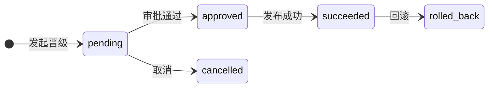

# 资源治理

资源治理是报表平台的**控制面**：谁拥有资源、谁能访问、发布要不要审批、跑在什么环境、查询花了多少钱、服务达没达标。在「报表中心 → 资源治理」（`/report/governance`）管理，页面分六个标签页。

所有报表资源（数据源、数据集、仪表盘、指标、打印模板、填报模板、资产模板）的访问同时受 **RBAC 权限码、租户边界、所有权与 ACL** 四层约束。

> 除直接打开本页外，数据源 / 数据集 / 仪表盘 / 打印报表列表的「**权限与转移**」操作会带着资源上下文直达本页，便于就地授权与转移。

## 目录与资源权限

### 资源目录

目录按资源类型分树：`datasource | dataset | dashboard | metric | print_template | fill_template | asset_template`，资源可归入目录便于组织与授权：

- 目录**不能跨资源类型移动**；
- 目录**非空时不能删除**（需先清空或移走资源）。

### ACL 授权

ACL 主体为**用户或角色**，权限级别为 `viewer（查看）< editor（编辑）< owner（所有者）`：

- 资源**所有者天然拥有 `owner`** 级别；授权操作只允许资源所有者执行；
- ACL 可设置**失效时间**，可配置在**目录上并向下继承**；
- 有效权限 = 直接 ACL、继承 ACL 与所有权的**最高级别**，但不会跨租户；
- 「有效权限检查」可输入用户 + 资源，查询系统最终判定的访问级别，便于排查授权问题。

::: warning 注意
不要给全局目录补租户 ACL，也不要用 ACL 绕过数据集行级权限——ACL 决定「能不能打开资源」，行级权限决定「能看到哪些行」，两者独立生效。
:::

## 发布审批

对资源的**发布 / 环境晋级 / 废弃**动作可走审批流：申请人提交（携带资源、动作、修订与发布快照）→ 审批人**通过 / 拒绝**，申请人可**取消**。状态流转为 `pending → approved | rejected | cancelled`。

## 所有权转移

资源负责人变更（如人员离职）通过所有权转移完成：发起转移 → 新负责人**接受 / 拒绝**，发起人可**取消**。状态为 `pending → accepted | rejected | cancelled`。

- 接受后**原所有者失去天然权限**；确需保留访问时应显式为其创建 ACL。

## 环境与发布

内置 `dev → staging → prod` 三个环境（可自定义增删），资源通过**晋级（promotion）**在环境间发布：

- 晋级保存**源修订与源快照**，禁止直接从开发环境覆盖生产环境的未审批版本；
- 当前同步晋级流转为 `pending → approved → succeeded`；待处理记录可**取消**（`cancelled`）；
- 成功发布可**回滚**（`rolled_back`），不直接改生产快照；
- 环境的 `baseUrl/config` 不存密钥，数据源凭据仍由加密字段管理。

## 配额与成本

### 查询配额

按**租户或用户**限制查询资源用量：并发数、每日查询次数、返回行数、字节数与成本预算。

- 日限额 `0` 表示不限次数，但**并发上限（20）与数据源预算仍然生效**；
- 可查看配额当前用量，或手动**重置**用量计数。

### 查询成本

每次取数记录成本日志（数据源、耗时、行数、字节数、估算成本），提供**统计与趋势**视图定位高成本查询与数据集，支持导出（`report:query-cost:export`）。

## SLA 与违规

对数据资产定义服务等级目标并自动巡检：

| SLA 类型 | 监控目标 |
|----------|----------|
| `freshness` | 数据新鲜度（最近刷新时间） |
| `query_latency_p95` | 查询 P95 延迟 |
| `availability` | 取数可用性 |
| `dq_score` | 数据质量评分（联动[数据质量](./quality)） |

- 「评估」通过任务中心异步任务（`report-sla-rule-evaluate`）执行；
- 未达标产出**违规记录**，状态 `open → acknowledged | resolved` 闭环处置。

## 权限

| 操作 | 权限码 |
|------|--------|
| 目录查看 / 新增 / 编辑 / 删除 | `report:folder:list` / `:create` / `:update` / `:delete` |
| ACL 管理 | `report:resource:acl` |
| 有效权限检查 | `report:resource:access` |
| 所有权转移 | `report:resource:transfer` |
| 审批查看 / 申请（含取消） / 处理 | `report:approval:list` / `:request` / `:approve` |
| 环境查看 / 新增 / 编辑 / 删除 | `report:environment:list` / `:create` / `:update` / `:delete` |
| 环境晋级 / 回滚 | `report:environment:promote` |
| 物化快照查看 / 刷新 / 清理 | `report:materialization:list` / `:refresh` / `:purge` |
| 配额查看 / 新增 / 编辑（含重置） / 删除 | `report:query-quota:list` / `:create` / `:update` / `:delete` |
| 成本查看 / 导出 | `report:query-cost:list` / `report:query-cost:export` |
| SLA 查看 / 新增 / 编辑（含违规处置） / 删除 / 评估 | `report:sla:list` / `:create` / `:update` / `:delete` / `:evaluate` |
