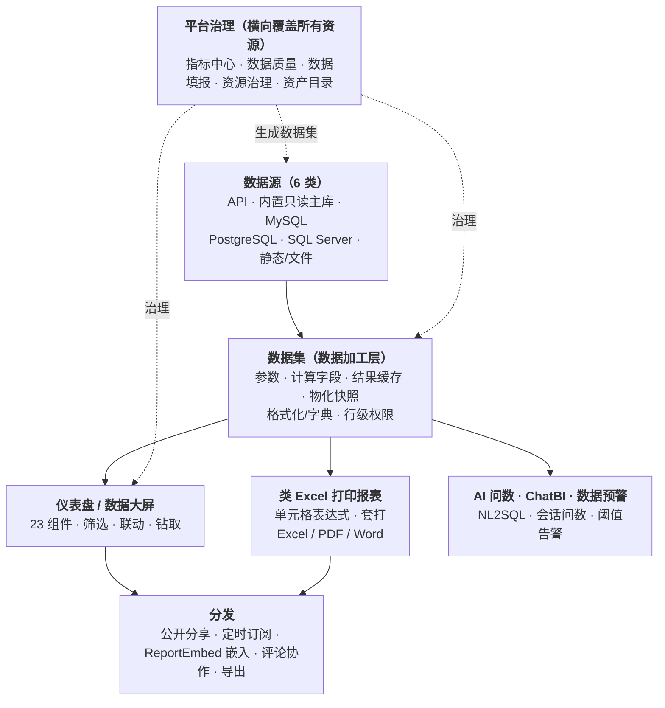

# 报表中心 · 总览

报表中心是 Zenith Admin 内置的**自助式数据可视化与报表平台**，覆盖从数据接入、数据加工到仪表盘、数据大屏、类 Excel 单据报表的全链路，并提供 AI 问数、ChatBI、数据预警、分享订阅、跨模块嵌入等能力；在此之上还提供指标中心、数据质量、资源治理、资产目录、数据填报等**平台化治理**能力。全程零外部依赖，基于项目自带的 PostgreSQL + Redis 即可运行。

## 章节导航

### 搭建报表

| 文档 | 内容 |
|------|------|
| [数据源接入](./datasources) | API / 内置库 / MySQL / PostgreSQL / SQL Server / 静态数据 / 文件上传；凭据加密与连接测试 |
| [数据集与数据加工](./datasets) | 参数化查询、计算字段、结果缓存、物化快照、字段格式化与字典翻译、行级数据权限 |
| [仪表盘设计](./dashboards) | 拖拽设计器、23 种组件、全局筛选器、点击联动、钻取、发布生命周期、版本与收藏 |
| [数据大屏](./data-screen) | 自由画布、等比自适应缩放、深色科技皮肤、翻牌器/滚动榜单/地图、全屏与自动刷新 |
| [类 Excel 打印报表](./print-reports) | Univer 单元格设计器、单元格表达式、纵向扩展、多数据集/交叉表/子报表、套打与导出 |

### 智能与监控

| 文档 | 内容 |
|------|------|
| [AI 问数与数据预警](./ai-and-alerts) | 自然语言生成 SQL（NL2SQL）、阈值预警规则（数据集/指标）、邮件/站内信/Webhook 通知 |
| [智能问数 ChatBI](./chatbi) | 会话式问数、冻结元数据上下文、表白名单、结果保存为数据集/仪表盘、用量与审计 |

### 平台治理

| 文档 | 内容 |
|------|------|
| [指标中心](./metrics) | 语义指标统一口径：简单/比率/复合指标、生命周期与发布快照、评估与引用关系 |
| [数据质量](./quality) | 7 类质量规则、数据集评分、质量异常处置、运行历史 |
| [数据填报](./fill) | 填报模板（复用工作流表单）、填报入口、提交/审核/Workflow 审批、批准后生成数据集 |
| [资源治理](./governance) | 资源目录与 ACL、发布审批、所有权转移、环境晋级、查询配额与成本、SLA |
| [资产目录](./assets) | 统一资产目录、用量分析与闲置资产、弃用公告、可复用资产模板 |

### 分发与运行时

| 文档 | 内容 |
|------|------|
| [分享 / 订阅 / 嵌入 / 协作](./sharing) | 公开分享链接、定时订阅推送、`<ReportEmbed>` 跨模块嵌入、Embed SDK 协议、评论批注 |
| [取数运行时与可靠投递](./runtime-governance) | 统一批量取数、执行日志、缓存与物化、订阅/预警可靠投递、异步任务、运维要点 |

## 按场景快速定位

| 我想… | 看这里 |
|-------|--------|
| 快速做一张数据看板 | [典型上手路径](#典型上手路径) → [数据集](./datasets) → [仪表盘](./dashboards) |
| 做全屏大屏投屏 | [数据大屏](./data-screen) |
| 打印对账单 / 在预印票据上套打 | [类 Excel 打印报表](./print-reports) |
| 让业务同事用自然语言自己查数 | [智能问数 ChatBI](./chatbi) |
| 统一公司各处的指标口径 | [指标中心](./metrics) |
| 数据异常时自动收到通知 | [数据预警](./ai-and-alerts#数据预警)、[数据质量](./quality) |
| 每天定时把日报推给老板 | [定时订阅推送](./sharing#定时订阅推送) |
| 把看板嵌进其它业务系统 | [嵌入 `<ReportEmbed>`](./sharing#跨模块嵌入-reportembed) |
| 收集一段需要人工填写的数据 | [数据填报](./fill) |
| 管控谁能看、谁能发布 | [资源治理](./governance) |
| 盘点哪些报表没人用、该下线 | [资产目录](./assets) |

## 能力全景

## 设计理念

- **自助式**：业务/运营人员无需开发即可通过界面接入数据、拖拽搭建仪表盘与大屏、设计打印单据、发起填报。
- **安全优先**：所有取数走只读通道（READ ONLY 事务 / 只读 SELECT 约束 / 语句超时 / 行数上限）；外部库密码与 API 密钥 AES 加密存储、读取脱敏；数据权限系统变量由服务端权威注入，防越权。
- **零外部依赖**：取数、缓存、物化、定时刷新/推送全部基于自带的 PostgreSQL + Redis + 任务中心。
- **可治理**：资源有目录、所有权与 ACL；发布有审批与环境晋级；查询有配额与成本核算；口径有指标中心统一。
- **可嵌入**：任意仪表盘可通过一行 `<ReportEmbed>` 嵌入项目其它模块，或生成公开链接 / iframe 对外分享。

## 后台菜单与权限

报表中心为顶级目录「报表中心」，包含以下页面（按菜单顺序）：

| 页面 | 路径 | 权限码 |
|------|------|--------|
| 数据源 | `/report/datasources` | `report:datasource:list` / `:create` / `:update` / `:delete` |
| 数据集 | `/report/datasets` | `report:dataset:list` / `:create` / `:update` / `:delete` |
| 仪表盘 | `/report/dashboards` | `report:dashboard:list` / `:create` / `:update` / `:delete` |
| 订阅推送 | `/report/subscriptions` | `report:subscription:list` / `:create` / `:update` / `:delete` |
| 打印报表 | `/report/print` | `report:print:list` / `:create` / `:update` / `:delete` |
| 数据预警 | `/report/alerts` | `report:alert:list` / `:create` / `:update` / `:delete` |
| 指标中心 | `/report/metrics` | `report:metric:list` / `:create` / `:update` / `:delete` / `:evaluate` / `:publish` |
| 数据质量 | `/report/quality` | `report:dq:list` / `:create` / `:update` / `:delete` / `:run` / `:export` |
| 资源治理 | `/report/governance` | `report:folder:*`、`report:resource:*`、`report:approval:*`、`report:environment:*`、`report:materialization:*`、`report:query-quota:*`、`report:query-cost:*`、`report:sla:*`（详见[资源治理](./governance)） |
| 资产目录 | `/report/assets` | `report:asset:list` / `:usage` / `:export`、`report:deprecation:*`、`report:asset-template:*` |
| 智能问数 | `/report/chatbi` | `report:chatbi:list` / `:create` / `:update` / `:delete` / `:ask` / `:save` / `:audit` |
| 填报模板 | `/report/fill-templates` | `report:fill:template:list` / `:create` / `:update` / `:publish` / `:clone` / `:delete` |
| 填报记录 | `/report/fill-records` | `report:fill:record:list` / `:create` / `:update` / `:submit` / `:cancel` / `:review` / `:export` |

除菜单页外还有以下**隐藏路由**：

| 路由 | 说明 |
|------|------|
| `/report/dashboards/{id}/design` | 仪表盘拖拽设计器 |
| `/report/dashboards/{id}/view` | 仪表盘只读预览页 |
| `/report/print/{id}/design` | 打印报表 Univer 设计器 |
| `/report/fill/{code}` | 按模板编码打开的填报入口 |
| `/public/report/{token}` | 公开分享页（无需登录） |

> 超级管理员默认拥有全部权限；其他角色需在「角色管理」中分配对应权限码。

## 典型上手路径

1. 在「数据源」新建一个数据源（最简单从内置库「内置主库」开始，无需任何连接配置）。
2. 在「数据集」基于数据源编写一条 SQL（或上传 Excel/CSV），点击「试跑预览」确认取数结果，用结果一键生成字段。
3. 在「仪表盘」新建仪表盘，进入设计器，从左侧拖入指标卡 / 图表，右侧为组件选择刚建的数据集与字段。
4. 需要大屏时，在设计器顶部把「栅格布局」切换为「大屏画布」，进入自由画布 + 深色科技皮肤。
5. 保存（草稿）后在列表点「**发布**」，对外查看、公开分享、嵌入均消费发布快照。
6. 在「分享」生成公开链接、配置定时订阅，或用 `<ReportEmbed>` 嵌入到其它业务页面。

内置示例「示例仪表盘」「运营数据大屏」「行为分析概览」「部门用户统计表（打印）」可直接打开参考或修改。

## 常见问题

| 现象 | 原因与处理 |
|------|-----------|
| 保存了仪表盘，别人却看不到最新内容 | 「保存」只保存草稿，需在列表点「**发布**」固化发布快照（见[发布与生命周期](./dashboards#发布与生命周期)） |
| 数据集无法启用物化快照 | 数据集含参数、`${__*}` 系统变量或行级权限规则——物化是全局快照，会绕过这些上下文，保存时被拦截（见[物化的约束](./datasets#物化快照)） |
| 仪表盘无法公开分享 / 定时推送 | 其中有数据集使用行级权限、系统变量或必填参数，不能进入匿名/无身份场景（见[安全防护](./sharing#公开分享链接)） |
| 数据源 / 数据集删除失败 | 存在下游引用（数据集/组件/打印/预警），先用「血缘」定位并解除引用（见[血缘与删除保护](./datasets#血缘与删除保护)） |
| 保存时提示修订冲突（409） | 他人已先保存，刷新获取最新修订后重做修改（仪表盘/指标/填报均带乐观锁） |
| 外部 API / 数据库连不上内网地址 | 出站默认拒绝私网/保留地址，需运维配置 `REPORT_OUTBOUND_PRIVATE_ALLOWLIST` 白名单（见[数据源接入](./datasources)） |
| 预警配了 Cron 却没有触发通知 | 检查规则是否启用、错过策略、静默期设置，以及「最近投递」状态与投递历史（见[投递历史与确认](./ai-and-alerts#投递历史与确认)） |
