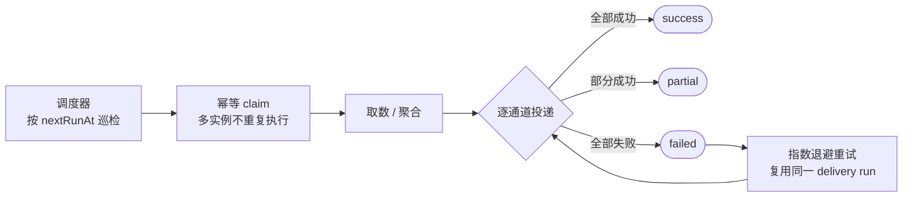

# 取数运行时与可靠投递

本篇面向需要理解报表中心**运行机制**的管理员与开发者：数据是怎么统一取的、缓存与物化何时生效、订阅/预警的通知如何保证送达，以及各类异步任务与运维要点。

## 统一批量取数

仪表盘查看、内部嵌入、公开分享**统一走同一条批量取数链路**：

- 登录态：`POST /api/report/dashboards/{id}/data`
- 公开分享：`POST /api/report/public/dashboards/{token}/data`

一次请求返回整个仪表盘所有组件的结构化结果，逐组件隔离成功与失败：

```json
{
  "widgetId": {
    "data": { "columns": [], "fields": [], "rows": [], "total": 0 },
    "error": { "code": 400, "message": "数据源已停用" },
    "durationMs": 23,
    "cacheHit": false
  }
}
```

- 单个组件取数失败只影响该卡片，不拖垮整屏；
- `fields` 字段元数据（格式化、字典翻译）贯通表格、图表 tooltip 与导出；
- 数据集取数支持 `limit` 模式或 `page/pageSize/sortField/sortOrder` 分页模式：**表格组件走服务端分页**，其余组件走 limit；
- 数据源停用后，预览、数据集、仪表盘、打印、预警、订阅、公开分享**统一禁止取数**。

## 只读与查询预算

所有取数在只读通道执行（只读事务 / 只读 SELECT 约束 / 语句超时 / 行数上限，详见[数据源接入](./datasources)）。在此之上：

- **参数与字段校验**：参数名 / 字段名 / 计算字段名仅允许标识符格式；`__` 前缀保留给系统变量；API 运行参数只允许传递已声明参数；计算字段表达式引用未声明字段时拒绝保存。
- **查询配额与成本**：按租户/用户限制并发、每日次数、行数、字节数与成本，每次取数记录成本日志（见[资源治理 · 配额与成本](./governance#配额与成本)）。

## 结果缓存与失效

数据集可配置 TTL 结果缓存（见[数据集 · 结果缓存](./datasets#结果缓存-ttl)）。运行时保证：

- Redis 缓存 key 纳入数据集与数据源的 `updatedAt`——**更新配置后旧缓存立即失效**，不依赖扫描清理；
- 缓存按「数据集 + 参数 + 用户（行级权限视角）」隔离，不同权限视角互不串扰；
- 清理失败会写服务端日志。

## 物化快照

- 手动刷新：`POST /api/report/datasets/{id}/materialize`，以**任务中心异步任务**执行，返回任务实体可跟踪进度/取消；幂等键基于 `datasetId + updatedAt + refreshedAtMs`，防止重复刷新；
- 周期刷新（Cron）由定时任务巡检到期项，复用同一刷新核心；
- 快照生命周期 `pending → building → ready | failed`，就绪快照后续可进入 `expired | deleted`；全量/增量刷新与快照管理详见[资源治理](./governance)与[数据集 · 物化快照](./datasets#物化快照)。

## 执行日志

每次数据集执行（预览、仪表盘取数、订阅/预警评估等）落库执行日志，可通过 `GET /api/report/executions` 查询：来源、耗时、行数、是否命中缓存、错误信息，用于定位慢查询与失败原因。

## 可靠投递

订阅推送与预警通知统一接入**可靠投递**机制，保证「发了没有、发到哪了」可追溯。



### 调度

- 定时扫描按 `nextRunAt` + **幂等 claim** 认领到期任务，多实例部署不会重复执行；
- 订阅 / 预警支持 **`timezone`**（IANA 时区）与 **`misfirePolicy`**（错过策略）：服务停机错过触发点后，`skip` 跳过本轮、`fire_once` 补跑一次；
- 手动「立即推送」/「评估」提交任务中心异步任务执行。

### 投递历史与状态语义

每次投递落一条 **delivery run**（含各通道 attempt 明细），支持分页查询与告警确认：

- 历史查询：`GET /api/report/delivery-runs`；确认：`POST /api/report/delivery-runs/{id}/acknowledge`；
- 状态语义：所有通道成功 → `success`；部分成功 → `partial`；全部失败 → `failed`；取消 → `cancelled`；
- **只有全部必需通道成功**才更新订阅的 `lastRunAt/lastSummary` 与预警的 `lastNotifiedAt`；
- 投递失败**不会进入静默窗口**；重试使用**指数退避**并复用同一 delivery run；
- 前端在订阅/预警列表展示「最近投递」状态列，点开可查看投递历史（见[订阅](./sharing#定时订阅推送)与[预警](./ai-and-alerts#投递历史与确认)）。

## 异步任务一览

报表中心的重任务全部走**任务中心**（TaskTray 通过 `/api/async-tasks/mine` 与 `/api/async-tasks/{id}` 展示进度），不另建轮询表或进程内定时器：

| 任务类型 | 触发入口 | 用途 |
|----------|----------|------|
| `report-dataset-materialize` | 数据集「刷新物化」/ 治理页刷新 | 全量/增量物化快照 |
| `report-dq-rule-run` | 数据质量「执行」 | DQ 取数、评估、评分和异常 |
| `report-sla-rule-evaluate` | SLA「评估」 | SLA 评估与违约 |
| `report-fill-sync` | 填报批准后内部提交 | 同步批准记录到生成数据集 |
| 订阅手动推送 / 预警手动评估 | 列表「立即推送」/「评估」 | 立即执行一次投递/评估 |

取消、重试、并发与保留期全部由任务中心统一管理。

## 运维要点

1. **Schema 变更**：修改报表相关表后必须 `npm run db:generate` 生成 Drizzle 迁移，再 `npm run db:migrate`；禁止手写迁移 SQL。
2. **种子数据**：`npm run db:seed` 可重复运行，不覆盖已有用户资源；内置示例资源只在归属为空时补齐 `owner/folder`。
3. **部署检查**：确认 Redis 与任务中心 worker 可用，核对物化、DQ、SLA、填报四类 handler 已注册；监控任务失败率、队列深度、数据库只读查询超时与存储增长。
4. **凭据安全**：环境 `baseUrl/config` 不存密钥；数据源凭据由加密字段管理；生产环境发布只使用审批快照。
5. **回滚**：回滚应用前先确认数据库迁移是否向后兼容；资源晋级失败使用环境回滚状态机，不直接改生产快照。
