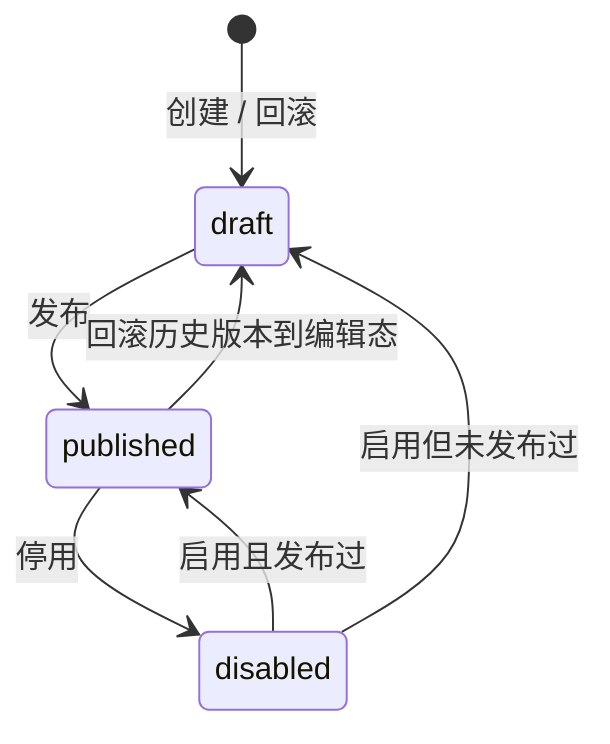

# 决策表

决策表用 `key` 定位一组输入列、输出列和规则行，发布后生成不可变快照供运行时求值。编辑态可以随时保存、测试、仿真和体检；业务消费方只读取发布快照。

## 数据结构

| 字段 | 说明 |
| --- | --- |
| `key` | 规则资产唯一键，字母开头，支持字母、数字、下划线、短横线；更新时不可修改 |
| `name` / `description` | 展示名与说明 |
| `categoryId` | 可关联工作流分类，用于后台归类 |
| `status` | `draft` / `published` / `disabled` |
| `hitPolicy` | `first` / `unique` / `priority` / `collect` / `any` |
| `inputs` | 输入列数组：`key`、`label`、`expr`、`type`、可选 `dictCode` |
| `outputs` | 输出列数组：`key`、`label`、`type`、可选 `default`、`isExpr` |
| `rules` | 规则行数组：`id`、`when`、`then`、可选 `priority`、`label` |
| `settings` | `collectAggregate`、`fallbackToDefaults` |
| `version` / `publishedAt` | 发布版本与发布时间 |
| `gray` | 灰度配置：`grayPercent`、`grayDimension`、`grayVersion` |
| `dirty` | 编辑态与最新发布快照不一致 |
| `reviewStatus` | 决策表发布审批状态，目前使用 `pending` |

输入列的 `expr` 和输出列的 `= 表达式` 使用工作流安全表达式引擎，例如 `form.amount`、`= form.amount * 0.8`。

## 单元格 DSL

`rules[].when[i]` 与 `inputs[i]` 一一对应，解析逻辑由 `packages\shared\src\rules\cell.ts` 统一提供。

| 写法 | 语义 | 适用类型 |
| --- | --- | --- |
| 空、`-`、`*` | 通配，恒真 | 全部 |
| `> 100`、`>=10`、`!= 3` | 比较；`=` / `==` / `===` 等价，`!=` / `!==` 等价 | number / date；string / boolean 仅支持等于与不等于 |
| `10-20` | 数值闭区间 | number |
| `[10..20)`、`(0..5]` | FEEL 风格开闭区间 | number / date |
| `in a,b,c` | 集合命中 | string / number / boolean / date |
| `not in a,b` | 集合排除 | string / number / boolean / date |
| 其它字面量 | 按列类型归一化后等值匹配 | 全部 |

`date` 值按 `YYYY-MM-DD` 或 `YYYY-MM-DD HH:mm:ss` 解析后比较。

## 命中策略

| 策略 | 行为 |
| --- | --- |
| `first` | 取第一条命中行输出 |
| `unique` | 必须唯一命中；多行命中返回 `matched=false`，`reason=unique_conflict` |
| `priority` | 多行命中时按 `priority` 降序取最高优先级 |
| `collect` | 收集所有命中行输出，并按 `settings.collectAggregate` 聚合 |
| `any` | 允许多行命中，但所有命中行输出必须一致；不一致返回 `reason=any_conflict` |

`collectAggregate` 可取：`list`（默认）、`sum`、`min`、`max`、`count`、`distinct`。启用 `fallbackToDefaults` 时，未命中仍返回输出列默认值，`matched=false` 且 `usedFallback=true`。

## 生命周期



发布会写入 `rule_decision_table_versions` 快照，并清理运行时缓存。运行时按发布快照执行；后台测试按编辑态执行。

## 发布门禁与审批

发布前执行以下门禁：

1. 至少一个输入列、一个输出列、一条规则行。
2. 输入列表达式语法有效。
3. 条件单元格 DSL 语法有效。
4. `= 表达式` 输出语法有效。
5. 测试用例全部通过。
6. 存在测试用例时，规则行覆盖率必须为 100%。

运行时设置 `rules.publishApproval`（通用设置页「规则引擎」，登录用户可通过 `GET /api/settings/me` 读到该开关）为 `true` 时，直接发布接口会拒绝发布，需要先申请发布，再由非申请人审批。审批通过后执行发布，驳回会清空待审批状态并记录意见。待审批期间修改快照内容会使申请失效。

## 灰度发布

`POST /api/rules/decision-tables/{id}/publish` 可携带：

```json
{
  "grayPercent": 20,
  "grayDimension": "form.userId"
}
```

- `grayPercent` 范围为 1–99。
- `grayDimension` 是可选安全表达式；为空时使用整个输入包作为分桶依据。
- 分桶使用 FNV-1a：`bucket = fnv1a(subject) % 100`，`bucket < grayPercent` 走新版本，否则走上一版本。
- 首次发布不能灰度，因为没有上一版本承接灰度外流量。
- `POST /api/rules/decision-tables/{id}/gray` 使用 `complete` 转正，使用 `cancel` 放弃灰度并以前一版本内容前滚为新版本。

## 测试、仿真与观测

| 能力 | API | 说明 |
| --- | --- | --- |
| 编辑态测试 | `POST /api/rules/decision-tables/{id}/test` | 使用输入 JSON 直接求值，返回命中行、输出、原因 |
| 按 key 求值 | `POST /api/rules/decision-tables/evaluate` | 后台手动求值，caller 为 `admin.evaluate`，source 为 `manual` |
| 测试用例 | `/api/rules/decision-tables/{id}/cases*` | 维护输入与期望输出，可批量运行并计算覆盖率 |
| 批量仿真 | `POST /api/rules/decision-tables/{id}/simulate` | 每行一条输入，最多 200 行，按编辑态汇总命中率与行命中分布 |
| 命中分析 | `GET /api/rules/decision-tables/{id}/stats?days=30` | 基于执行记录统计总量、命中、未命中、日期趋势、行命中与来源分布 |
| 影子对比 | `POST /api/rules/decision-tables/{id}/shadow-run` | 重放最近执行输入到编辑态，比较线上输出与编辑态输出差异，最多 500 条 |
| 版本对比 | `GET /api/rules/decision-tables/{id}/diff?from=1&to=0` | `0` 表示当前编辑态 |

## 删除保护

删除决策表前会进行 where-used 分析：

- 工作流网关节点的 `decisionRuleKey` 与 `decisionRefKind=table`。
- 内置 `coupon_eligibility` 消费方。
- 内置 `payment_risk` 消费方。

存在引用时拒绝删除；停用不受引用保护限制，可作为运维开关。

## 管理 API

| 方法 | 路径 | 说明 | 权限 |
| --- | --- | --- | --- |
| GET | `/api/rules/decision-tables` | 分页列表，支持 `keyword`、`status` | `rule:table:list` |
| GET | `/api/rules/decision-tables/{id}` | 详情 | `rule:table:list` |
| POST | `/api/rules/decision-tables` | 创建 | `rule:table:create` |
| PUT | `/api/rules/decision-tables/{id}` | 更新，支持 `expectedUpdatedAt` 乐观锁 | `rule:table:update` |
| DELETE | `/api/rules/decision-tables/{id}` | 删除 | `rule:table:delete` |
| DELETE | `/api/rules/decision-tables/batch` | 批量删除 | `rule:table:delete` |
| POST | `/api/rules/decision-tables/{id}/publish` | 发布，可选灰度 | `rule:table:publish` |
| POST | `/api/rules/decision-tables/{id}/toggle` | 启用 / 停用 | `rule:table:publish` |
| POST | `/api/rules/decision-tables/{id}/gray` | 灰度转正 / 放弃 | `rule:table:publish` |
| POST | `/api/rules/decision-tables/{id}/submit-review` | 申请发布 | `rule:table:publish` |
| POST | `/api/rules/decision-tables/{id}/review` | 审批发布 | `rule:table:approve` |
| POST | `/api/rules/decision-tables/{id}/test` | 编辑态测试求值 | `rule:table:evaluate` |
| POST | `/api/rules/decision-tables/evaluate` | 按 key 手动求值 | `rule:table:evaluate` |
| GET | `/api/rules/decision-tables/{id}/versions` | 版本列表 | `rule:table:list` |
| GET | `/api/rules/decision-tables/{id}/diff` | 版本对比 | `rule:table:list` |
| POST | `/api/rules/decision-tables/{id}/rollback/{version}` | 回滚到历史版本 | `rule:table:update` |
| GET | `/api/rules/decision-tables/{id}/usages` | 引用分析 | `rule:table:list` |
| GET | `/api/rules/decision-tables/{id}/stats` | 命中分析 | `rule:table:list` |
| POST | `/api/rules/decision-tables/{id}/shadow-run` | 影子对比 | `rule:table:evaluate` |
| POST | `/api/rules/decision-tables/{id}/simulate` | 批量仿真 | `rule:table:evaluate` |
| GET | `/api/rules/decision-tables/{id}/cases` | 测试用例列表 | `rule:table:list` |
| POST | `/api/rules/decision-tables/{id}/cases` | 新增测试用例 | `rule:table:update` |
| PUT | `/api/rules/decision-tables/{id}/cases/{caseId}` | 更新测试用例 | `rule:table:update` |
| DELETE | `/api/rules/decision-tables/{id}/cases/{caseId}` | 删除测试用例 | `rule:table:update` |
| POST | `/api/rules/decision-tables/{id}/cases/run` | 批量运行用例 | `rule:table:evaluate` |
