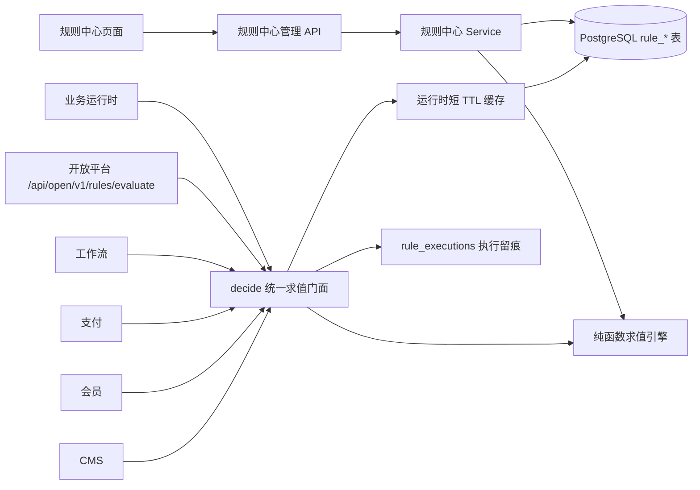

# 规则中心

规则中心是系统内统一的业务决策底座，管理可发布的规则资产，并通过 `decide()` 为支付、会员、工作流、CMS、开放平台等业务链路提供稳定求值结果。资产编辑态与运行态隔离：业务侧只使用发布快照，后台测试、仿真和影子对比用于评估发布影响。

---

## 文档导航

| 文档 | 内容 |
| --- | --- |
| [决策表](./decision-tables.md) | 输入 / 输出列、单元格 DSL、命中策略、发布门禁、版本、灰度、仿真、测试矩阵、影子对比 |
| [决策流](./flows.md) | 多决策表顺序编排、步骤条件、输出命名空间、发布快照、版本回滚、测试 trace |
| [评分卡](./scorecards.md) | 基础分、变量表达式、分段打分、权重、等级与建议决策、版本与测试求值 |
| [名单库](./lists.md) | 黑 / 白 / 灰名单、精确 / 前缀 / 正则匹配、批量导入、过期清理、删除引用保护 |
| [求值接入](./evaluation.md) | `decide()` 统一门面、开放平台 evaluate API、内置业务消费方与 facts 约定 |
| [执行留痕](./executions.md) | `rule_executions`、caller / bizRef / source 语义、调用方展示名、90 天保留策略 |
| [接口与数据模型速查](./reference.md) | API 路径、权限码、表结构、枚举值、种子菜单与内置规则资产 |

---

## 架构总览



- **资产管理面**：`packages\web\src\pages\rules\` 提供决策表、执行记录、决策流、名单库、评分卡五组页面。
- **协议边界**：`/api/rules/decision-tables`、`/api/rules/decision-flows`、`/api/rules/lists`、`/api/rules/scorecards`、`/api/rules/executions`。
- **运行时入口**：业务代码调用 `packages\server\src\services\platform\rules-runtime.service.ts` 的 `decide(ref, facts, opts)`。
- **开放平台入口**：`POST /api/open/v1/rules/evaluate`，scope 为 `rules:evaluate`。
- **执行记录**：`recordRuleExecution()` 异步批写，查询前 flush，保留策略键为 `rule_executions`，默认 90 天。

## 能力总览

| 能力 | 当前实现 |
| --- | --- |
| 决策表 | `first` / `unique` / `priority` / `collect` / `any` 命中策略；输入表达式、输出表达式、单元格 DSL、默认输出回退 |
| 版本治理 | 决策表使用 `rule_decision_table_versions`；决策流和评分卡使用 `rule_asset_versions`；版本回滚覆盖编辑态并置为草稿 |
| 发布控制 | 决策表发布前校验输入表达式、条件单元格、输出表达式；有测试用例时要求全部通过且覆盖率 100%；支持 `rules.publishApproval` 四眼审批（运行时设置） |
| 灰度发布 | 决策表可传 `grayPercent` 与 `grayDimension`，按 FNV-1a 主体分桶，灰度外流量走上一版本 |
| 批量评估 | 决策表支持测试求值、测试矩阵、批量仿真、命中分析、影子对比 |
| 决策流 | 步骤按序执行，前序输出并入 scope，支持条件跳过和输出命名空间 |
| 评分卡 | 变量表达式取值，分段 `range` / `eq` / `in` / `default` 打分，变量得分乘权重后映射等级与建议决策 |
| 名单库 | `black` / `white` / `grey` 类型，条目支持 `exact` / `prefix` / `regex`，支持过期时间、批量导入和过期清理 |
| 统一求值 | `decide()` 分发 `table` / `flow` / `scorecard` / `list`，支持 `optional` 与 `required` 语义，只使用发布快照 |
| 多租户 | 资产按租户精确匹配优先，回退平台级 `tenantId = null`；无上下文且单一候选时兼容使用 |
| 留痕审计 | `rule_executions` 记录 `refKind`、`ruleKey`、`version`、`caller`、`bizRef`、`source`、输入、输出与命中行 |

## 页面入口

| 菜单 | 路由 | 页面组件 | 主要操作 |
| --- | --- | --- | --- |
| 规则中心 / 决策表 | `/rules/tables` | `rules/tables/RuleTablesPage` | CRUD、导入导出、发布、灰度、审批、测试、版本、用例、统计、影子对比、仿真 |
| 规则中心 / 执行记录 | `/rules/executions` | `rules/executions/RuleExecutionsPage` | 按资产类型、来源、结果、时间、调用方与业务关联筛选 |
| 规则中心 / 决策流 | `/rules/flows` | `rules/flows/RuleFlowsPage` | CRUD、步骤编排、发布、启停、测试、版本、回滚 |
| 规则中心 / 名单库 | `/rules/lists` | `rules/lists/RuleListsPage` | CRUD、命中检测、条目管理、批量导入、清理过期条目 |
| 规则中心 / 评分卡 | `/rules/scorecards` | `rules/scorecards/RuleScorecardsPage` | CRUD、变量 / 分段 / 等级配置、发布、启停、测试、版本、回滚 |

## 运行时链路

```text
业务调用方 → decide({ kind, key }, facts, opts)
  → 按 kind 解析发布资产
  → 决策表应用灰度选版 / 决策流取 publishedSteps / 评分卡取 publishedSnapshot / 名单取启用条目
  → 纯函数求值
  → 返回 RuleDecision
  → 异步写入 rule_executions
```

`decide()` 的默认 `mode` 为 `optional`：资产不存在、未发布、停用或求值异常时返回 `matched=false`，适合可插拔的业务接入。开放平台 evaluate API 使用 `required`：资产不可用或输入非法时返回 400。

## 相关源码

| 层 | 位置 |
| --- | --- |
| 共享类型与校验 | `packages\shared\src\rules\types.ts`、`constants.ts`、`validation.ts`、`cell.ts` |
| 表结构 | `packages\server\src\db\schema\rules.ts` |
| 管理 API | `packages\server\src\routes\platform\rules*.ts` |
| 业务服务 | `packages\server\src\services\platform\rules*.service.ts` |
| 求值引擎 | `packages\server\src\lib\rules-engine.ts`、`rules-flow.ts`、`rules-scorecard.ts` |
| 运行时门面 | `packages\server\src\services\platform\rules-runtime.service.ts` |
| 前端页面 | `packages\web\src\pages\rules\` |
| 前端查询 | `packages\web\src\hooks\queries\rules.ts`、`rules-scorecards.ts` |
| 种子数据 | `packages\shared\src\seed\menus\rules.ts`、`packages\shared\src\seed\rules.ts` |
