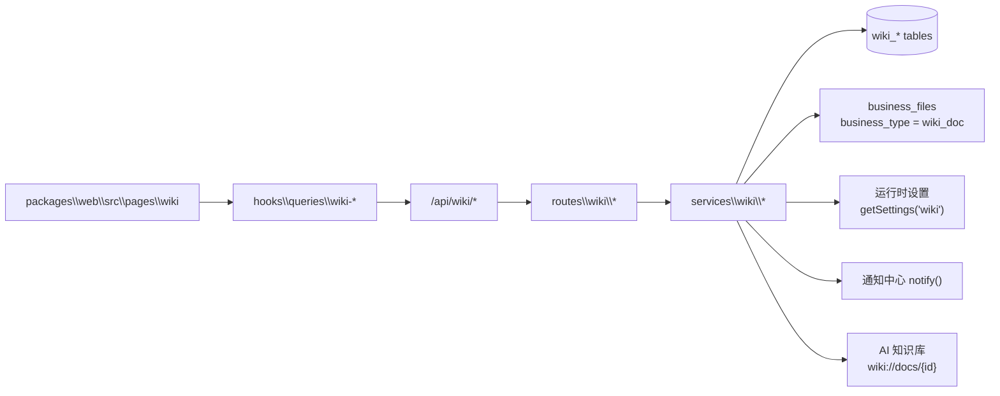

# 知识中心

知识中心是面向企业内部文档协作、制度沉淀与知识治理的 Wiki / 文档中心领域。它以知识空间为权限边界，围绕 Markdown 文档树、版本、评论、审批、治理清单、统计看板和 AI 知识库同步形成完整闭环。

---

## 文档导航

| 文档 | 内容 |
| --- | --- |
| [空间与权限](./spaces-permissions.md) | 知识空间、成员角色、菜单权限、访问边界与种子配置 |
| [文档管理与阅读](./documents.md) | 文档树、移动排序、编辑器、模板、附件、版本、收藏、搜索、阅读视图与回收站 |
| [协作与审批](./collaboration-approval.md) | 评论 / 回复 / @提及、问题解决、订阅通知、发布审核、阅读确认 |
| [治理、统计与设置](./governance-stats-settings.md) | 治理清单、批量治理、无结果搜索词、统计看板、系统设置、每日治理任务、AI 同步 |
| [数据模型与接口速查](./reference.md) | 表结构、枚举、权限码、设置字段、通知事件、API 路径清单 |

---

## 架构总览

| 层 | 位置 | 职责 |
| --- | --- | --- |
| 共享契约 | `packages\shared\src\wiki\` | 实体 schema 与 API 契约（`contracts/`）、枚举、Zod 入参；全局设置模块在 `packages\shared\src\settings\modules\wiki.ts` |
| 数据模型 | `packages\server\src\db\schema\wiki.ts` | 空间、成员、文档、版本、标签、评论、互动、审核、搜索日志 |
| API 路由 | `packages\server\src\routes\wiki\` | 由契约派生的 `/api/wiki/*` 路由与权限门控 |
| 业务服务 | `packages\server\src\services\wiki\` | 权限校验、状态机、树重排、版本、治理、通知、AI 同步 |
| 前端页面 | `packages\web\src\pages\wiki\` | 文档中心、空间、审核、模板、标签、评论、回收站、统计、设置、治理 |
| 菜单权限 | `packages\shared\src\seed\menus\wiki.ts` | `16000` 段知识中心菜单与 `wiki:*` 权限 |

## 能力总览

| 能力 | 当前实现 |
| --- | --- |
| 空间管理 | `public` 全员可读、`private` 成员可见；空间成员角色为 `owner` / `admin` / `editor` / `viewer`；创建空间时创建人自动成为负责人 |
| 文档树 | 空间内树形文档、置顶排序、标题搜索、展开状态按空间写入 `localStorage`；拖拽支持同层排序、跨层移动、拖到节点上成为子文档 |
| 文档编辑 | 全屏 Markdown 编辑器、模板套用、标签、附件、阅读确认开关、本地自动草稿、`revision` 乐观锁 |
| 版本历史 | 正文或标题变更生成版本；历史页支持版本对比与回滚，回滚生成新版本并回到草稿 |
| 阅读体验 | 左树右详情、深链 `?spaceId=&docId=`、面包屑、上一篇 / 下一篇、正文 TOC、大纲锚点、正文站内文档链接页内切换 |
| 检索与个人视图 | 文档中心包含目录、收藏、最近、我的、搜索；全文检索按标题 / 摘要 / 正文加权并返回命中片段 |
| 评论协作 | 已发布文档可评论 / 回复，支持 @ 提及、问题评论、标记解决、个人删除与管理端隐藏 / 恢复 / 删除 |
| 发布审批 | `draft` / `pending` / `published` / `rejected` 状态机；支持提交、撤回、通过、驳回和审核时间线 |
| 通知 | 发布、评论、@提及、审核结果、治理维护、复审到期统一进入通知中心 |
| 治理运营 | 过期、待复审、长期未更新、无负责人、草稿积压、审核积压、已归档、无结果搜索词；支持批量提醒、归档、负责人、复审周期 / 有效期设置 |
| 统计 | 概览卡、近 30 天趋势、空间分布、搜索成功率、审核通过 / 驳回、热门文档、贡献榜、沉睡文档 |
| 回收站 | 删除先进入回收站；支持还原与彻底删除；每日治理任务可按保留天数清理 |
| AI 同步 | 全局开关 + 空间开关双重门控；已发布文档以 `wiki://docs/{id}` 来源写入目标 AI 知识库 |

## 页面入口

| 菜单 | 路径 | 组件 |
| --- | --- | --- |
| 文档中心 | `/wiki/docs` | `wiki/docs/WikiDocCenterPage` |
| 文档编辑页 | `/wiki/docs/edit` | `wiki/docs/WikiDocEditPage` |
| 版本对比页 | `/wiki/docs/history` | `wiki/docs/WikiDocHistoryPage` |
| 知识空间 | `/wiki/spaces` | `wiki/spaces/WikiSpacesPage` |
| 发布审核 | `/wiki/approvals` | `wiki/approvals/WikiApprovalsPage` |
| 文档模板 | `/wiki/templates` | `wiki/templates/WikiTemplatesPage` |
| 标签管理 | `/wiki/tags` | `wiki/tags/WikiTagsPage` |
| 评论管理 | `/wiki/comments` | `wiki/comments/WikiCommentsPage` |
| 回收站 | `/wiki/recycle` | `wiki/recycle/WikiRecyclePage` |
| 知识统计 | `/wiki/stats` | `wiki/stats/WikiStatsPage` |
| 知识库设置 | `/wiki/settings` | `wiki/settings/WikiSettingsPage` |
| 内容治理 | `/wiki/governance` | `wiki/governance/WikiGovernancePage` |
