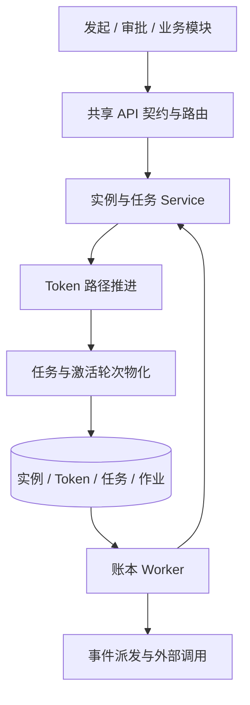

# 引擎架构与执行模型

工作流域的 API、共享契约、前端与 Worker 位于同一系统内。流程图决定路径，Token 记录活动位置，人工任务承载人的处理，作业账本承载自动执行与外部副作用。

## 主执行链路

`workflow-token-engine.ts` 的 `advanceTokens()` 计算路径，实例服务通过 `advanceAndMaterialize()` 在事务内保存 Token、任务、审批轮次和实例结果。`workflow-engine.ts` 提供结构校验、条件和图遍历工具，不负责独立落库推进。仿真复用 Token 路径计算，在内存中生成模拟任务与结果。

## 定义、版本与实例快照

流程定义使用 `nodes / edges / settings` 图结构，树式设计器是它的编辑投影。发布时保存定义版本及表单 schema；实例新发起、草稿提交和退回重提时，从当前已发布定义与绑定表单建立实例快照。运行实例按自己的快照执行，变更定义不会直接改写运行中的路径。

恢复定义版本是恢复草稿配置和表单绑定，不回滚表单库。管理员迁移运行实例属于另一个受权操作，详见[实例生命周期](./instance-lifecycle.md#管理员操作)。

## 运行对象

| 对象 | 职责 |
| --- | --- |
| 实例 | 保存标题、业务编号、发起人、运行状态、表单和定义快照 |
| Token | 保存活动分支、汇聚范围、父子关系和执行位置 |
| 节点激活轮次 | 记录一次进入节点的审批方式、基础席位数与阈值 |
| 审批席位与加签组 | 保存正式意见及临时补充审批条件，转办任务仍归属原席位 |
| 任务 | 保存处理人、意见、附件、签名和等待原因；任务记录数量不是基础票数 |
| 作业与执行尝试 | 保存自动作业的排程、租约、执行轮次、错误与逐次结果 |
| 已提交步骤回执 | 保存作业事务内已经提交的结果，恢复时复用结果以免重复写入 |

## 异步与事件边界

API 角色处理请求和 WebSocket，Worker 角色执行后台作业。工作流推进与事件外呼分别使用账本执行池，直接领取到期作业；pg-boss 消息合并唤醒，短轮询负责补充发现。租约、执行截止时间和 generation 确定执行权，详见[作业执行与恢复](./jobs.md)。

业务状态与事件派发作业在同一事务登记。`event_dispatch` 消费后调用进程内订阅者，并可靠登记自动化动作链和独立 Webhook 投递。进程内通知、业务回写和节点监听器有各自的失败边界，见[事件总线与事件订阅](./event-bus.md)。

外部写请求使用稳定操作键并记录副作用标记；结果不明时进入待确认死信。作业入库幂等和数据库事务不代表外部 HTTP 只执行一次。

## 实现入口

| 层 | 位置 |
| --- | --- |
| 契约、图、表单与审批纯逻辑 | `packages/shared/src/workflow/`，API 契约在 `contracts/` |
| API 与动作门禁 | `packages/server/src/routes/workflow/` |
| 定义、实例、协作、自动化与集成服务 | `packages/server/src/services/workflow/` |
| Token 推进 | `packages/server/src/lib/workflow-token-engine.ts` |
| 作业租约、领取、步骤与 handler | `packages/server/src/lib/workflow-jobs/` |
| 数据模型 | `packages/server/src/db/schema/workflow.ts`、`workflow-job-effects.ts` |
| 前端页面与公共容器 | `packages/web/src/pages/workflow/`、`components/workflow/` |
| 查询层与移动入口 | `packages/web/src/hooks/queries/workflow-*.ts`、`packages/web/src/approval/` |

运行角色与系统配置见[引擎诊断、健康与运行配置](./engine-health.md)，业务域接入见[业务模块接入工作流](./business-integration.md)。
