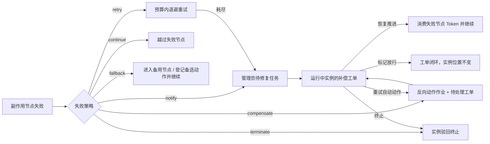

# 补偿与 Saga

节点失败策略决定外部副作用失败后是继续、重试、进入备用路径、执行反向动作，还是交给管理员修复。补偿工单保存处理过程，独立的补偿作业保存自动动作的执行事实；外部审批另按自己的派发与兜底配置处理，见[触发器与外部审批](./trigger-nodes.md)。

## 节点失败策略

在 `工作流引擎 → 流程管理 → 流程定义 → 流程设计` 的触发器 / 子流程节点配置中设置 `failurePolicy`。显式策略按 `action` 分流；没有显式策略时，触发器的 `onFailure=continue/retry` 对应继续 / 重试，其余失败可经异常边进入 `catchNode`。

| 动作 | 行为 |
| --- | --- |
| `continue` | 越过失败节点继续流转，工单记为已处理 |
| `retry` | 按节点作业的尝试预算与退避处理；耗尽后转入人工修复 |
| `compensate` | 登记反向动作作业与待处理工单，在失败节点建立管理员待修复任务 |
| `fallback` | 有有效 `fallbackNodeKey` 时进入备用节点；配置 `fallbackAction` 时登记备选动作后立即继续流转 |
| `notify` | 建立管理员待修复任务与待处理工单，通过任务通知提示处理人 |
| `terminate` | 终止当前实例，状态为 `rejected`，工单记为已终止 |

`fallbackNodeKey` 与 `fallbackAction` 都存在时先采用有效备用节点。备选动作与继续流转在同一事务登记，流程不等待该动作成功；工单可以是 `resolved` 而自动动作仍是 `pending`、`running` 或 `failed`。如果需要等待外部处理后再推进，应使用有等待 / 回调语义的节点。

`notify`、`compensate` 或重试耗尽的人工修复路径中，实例保持 `running`，失败节点建立 `catchNode` 待办并保留可继续执行的 Token。它没有进入管理员 `suspended` 状态，也不会冻结其它分支的后台作业。若无法解析管理员，实例被驳回终止并记录原因。

## 反向与备选动作

`compensate` 的反向动作与 `fallback` 的备选动作共用 `WorkflowCompensationAction`。支持文本模板 <code v-pre>{{form.字段}}</code>、<code v-pre>{{instanceId}}</code>、<code v-pre>{{nodeKey}}</code>、<code v-pre>{{error}}</code>，语法与[自动化动作模板](./automations.md)的 `system.* / formData.*` 不同。

| 类型 | 配置与用途 |
| --- | --- |
| `http` | 直连 HTTP：`url`、`httpMethod`、`headers`、`bodyTemplate`，例如撤销外部订单 |
| `connector` | 经连接器调用：`connectorId`、`url`（相对路径）、`httpMethod`、`headers`、`bodyTemplate`，复用鉴权、限流、熔断和审计 |
| `sms` | `templateId`、`recipients`、`fieldValues` 模板变量，用于短信通知 |
| `email` | `recipients`、`bodyTemplate`，主题为流程补偿失败通知 |
| `updateData` | `fieldKeys`、`fieldValues`，回写当前实例表单字段；值按文本模板渲染，未配置的值写入 null |

动作配置随补偿作业 payload 保存，表单变量从执行时实例的当前 `formData` 读取。每个动作是独立 `compensation_action` 作业，最大尝试次数为 `maxRetries + 1`（未配置时共 4 次）；自动失败、退避和死信遵循[统一作业执行](./jobs.md)。自动动作结果回写工单 `compensationActionStatus`，成功不会自行消费待修复任务或自动闭环 pending 工单。

HTTP 出站复用[连接器出站安全](./connectors.md#出站安全)：SSRF 校验、禁止跟随重定向、连接器同源约束，URL 占位值按百分号编码。内部 `updateData` 写入使用步骤回执；不安全外部写入结果不明时停止自动重发，应先核对外部系统。恢复时同时查看工单与作业详情，不能只凭自动动作摘要判断请求是否已生效。

## Saga 回滚登记

失败节点开启 `failurePolicy.sagaRollback` 后，引擎查找同实例中状态为 `succeeded` 的 `trigger_dispatch`、`external_dispatch`、`webhook_delivery` 作业，按作业 ID 降序处理。只选择带节点 key、不是当前失败节点、且声明了反向 `compensation` 动作的节点，同一节点在一次登记中只处理一次。

每个符合条件的节点分别建立补偿工单并登记独立 `compensation_action` 作业，作业按实例与节点的幂等键去重。ID 倒序是登记顺序，不是按完成时间倒序，也不保证各反向动作严格串行完成；多个动作可被执行池并发领取，失败和重试各自独立。需要跨系统串行依赖的反向操作应由外部接收方或明确的流程节点编排。

## 补偿工单与生命周期

页面入口为 `工作流引擎 → 运维与集成 → 流程监控 → 补偿工单`。

| 字段 | 含义 |
| --- | --- |
| 工单 `status` | `pending` 待处理、`resolved` 已处理、`terminated` 已终止 |
| `compensationActionStatus` | 自动动作摘要：`none`、`pending`、`running`、`succeeded`、`failed` |
| `failedNodeKey` | 人工恢复时要消费并继续向后推进的失败节点 |
| `actionPayload` | 可重试的反向 / 备选动作配置 |
| 处理历史 | 备注、附件、自动动作结果、重试、恢复推进、放行和终止 |

工单状态、自动动作状态、父作业状态和实例状态是不同对象。自动动作处于等待重试或外部结果待确认时，以[作业账本](./jobs.md#父作业与执行尝试)为准。

以下接口相对于 `/api/workflows`；查看需 `workflow:instance:monitor`，处理需 `workflow:engine:operate`，操作留审计。

| 操作 | 条件与结果 | 接口 |
| --- | --- | --- |
| 列表 | 按工单状态、实例筛选可见租户内工单 | `GET /compensation/list` |
| 详情 | 错误、自动动作与处理历史时间线 | `GET /compensation/{id}` |
| 恢复推进 | 工单必须 pending、实例必须 running；关闭失败节点待修复任务，消费其 Token 并越过失败节点继续，工单置 resolved | `POST /compensation/{id}/resume` |
| 重试自动动作 | `compensationActionStatus=failed` 且有有效动作配置时新建补偿作业，保留已有尝试与处理历史 | `POST /compensation/{id}/retry` |
| 添加备注 / 附件 | 任意工单状态均可追加过程记录 | `POST /compensation/{id}/note` |
| 标记修复放行 | pending 工单置 resolved，只关闭工单，不替代恢复推进 | `POST /compensation/{id}/resolve`，`action=resolve` |
| 终止 | pending 工单置 terminated；实例置 rejected，pending 待办跳过、活动 Token 消费 | 同上，`action=terminate` |

管理员先核实外部操作和自动动作结果，再选择恢复推进或关闭工单。已被管理员挂起的实例需要先恢复为 running，才能执行工单恢复推进。重试自动动作与恢复推进是独立操作，不能把提交重试当成反向动作已完成。

## 处理路径

## 数据对象

| 对象 | 职责 |
| --- | --- |
| `workflow_compensations` | 工单、失败节点、错误、处理状态、自动动作摘要与动作配置 |
| `workflow_compensation_logs` | 备注、附件、自动结果和人工处理历史 |
| `workflow_jobs` / `workflow_job_executions` | 补偿动作调度状态与逐次执行事实 |
| `workflow_job_effects` | 已提交内部补偿步骤的回执 |
