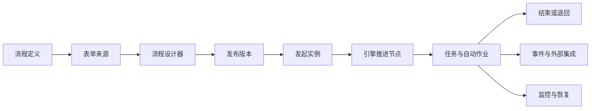

# 工作流引擎总览

Zenith Admin 的工作流引擎用于把表单、审批、自动节点、外部系统联动和运行态运维组织成一套可配置的流程平台。用户侧围绕「发起、处理、查看」工作，管理员侧围绕「定义、集成、监控、恢复」工作。

## 功能地图

| 模块 | 页面 / 能力 | 说明 |
| --- | --- | --- |
| 发起工作台 | `工作流引擎 → 发起工作台` | 按分类浏览可发起的已发布流程，填写表单，提交申请或保存草稿 |
| 定义与设计 | 流程定义、流程设计器、流程模板、流程分类 | 管理流程定义、版本、导入导出、模板复用、发布前体检和流程仿真 |
| 表单能力 | 表单库、自定义业务表单、业务系统主导表单 | 支持可视化表单、React 自定义页面和 `bizType + bizId` 外部业务关联 |
| 运行协作 | 我的申请、待我审批、抄送我的、我已办、审批代理 | 覆盖草稿、撤回、重新提交、审批、驳回、转办、委派、协办、加签、减签、退回、催办、动态抄送 |
| 移动审批轻页 | `/approval.html`（独立 SPA 入口，头像菜单 → 移动审批） | 移动优先底部图标标签栏（待办/已办/我的申请/抄送我，主流 App TabBar，图标+文字+角标）、搜索、极速同意、下拉刷新、审批详情（进度提示、表单权限过滤、可编辑字段、签名、快捷短语、底部操作抽屉）、同意/驳回/转办、发起人撤回/催办、沟通评论、发起申请（搜索+最近使用）；与后台共享登录态，业务表单与自选审批人场景引导回桌面端 |
| 自动节点 | 延迟器、触发器、子流程、抄送、异常捕获 | 自动暂停、外呼、等待回调、数据回写、发起子流程、分支汇聚、异常路由，以及节点级失败策略（重试 / 补偿 / 兜底 / 恢复，见[补偿 / Saga](./compensation.md)） |
| 集成能力 | 事件订阅、节点监听器、外部审批、连接器、远程数据源 | 通过 HMAC 签名、连接器鉴权、重试、熔断和数据源选项拉取对接外部系统 |
| 自动化与定时 | 流程自动化、定时发起 | 在实例创建/结束时执行联动动作，或按 Cron 由指定发起人自动发起流程 |
| 监控运维 | 流程监控、健康巡检、引擎诊断、作业账本、补偿工单 | 观测实例、任务、执行 Token、异步作业、事件投递、子流程和健康趋势，并执行恢复动作 |

## 设计到运行

1. 管理员创建流程定义，选择表单来源，并在设计器里配置节点、分支、审批人和高级设置。
2. 发布流程定义后，系统保存版本快照；运行中的历史实例继续使用发起时冻结的定义和表单快照。
3. 用户在发起工作台或业务模块中提交申请，实例进入 `running`，引擎从开始节点推进。
4. 人工节点生成 `workflow_tasks` 待办；自动节点生成或消费统一作业账本中的 `workflow_jobs`。
5. 节点完成后产生事件，事件由统一作业分发到进程内订阅者、Webhook 订阅、通知和自动化规则。
6. 实例完成、驳回、撤回或取消后进入终态；监控页保留详情、轨迹、诊断和恢复入口。

## 核心数据对象

| 对象 | 说明 |
| --- | --- |
| 流程定义 `workflow_definitions` | 流程模板本体，包含基础信息、表单配置、流程图 `flowData`、状态和发起范围 |
| 定义版本 `workflow_definition_versions` | 每次发布保存的定义快照，用于版本对比、恢复和历史实例解释 |
| 流程实例 `workflow_instances` | 一次申请的运行记录，保存标题、发起人、状态、表单数据、快照、业务关联和当前节点 |
| 流程任务 `workflow_tasks` | 人工审批、办理、抄送、等待回调、延迟、子流程等运行节点的任务记录 |
| 执行 Token `workflow_tokens` | 显式 DAG 执行路径，表示活动分支、汇聚状态和可恢复的推进位置 |
| 作业账本 `workflow_jobs` | 延时唤醒、审批超时、触发器派发、外部审批、子流程、事件派发、Webhook 投递的统一异步队列 |
| 作业执行 `workflow_job_executions` | 每次作业尝试的审计记录，保存请求、响应、错误、耗时和执行状态 |
| 事件订阅 `workflow_event_subscriptions` | HTTP Webhook 订阅配置，可按流程定义和事件类型过滤 |
| 连接器 `workflow_connectors` | 外呼基础配置、凭据、限流、重试、熔断和调用审计 |

## 运行状态

### 流程定义

| 状态 | 说明 |
| --- | --- |
| `draft` | 草稿，可编辑，不可发起 |
| `published` | 已发布，可按发起范围被用户使用 |
| `disabled` | 已禁用，不再允许新发起，历史实例不受影响 |

### 流程实例

| 状态 | 说明 |
| --- | --- |
| `draft` | 用户保存但尚未提交的申请 |
| `running` | 正在流转 |
| `approved` | 所有路径完成并通过 |
| `rejected` | 节点驳回并按策略终止 |
| `withdrawn` | 发起人撤回 |
| `cancelled` | 管理员强制取消 |

### 流程任务

| 状态 | 说明 |
| --- | --- |
| `pending` | 等待处理人操作 |
| `waiting` | 等待顺序会签、延迟、触发器回调、外部审批或子流程汇聚 |
| `approved` | 已通过或自动通过 |
| `rejected` | 已驳回 |
| `skipped` | 被流程推进、撤回、退回、或签抢占、减签等逻辑跳过 |

## 文档目录

- [流程定义与设计器](./designer.md)
- [流程模板](./templates.md)
- [表单、远程数据源与连接器](./form-design.md)
- [节点配置](./node-config.md)
- [节点类型速查](./node-types.md)
- [审批、任务与协作](./approval.md)
- [实例生命周期](./instance-lifecycle.md)
- [触发器与外部审批](./trigger-nodes.md)
- [补偿 / Saga 能力](./compensation.md)
- [事件总线与事件订阅](./event-bus.md)
- [流程自动化与定时发起](./automations.md)
- [监控、诊断与运维](./monitoring-operations.md)
- [业务模块接入工作流](./business-integration.md)
- [权限与范围控制](./permissions.md)
