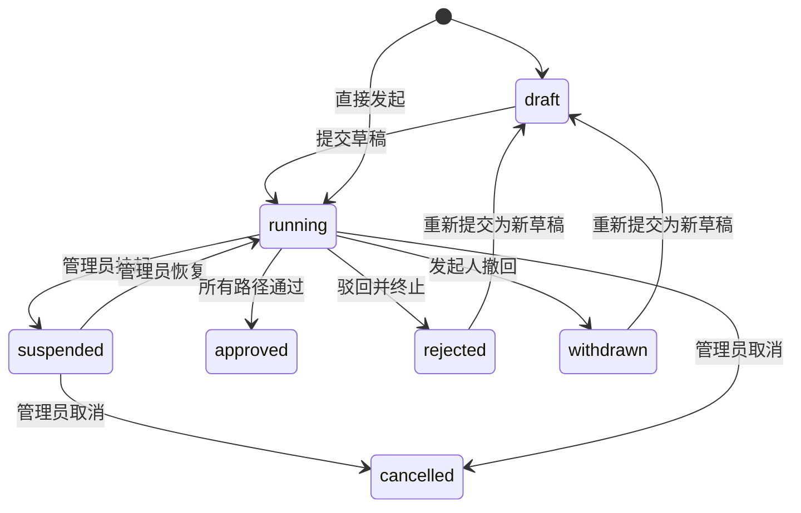

# 实例生命周期

流程实例是用户基于已发布流程定义发起的一次申请。实例保存发起时的定义快照、表单快照、业务编号、表单数据、当前节点、任务、执行 Token 和业务关联。

## 状态流转

| 状态 | 说明 |
| --- | --- |
| `draft` | 已保存但未进入流转 |
| `running` | 正在执行 |
| `suspended` | 管理员挂起：待办不可处理，SLA 超时与延迟计时冻结，恢复后按剩余时长续跑 |
| `approved` | 已通过 |
| `rejected` | 已驳回 |
| `withdrawn` | 已撤回 |
| `cancelled` | 已取消 |

## 发起与草稿

用户在「发起工作台」选择已发布且有权限发起的流程，填写表单并提交。也可以保存草稿，再到「我的申请」继续编辑和提交。

发起时系统会：

1. 校验流程定义状态与发起人范围。
2. 冻结定义快照和表单快照。
3. 写入实例标题、优先级、表单数据、发起时抄送人和业务编号。
4. 进入 `running` 后创建首批执行 Token 与任务。
5. 入队 `event_dispatch` 作业，分发 `instance.created`、`task.created`、`task.assigned` 等事件。

## 任务与自动作业

人工任务写入 `workflow_tasks`，自动副作用写入 `workflow_jobs`。

| 作业类型 | 说明 |
| --- | --- |
| `delay_wake` | 延迟节点唤醒 |
| `task_timeout` | 审批/办理节点超时处理 |
| `trigger_dispatch` | 触发器节点派发 |
| `external_dispatch` | 外部审批派发 |
| `subprocess_spawn` | 子流程发起 |
| `subprocess_join` | 子流程汇聚 |
| `event_dispatch` | 工作流事件可靠分发 |
| `webhook_delivery` | 事件订阅 Webhook 投递 |

每个作业都有状态、尝试次数、幂等键、`traceId`、下次执行时间和执行结果；每次尝试写入 `workflow_job_executions`。

## 执行 Token

执行 Token 表示流程图中的活动路径。分支、汇聚、子流程、跳过和重放都基于 Token 记录。监控诊断页展示活动 Token、已消费 Token、死亡 Token 和父子 Token 关系，用于解释实例为什么停在某个节点。

## 结束

当所有活动路径完成且没有后续节点时，实例进入 `approved`。实例通过、驳回、撤回都会触发对应 `instance.*` 事件，并驱动通知、业务桥接、自动化和 Webhook 订阅。

## 撤回与重新提交

发起人在流程允许撤回时可撤回运行实例。撤回会把实例置为 `withdrawn`，未处理任务标记为 `skipped`。被驳回或撤回的实例可重新提交，系统会基于原数据创建新的草稿。

## 管理员操作

流程监控页提供管理员运维操作：

| 操作 | 说明 |
| --- | --- |
| 取消流程 | 强制终止运行/挂起实例，状态变为 `cancelled` |
| 挂起流程 | 冻结流转：待办不可处理、外部回调拒绝、`task_timeout`/`delay_wake` 计时作业暂停计时（记录剩余时长） |
| 恢复流程 | 从挂起恢复为 `running`，计时作业按挂起前剩余时长重排续跑 |
| 离职交接 | 把某人名下全部未处理待办批量改派给接手人（转办链留痕、逐条互不阻断），可同时停用其审批代理规则，并提示将其写死为审批人的定义清单 |
| 删除实例 | 删除实例及关联任务 |
| 强制跳转 | 跳转到指定节点重新生成活动路径 |
| 改派处理人 | 将待办改派给其他用户 |
| 迁移版本 | 将运行实例迁移到当前定义版本，迁移前检查活动节点是否仍存在 |
| Token 跳过 | 跳过卡死执行 Token |
| Token 重放 | 从执行 Token 所在节点重放流程 |
| 批量推进卡死实例 | 按定义、节点和卡住时长批量跳过活动 Token |

## 详情视图

实例详情包含：

| 页签 | 说明 |
| --- | --- |
| 表单 | 渲染发起时表单或业务查看组件 |
| 审批流程 | 任务时间线 |
| 流程图 | 结合任务状态显示流程节点 |
| 沟通 | 评论与提及 |
| 协办 | 协办请求和回复 |
| 子流程 | 父子实例关系与跳转 |

运行时技术诊断见 [监控、诊断与运维](./monitoring-operations.md)。
