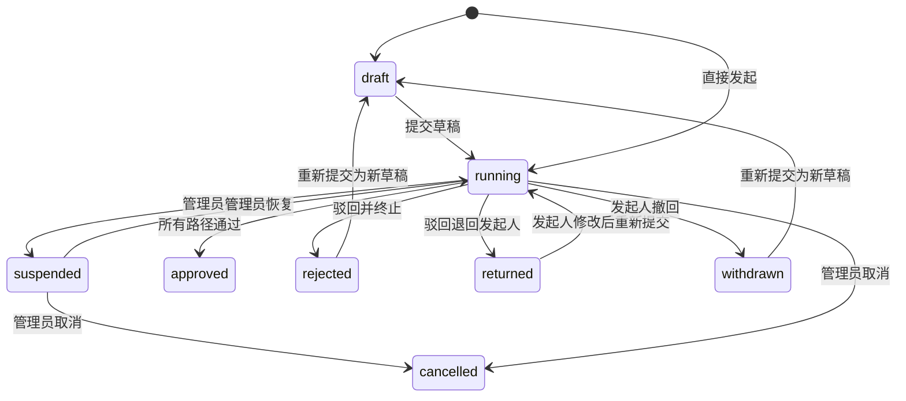

# 实例生命周期

流程实例是用户基于已发布流程定义发起的一次申请。实例保存发起时的定义快照、表单快照、业务编号、表单数据、当前节点、任务、执行 Token 和业务关联。

## 状态流转

```mermaid
stateDiagram-v2
  [*] --> draft
  draft --> running: 提交草稿
  [*] --> running: 直接发起
  running --> suspended: 管理员挂起
  suspended --> running: 管理员恢复
  suspended --> cancelled: 管理员取消
  running --> approved: 所有路径通过
  running --> rejected: 驳回并终止
  running --> returned: 驳回退回发起人
  returned --> running: 发起人修改后重新提交
  running --> withdrawn: 发起人撤回
  running --> cancelled: 管理员取消
  rejected --> draft: 重新提交为新草稿
  withdrawn --> draft: 重新提交为新草稿
```

| 状态 | 说明 |
| --- | --- |
| `draft` | 已保存但未进入流转 |
| `running` | 正在执行 |
| `suspended` | 管理员挂起：待办不可处理，自动推进作业暂停，恢复后按剩余时长续跑；结果不明的在途外呼进入死信 |
| `returned` | 已退回：驳回策略为「退回发起人」时进入，发起人修改表单后在同一实例上重新提交，保留审计历史与业务编号 |
| `approved` | 已通过 |
| `rejected` | 已驳回 |
| `withdrawn` | 已撤回 |
| `cancelled` | 已取消 |

## 发起与草稿

用户在「发起工作台」选择已发布且有权限发起的流程，填写表单并提交。也可以保存草稿，再到「我的申请」继续编辑和提交。整页发起深链 `/workflow/launch/:definitionId` 与发起工作台同源读取「已发布定义」，普通发起人可直接收藏或分享该链接。

发起时系统会：

1. 校验流程定义状态与发起人范围。
2. 冻结定义快照和表单快照。
3. 写入实例标题、优先级、表单数据、发起时抄送人和业务编号。
4. 进入 `running` 后创建首批执行 Token 与任务。
5. 入队 `event_dispatch` 作业，分发 `instance.created`、`task.created`、`task.assigned` 等事件。

审批表单中的附件、图片字段统一通过 `POST /api/workflows/attachments` 上传，按工作流身份（可发起或可审批任一权限）放行，与文件中心的管理端上传接口权限隔离；上传仍执行统一的大小上限与 magic bytes 真实类型校验，并进入受管文件与审计。

## 激活轮次与运行不变量

同一节点每次被进入（首次流转、退回重审、退回发起人后重提、撤回已办重审）都会分配一个新的激活轮次 `activationId`，该轮生成的一批任务共享同一轮次标识。引擎在数据库层维护两条硬性不变量：

| 不变量 | 约束 |
| --- | --- |
| 活动任务唯一 | 同一实例、同一节点、同一激活轮次内，一个处理人最多持有一条 `pending`/`waiting` 任务（部分唯一索引强制） |
| 活动 Token 唯一 | 同一实例、同一节点、同一分支路径最多存在一个 `active` Token（部分唯一索引强制） |

协作动作（转办、委派、加签、改派、离职交接）在写入前对目标处理人做同轮预检，命中时返回带姓名的 `409`（如「张三 已是本节点待办处理人，无需重复指派」），不会击穿唯一索引。

## 全量清场语义

凡是让实例离开当前执行位置的动作，都会对「活动任务 + 活动 Token + 在途推进类作业」做一次全实例清场，保证不留任何可被旧轮消费的残骸：

| 动作 | 清场范围 | 任务留痕注释 |
| --- | --- | --- |
| 驳回终止 | 全实例活动任务 skip、Token 终止、推进类作业取消 | `[流程驳回] 流程已被驳回终止，本待办作废` |
| 退回发起人 | 全实例（含并行分支的跨节点待办）任务 skip、Token 终止、推进类作业取消，实例进入 `returned` | `[退回发起人] 流程退回修改，本待办作废` |
| 发起人撤回 | 同上，实例进入 `withdrawn` | `[发起人撤回] 流程已撤回，本待办作废` |
| 管理员取消 | 同上，实例进入 `cancelled` | `[管理员取消] 流程已取消，本待办作废` |
| 自动拒绝终止 | 同上，实例进入 `rejected` | `[自动拒绝] 流程被自动拒绝终止，本待办作废` |
| 流程正常完结 | 清理残余等待任务与在途推进作业 | `[流程结束] 流程已结束，本待办作废` |

清场取消的推进作业由共享常量 `WORKFLOW_ADVANCING_JOB_TYPES` 定义：`delay_wake`、`task_timeout`、`external_dispatch`、`subprocess_spawn`、`subprocess_join`。触发器、事件分发、Webhook 投递与补偿动作不在该范围；已经发生的触发事实继续投递，仍在门控的触发器由任务与实例状态校验决定是否继续。作业自身完成实例时保留当前执行者，取消其它残留推进作业。

`returned` 实例重提时，引擎在物化新一轮任务前还会执行一次防御性清场（残留任务 skip、Token 终止、推进作业取消，注释 `[重提清场] 上一轮残留待办作废`），即使退回后有旧作业迟到推进也不会产生并存轮次。

## 任务与自动作业

人工任务写入 `workflow_tasks`，自动副作用写入 `workflow_jobs`。

| 作业类型 | 说明 |
| --- | --- |
| `delay_wake` | 延迟节点唤醒 |
| `task_timeout` | 审批/办理节点超时处理 |
| `trigger_dispatch` | 触发器节点派发 |
| `external_dispatch` | 外部审批派发 |
| `subprocess_spawn` | 子流程发起 |
| `subprocess_join` | 子流程汇聚 |
| `event_dispatch` | 工作流事件可靠分发 |
| `webhook_delivery` | 事件订阅 Webhook 投递 |
| `compensation_action` | 失败策略的反向 / 兜底补偿动作（见[补偿 / Saga](./compensation.md)） |

每个作业都有状态、尝试次数、幂等键、`traceId`、下次执行时间和执行结果；每次尝试写入 `workflow_job_executions`。审批、驳回、撤回、取消等动作产生的事件在业务事务内以 outbox 方式原子入队，保证状态变更与事件分发不脱节。

### 执行权与故障恢复

只有队列 Worker 执行作业；pg-boss 消息仅负责唤醒，执行权由 `workflow_jobs` 的 `generation`、`leaseToken` 和 `leaseUntil` 裁定。Worker 有执行容量时才领取一条作业，并与首次尝试审计一起提交。没有进程内定时器直接执行，也不在恢复扫描中批量领取后串行执行。

执行者每 15 秒续租 60 秒租约。`executionDeadline` 是独立的执行截止时间，默认每次尝试 10 分钟；正常心跳不能无限延长业务执行。失去租约或超过截止时间时会中止信号；旧执行者的后续 SQL 必须在业务短事务内重新核验执行权，实例与作业统一按 `instance → job` 顺序加锁。成功、失败与尝试审计在同一事务收口。HTTP 不进入业务事务。

取消、人工重试、暂停及恢复会更新 generation，旧执行者不能覆盖新状态。暂停实例时，延时、超时、触发器、外部审批与子流程作业使用 `paused` 状态保存剩余毫秒数，恢复后按剩余时间重新投递；已经开始不安全外呼且结果不明的运行中作业直接进入待确认死信，不会随实例恢复重放。事件分发、Webhook 投递与补偿动作继续执行。自动恢复仅条件回收已过期的租约并补投消息，耗尽预算则进入死信，不直接调用 handler。

`workflowTransaction` 中创建的作业在事务提交成功后发送唤醒；回滚不发送。实例流转和运维推进统一使用该事务入口，恢复实例则在恢复事务提交后显式发布计时作业。到期 pending 扫描负责补投，消息投递失败不回滚已经提交的业务事实。

外部写请求在发送前记录可能产生副作用的审计标记。若其执行失败、失联或超时且结果尚不明，作业进入 `dead` 并提示“外部操作结果待确认”，停止自动重试。人工确认后可重试，原操作键跨重试保持稳定；明确修改 payload 会创建新的操作键。租约不能撤销已经送达的外部请求，也不提供外部 HTTP 的 exactly-once 保证。

## 执行 Token

执行 Token 表示流程图中的活动路径。分支、汇聚、子流程、跳过和重放都基于 Token 记录。任务提交必须命中所在节点的 active Token，因此「任务在、Token 不在」属于必须修复的严重不一致——引擎诊断与健康巡检都会对其报 critical（见[监控、诊断与运维](./monitoring-operations.md)），修复入口为监控页「强制跳转」。

监控诊断页展示活动 Token、已消费 Token、死亡 Token 和父子 Token 关系，用于解释实例为什么停在某个节点。

## 结束

当所有活动路径完成且没有后续节点时，实例进入 `approved`。实例通过、驳回、撤回都会触发对应 `instance.*` 事件，并驱动通知、业务桥接、自动化和 Webhook 订阅。

## 撤回与重新提交

发起人在流程允许撤回时可撤回运行实例。撤回执行全量清场（见上文），实例置为 `withdrawn`。被驳回或撤回的实例可重新提交，系统会基于原数据创建新的草稿；`returned` 实例则在原实例上修改重提，保留业务编号与审计历史。

重提后若命中定义的「审批人自动去重」设置，同一实例内已通过的审批人会按配置自动通过，流程直接推进到下一个需要人工处理的节点。

## 管理员操作

流程监控页提供管理员运维操作：

| 操作 | 说明 |
| --- | --- |
| 取消流程 | 强制终止运行/挂起实例，全量清场后状态变为 `cancelled` |
| 挂起流程 | 冻结流转：待办不可处理、外部回调拒绝，延时、超时、触发器、外部审批与子流程作业暂停（记录剩余时长）；结果不明的在途外呼进入死信 |
| 恢复流程 | 从挂起恢复为 `running`，已暂停的自动推进作业按挂起前剩余时长重排续跑 |
| 离职交接 | 把某人名下全部未处理待办批量改派给接手人（转办链留痕、逐条互不阻断，接手人已在同节点持有待办的条目自动跳过），可同时停用其审批代理规则，并提示将其写死为审批人的定义清单 |
| 删除实例 | 删除实例及关联任务 |
| 强制跳转 | 终止当前所有活动任务并跳转到指定节点重建执行路径。确认框列出将被终止的活动任务清单（任务号/节点/处理人/状态），跳转原因必填并写入审计与被终止任务的备注 |
| 改派处理人 | 将待办改派给其他用户；目标用户已在同节点持有待办时返回 409 |
| 迁移版本 | 将运行实例迁移到当前定义版本，迁移前检查活动节点是否仍存在 |
| Token 跳过 | 跳过卡死执行 Token |
| Token 重放 | 从执行 Token 所在节点重放流程 |
| 批量推进卡死实例 | 按定义、节点和卡住时长批量跳过活动 Token，恢复原因必填并留痕 |

## 详情视图

实例详情包含：

| 页签 | 说明 |
| --- | --- |
| 表单 | 渲染发起时表单或业务查看组件 |
| 审批流程 | 任务时间线（含跳过任务的来源注释） |
| 流程图 | 结合任务状态显示流程节点 |
| 沟通 | 评论与提及 |
| 协办 | 协办请求和回复 |
| 子流程 | 父子实例关系与跳转 |

管理端返回的实例快照会剥离外部审批 / 触发器回调密钥与出站凭证请求头等敏感配置；表单数据按查看者身份脱敏（见[表单与远程数据源](./form-design.md#表单运行时与服务端校验)）。

运行时技术诊断见 [监控、诊断与运维](./monitoring-operations.md)。
