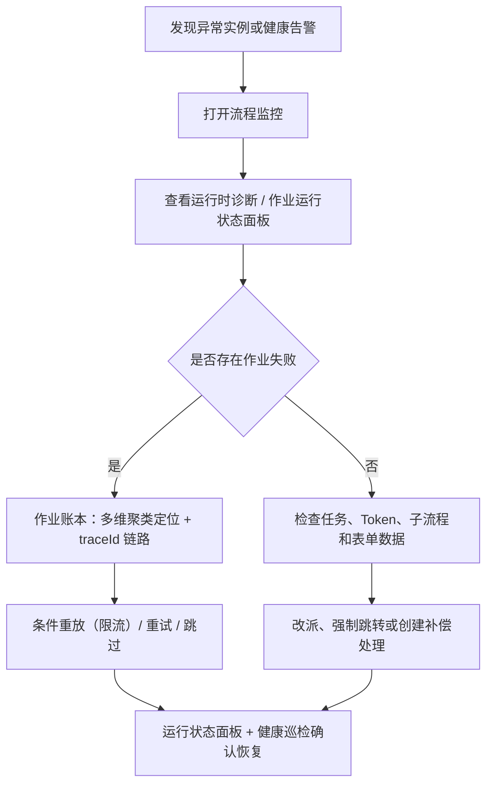

# 监控、诊断与运维

工作流运维围绕实例、任务、执行 Token、异步作业和健康巡检展开。后台入口包括 `流程监控`、`健康巡检`、`事件订阅` 和 `触发器执行`；`流程监控` 内还提供 `引擎诊断`、`作业账本` 和 `补偿工单`。

## 流程监控

`工作流引擎 → 流程监控` 提供实例维度的查询和处置能力：

| 能力 | 说明 |
| --- | --- |
| 实例列表 | 按流程、状态、发起人、时间等维度查询 |
| 流程详情 | 查看实例基础信息、表单数据、当前节点和任务 |
| 运行时诊断 | 汇总节点、任务、触发器、事件派发、执行 Token、定义快照 |
| 强制跳转 | 将实例推进到指定节点 |
| 改派处理人 | 调整待办任务处理人 |
| 批量恢复 | 对卡住实例执行批量跳过或恢复动作 |
| 诊断包导出 | 导出实例运行快照，便于工单留档和离线分析 |

运行时诊断抽屉包含这些视图：

| 视图 | 内容 |
| --- | --- |
| 引擎轨迹 | 实例相关的引擎事件和作业链路 |
| 节点 | 流程图节点状态、当前节点、异常节点 |
| 任务 | 全量任务、处理人、动作、耗时和状态 |
| 触发器 | 节点触发器派发状态、请求、响应和错误 |
| 事件派发 | 事件投递状态、订阅命中和错误 |
| 执行 Token | 并行、包容、子流程等待等执行路径状态 |
| 流程图 | 按运行状态渲染的流程定义快照 |
| 表单数据 | 实例运行时表单数据 |
| 定义快照 | 发起时冻结的流程定义 |

## 健康巡检

`工作流引擎 → 健康巡检` 用于快速识别异常实例和异步执行问题。巡检关注：

| 问题 | 说明 |
| --- | --- |
| 外部审批派发失败或长时间等待 | 审批人节点配置外部审批后，第三方系统未成功接收或未回调 |
| 触发器等待无执行记录 | 触发器节点进入等待态但没有对应执行记录 |
| 触发器执行失败 | 触发器作业请求失败或重试耗尽 |
| 子流程等待 | 父流程等待子流程完成 |
| 延迟器超期 | 延迟节点已到期但未恢复 |
| 延迟器缺唤醒作业 | 延迟任务在等待但找不到对应的 `delay_wake` 作业，将无法被自动唤醒 |
| 待办超时 | 节点配置的 SLA 已超期 |
| 事件派发失败 | 事件分发或 Webhook 投递失败 |
| 执行 Token 异常 | 并行、包容、子流程汇聚路径无法继续 |
| 实例疑似卡死 | 进行中实例既无待办/等待任务也无在途作业（如汇聚残留孤儿 Token、推进中断），需用监控页恢复动作处理 |

健康巡检的阈值由页面参数控制，适合日常看板和问题排查入口。

## 引擎诊断

`流程监控 → 引擎诊断` 展示引擎整体状态、队列分布、健康趋势和恢复动作。恢复动作已**按作业类型细分**，每个动作只处理对应类型的作业（不再全部一并 drain）：

| 动作 | 处理的作业类型 |
| --- | --- |
| 重放事件派发 | `event_dispatch` |
| 恢复触发器重派 | `trigger_dispatch` |
| 恢复延时任务 | `delay_wake` |
| 处理超时任务 | `task_timeout` |
| 恢复子流程 | `subprocess_spawn` / `subprocess_join` |
| 恢复 Webhook 投递 | `webhook_delivery` |

这些动作按恢复扫描设计，适合处理队列积压、进程重启后恢复和外部系统短暂故障后的补偿。按类型细分后，运维可精确定向恢复（例如「只恢复触发器」或「只处理超时」），减少无关作业的波及。

## 作业账本

异步能力统一进入作业账本。作业记录包含类型、状态、关联实例、任务、节点、`traceId`、运行时间、尝试次数、错误和执行明细。

| 作业类型 | 说明 |
| --- | --- |
| `delay_wake` | 延迟器到期唤醒 |
| `task_timeout` | 待办超时处理 |
| `trigger_dispatch` | 触发器节点派发 |
| `external_dispatch` | 外部审批派发 |
| `subprocess_spawn` | 发起子流程 |
| `subprocess_join` | 子流程完成后汇聚 |
| `event_dispatch` | 工作流事件分发 |
| `webhook_delivery` | 事件订阅 Webhook 投递 |

| 状态 | 说明 |
| --- | --- |
| `pending` | 等待执行 |
| `running` | 执行中 |
| `succeeded` | 执行成功 |
| `failed` | 本轮失败，仍可重试 |
| `dead` | 重试耗尽进入死信 |
| `canceled` | 已取消或跳过 |

作业账本支持按类型和状态筛选、查看执行明细、查看同一 `traceId` 的链路、单条重试、单条跳过、批量重试、批量跳过、条件重放和多维失败聚类。

::: tip Token 保留期清理
系统任务「工作流 Token 保留期清理」每天 03:40 分批清理终态（通过/驳回/撤回/取消）超过 90 天实例的执行 Token，控制 `workflow_tokens` 增长；保留期内的引擎 Trace 与诊断不受影响。
:::

### 运行状态面板

作业账本顶部提供**运行状态**面板，聚合 worker 心跳与作业派生指标，用于快速判断作业平台整体健康：

| 指标 | 说明 |
| --- | --- |
| 存活 Worker | 心跳新鲜的调度节点数 / 已注册节点总数（悬浮查看各节点在途数与心跳时间） |
| 在途作业 | 当前 `running` 状态作业数 |
| 卡死 | `running` 且锁定超过宽限期（5 分钟）的作业数 |
| 积压 | 已到期（`runAt<=now`）但仍 `pending` 的作业数 |
| 死信 | `dead` 状态作业数 |
| 最后领取 | 最近一次作业被领取的时间（`max lockedAt`） |
| 失败率(1h) | 近 60 分钟执行失败率 |
| 平均耗时(1h) | 近 60 分钟平均处理耗时 |

> 本系统为「单 Worker + drain 兜底」模型，「存活 Worker」实为心跳新鲜的调度节点数。

### 多维失败聚类

`失败聚类` 支持按 **错误原因 / 作业类型 / 实例 / TraceId** 四个维度下钻聚合 dead/failed 作业，定位高频故障来源。每个聚类簇可直接「重放该簇」，自动带入对应过滤条件进入条件重放弹窗。

### 条件重放与限流

`重放死信` 打开**条件重放**弹窗，支持按 目标状态（dead/failed）、作业类型、实例、TraceId、错误关键字、入库时长 精确圈定要重放的作业，并可先「预览匹配数」再执行。

为避免一次性重放大量死信冲垮下游连接器与数据库，重放内置**限流**：

- **重放速率（条/秒）**：默认 20，按速率对 `runAt` 错峰分散，而非全部立即入队；
- **单次上限**：默认 500、最大 500，超出部分需再次重放；
- 弹窗内展示预计错峰完成时间窗，执行结果会提示实际速率、成功数与匹配总数。

批量重试同样走错峰限流路径，默认 20 条/秒。

## 补偿工单

补偿工单用于承接需要人工判断的异常实例。工单记录实例、节点、异常原因、处理动作和状态。处理人可以：

| 操作 | 说明 |
| --- | --- |
| 标记修复放行 | 确认外部问题已处理，流程继续运行 |
| 终止流程 | 结束异常实例并跳过待办 |

补偿工单适合外部系统不可用、审批回调无法自动确认、异常路径需要人工兜底的场景。

## 接入系统告警

作业平台的关键指标已接入 `系统管理 → 监控告警`，可像 CPU/内存一样配置阈值规则、持续时长抑制、静默与多通道（邮件 / Webhook / 站内信）派发：

| 指标 | 说明 | 单位 |
| --- | --- | --- |
| 流程引擎健康分 | 引擎健康巡检综合评分 | 分 |
| 流程引擎队列积压 | 到期未处理作业数 | 项 |
| 流程作业死信数 | `dead` 状态作业数 | 项 |
| 流程作业失败率 | 近 60 分钟执行失败率 | % |
| 流程作业卡死数 | `running` 且锁定超宽限期的作业数 | 项 |

指标由告警评估器（默认每分钟）实时采集派生，无需额外采集任务。运维可据此在死信堆积、积压升高、失败率异常或长时间 running 卡死时自动收到告警。

## 排查顺序

