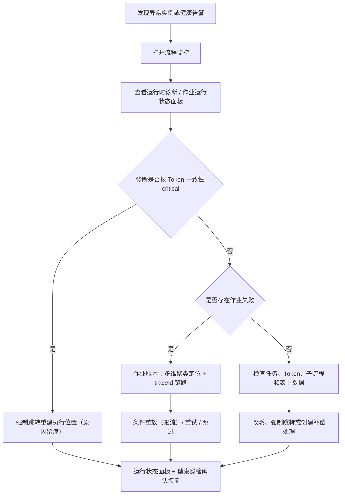

# 监控、诊断与运维

工作流运维围绕实例、任务、执行 Token、异步作业和健康巡检展开。后台入口包括 `流程监控`、`健康巡检`、`事件订阅` 和 `触发器执行`；`流程监控` 页内分五个页签：**实例监控、数据分析、引擎诊断、作业账本、补偿工单**。

## 流程监控（实例监控）

`工作流引擎 → 流程监控 → 实例监控` 提供实例维度的查询和处置能力：

| 能力 | 说明 |
| --- | --- |
| 实例列表 | 按流程、状态、发起人、时间等维度查询，支持保存视图快速切换筛选组合 |
| 实例导出 | 按当前筛选导出实例列表（单次封顶 10000 行） |
| 流程详情 | 查看实例基础信息、表单数据、当前节点和任务 |
| 运行时诊断 | 汇总节点、任务、触发器、事件派发、执行 Token、定义快照 |
| 强制跳转 | 将实例推进到指定节点（原因必填 + 终止任务清单，见下文） |
| 改派处理人 | 调整待办任务处理人；目标用户已在同节点持有待办时返回 409 |
| 批量恢复 | 对卡住实例执行批量跳过或恢复动作（原因必填） |
| 诊断包导出 | 导出实例运行快照，便于工单留档和离线分析 |

### 强制干预留痕

强制跳转与批量恢复属于改写执行位置的高危动作，统一要求留痕：

- **强制跳转**：确认框展示将被终止的活动任务清单（任务号、节点、处理人、状态），跳转原因必填（服务端 schema 同步强制）；执行后被终止任务标记 `skipped` 并写入 `[管理员强制跳转至「目标节点」] + 原因` 备注，原因同时进入操作审计。
- **批量推进卡死实例**：按定义、节点和卡住时长圈定实例，恢复原因必填，逐实例跳过活动 Token 并推进，单个失败不影响其它。

### 运行时诊断

运行时诊断抽屉包含这些视图：

| 视图 | 内容 |
| --- | --- |
| 引擎轨迹 | 实例相关的引擎事件和作业链路 |
| 节点 | 流程图节点状态、当前节点、异常节点 |
| 任务 | 全量任务、处理人、动作、耗时和状态（抄送任务显示「已抄送」） |
| 触发器 | 节点触发器派发状态、请求、响应和错误 |
| 事件派发 | 事件投递状态、订阅命中和错误 |
| 执行 Token | 并行、包容、子流程等待等执行路径状态 |
| 流程图 | 按运行状态渲染的流程定义快照 |
| 表单数据 | 实例运行时表单数据 |
| 定义快照 | 发起时冻结的流程定义 |

诊断结论内置双向 Token 一致性校验：

| 规则 | 级别 | 说明 |
| --- | --- | --- |
| 运行中实例没有活动任务 | critical | `running` 但无 `pending`/`waiting` 任务，推进中断或状态未回写 |
| 运行中实例无活动执行 Token | critical | `running` 但没有任何 active Token，执行路径中断 |
| 活动任务缺少执行 Token（Task→Token） | critical | 节点存在待处理任务但没有 active Token，任务提交必然失败，需用「强制跳转」重置执行位置 |
| Token 与任务不一致（Token→Task） | warning | 节点存在 active Token 但无活动任务，可能状态漂移（parked join Token 除外） |
| 等待任务无法被唤醒（疑似死锁） | critical | 仅剩 waiting 任务且不存在外部回调、触发器、子流程或同节点 pending 等任何唤醒来源 |
| 外部审批分派失败 / 触发器执行失败 | critical | 对应作业 `failed`/`dead` |
| 事件派发失败 / 待处理 | critical / warning | outbox 作业异常或积压 |

## 数据分析

`流程监控 → 数据分析` 提供流程效率与负载的聚合视图，可按流程定义过滤：

| 板块 | 内容 |
| --- | --- |
| 总量指标 | 各状态实例计数、已完结实例平均耗时、当前挂起任务数、近 7 天发起数 |
| 发起 / 完结趋势 | 近 14 天按日的发起与完结曲线 |
| 流程定义排行 | 实例量 Top 定义的运行中/通过/驳回分布与平均耗时 |
| 节点瓶颈 | 人工节点的平均处理时长与积压待办数，定位卡点节点 |
| 审批人工作量 | 各审批人的待办与已处理量 |
| 超时预警 | 已超时待办数、24 小时内将超时待办数，以及超时待办明细列表 |
| 异步健康 | 作业、Webhook 投递、子流程实例的状态分布速览 |

## 健康巡检

`工作流引擎 → 健康巡检` 用于快速识别异常实例和异步执行问题，阈值（10 分钟 ~ 1 天）由页面参数控制。巡检规则：

| 问题类型 | 级别 | 说明 |
| --- | --- | --- |
| `token_task_mismatch` 活动任务缺少执行 Token | critical | 超阈值活动任务所在节点无 active Token，提交必然失败，指向「强制跳转」修复 |
| `external_dispatch_failed` 外部审批分派失败 | critical | 派发作业 `failed`/`dead` |
| `external_dispatch_pending` 外部审批未派发 | warning | 任务等待超阈值仍未派发到外部系统 |
| `trigger_execution_failed` 触发器执行失败 | critical | 触发器作业最终失败 |
| `trigger_waiting_no_execution` 触发器无执行记录 | critical | 触发器任务等待超阈值且无执行记录 |
| `subprocess_waiting` 子流程等待过久 | warning | 父任务等待超阈值 |
| `delay_missing_wake_job` 延迟缺唤醒作业 | critical | 延迟任务无对应 `delay_wake` 作业，将无法自动唤醒 |
| `delay_overdue` 延迟到期未唤醒 | critical | 唤醒作业已到期但任务仍在等待 |
| `task_timeout_overdue` 任务超时未处理 | warning | 超时作业到期，等待超时处理器执行 |
| `waiting_task_stuck` 审批任务滞留过久 | warning | 普通人工待办超过阈值仍未处理（无其它异常特征），提示催办、转办或配置超时策略 |
| `workflow_event_outbox_failed` / `_pending` 事件派发异常 | critical / warning | 事件分发作业失败或积压 |
| `instance_stalled` 实例疑似卡死 | critical | 进行中实例既无待办/等待任务也无在途作业，需用监控页恢复动作处理 |

每条任务只报告最高优先级问题（Token 缺失 > 作业异常 > 滞留），不会重复计数。

## 引擎诊断

`流程监控 → 引擎诊断` 展示引擎内部状态内省、队列分布、健康趋势历史和恢复动作。恢复动作**按作业类型细分**，每个动作只处理对应类型的作业：

| 动作 | 处理的作业类型 |
| --- | --- |
| 重放事件派发 | `event_dispatch` |
| 恢复触发器重派 | `trigger_dispatch` |
| 恢复延时任务 | `delay_wake` |
| 处理超时任务 | `task_timeout` |
| 恢复子流程 | `subprocess_spawn` / `subprocess_join` |
| 恢复 Webhook 投递 | `webhook_delivery` |

这些动作按恢复扫描设计，适合处理队列积压、进程重启后恢复和外部系统短暂故障后的补偿。每个动作支持按**实例、入库时长、处理上限**筛选，并可先预览「待恢复作业数 + 样本」再提交补投。响应中的 `recovered` 表示回收的失效租约数，`requeued` 表示已提交的唤醒消息数，`dead` 表示回收时重试耗尽的作业数；响应成功不代表业务作业已执行完成，实际状态以作业账本和执行记录为准。引擎健康快照由系统任务每 5 分钟采集一次，沉淀为健康趋势历史曲线。

## 作业账本

异步能力统一进入作业账本。作业记录包含类型、状态、关联实例、任务、节点、`traceId`、运行时间、尝试次数、错误和执行明细。

| 作业类型 | 说明 |
| --- | --- |
| `delay_wake` | 延迟器到期唤醒 |
| `task_timeout` | 待办超时处理 |
| `trigger_dispatch` | 触发器节点派发 |
| `external_dispatch` | 外部审批派发 |
| `subprocess_spawn` | 发起子流程 |
| `subprocess_join` | 子流程完成后汇聚 |
| `event_dispatch` | 工作流事件分发 |
| `webhook_delivery` | 事件订阅 Webhook 投递 |
| `compensation_action` | 失败策略的反向 / 兜底补偿动作 |

| 状态 | 说明 |
| --- | --- |
| `pending` | 等待执行 |
| `running` | 执行中 |
| `paused` | 所属实例已挂起，自动推进作业保留剩余时长，等待实例恢复 |
| `succeeded` | 执行成功 |
| `failed` | 本轮失败，仍可重试 |
| `dead` | 重试耗尽进入死信 |
| `canceled` | 已取消或跳过（含实例终态/退回时清场取消的推进类作业） |

作业账本支持按类型和状态筛选、查看执行明细、查看同一 `traceId` 的链路、单条重试、单条跳过、批量重试、批量跳过、条件重放和多维失败聚类。详情提供执行轮次、单次时限、租约到期与执行截止时间。人工重试递增执行轮次、重置尝试次数，保留旧轮次的执行记录；`paused` 作业通过恢复所属实例续跑，不接受单独重试。运行中或已暂停的作业可以取消，取消会使旧执行失去所有权。

`delay_wake`、`task_timeout`、`external_dispatch`、`subprocess_spawn` 与 `subprocess_join` 为**推进类作业**：实例进入终态、被退回发起人、撤回或取消时随全量清场一并取消，不会苏醒后推进已终结的实例。实例挂起会冻结延时、超时、触发器、外部审批与子流程作业，恢复后按剩余时长重新排队；已经开始不安全外呼且结果不明的作业进入待确认死信。事件分发、Webhook 投递与补偿动作不受实例挂起影响。

::: tip 保留期清理
终态实例的执行 Token 由「数据保留策略」`workflow_tokens` 清理（每日 `data-retention` 任务执行，默认保留 90 天，仅处理通过/驳回/撤回/取消实例）；调度节点注册记录（`system_scheduler_nodes`，节点 ID 含进程号、每次进程重启新增一行）由数据保留策略按最后心跳时间清理（默认 7 天）。
:::

### 运行状态面板

作业账本顶部提供**运行状态**面板，聚合 worker 心跳与作业派生指标，用于快速判断作业平台整体健康：

| 指标 | 说明 |
| --- | --- |
| 存活 Worker | 心跳新鲜（90 秒内）的调度节点数 / 近 24 小时有心跳的节点数（悬浮查看各节点在途数与心跳时间；更早的历史节点行不计入分母，由保留策略清理） |
| 在途作业 | 当前 `running` 状态作业数 |
| 卡死 | `running` 且 `leaseUntil` 缺失或已到期，或已超过 `executionDeadline` 的作业数；按数据库时间判断，有效续租不因长时间执行被误回收 |
| 积压 | 已到期（`runAt<=now`）但仍 `pending` 的作业数 |
| 死信 | `dead` 状态作业数 |
| 最后领取 | 最近一次作业被领取的时间（`max lockedAt`） |
| 失败率(1h) | 近 60 分钟执行失败率 |
| 平均耗时(1h) | 近 60 分钟平均处理耗时 |

> Worker 收到唤醒消息后取得业务租约再执行；`drain` 只回收失效租约并补投唤醒消息。「存活 Worker」实为心跳新鲜的调度节点数。

### 多维失败聚类

`失败聚类` 支持按 **错误原因 / 作业类型 / 实例 / TraceId** 四个维度下钻聚合 dead/failed 作业，定位高频故障来源。每个聚类簇可直接「重放该簇」，自动带入对应过滤条件进入条件重放弹窗。

### 条件重放与限流

`重放死信` 打开**条件重放**弹窗，支持按 目标状态（dead/failed）、作业类型、实例、TraceId、错误关键字、入库时长 精确圈定要重放的作业，并可先「预览匹配数」再执行。

为避免一次性重放大量死信冲垮下游连接器与数据库，重放内置**限流**：

- **重放速率（条/秒）**：默认 20，按速率对 `runAt` 错峰分散，而非全部立即入队；
- **单次上限**：默认 500、最大 500，超出部分需再次重放；
- 弹窗内展示预计错峰完成时间窗，执行结果会提示实际速率、成功数与匹配总数。

批量重试同样走错峰限流路径，默认 20 条/秒。

## 补偿工单

补偿工单用于承接需要人工判断的异常实例。工单记录实例、失败节点、异常原因、自动补偿动作状态和处理历史。处理人可以：

| 操作 | 说明 |
| --- | --- |
| 恢复推进 | 补偿完成后从失败节点继续推进流程 |
| 重试补偿动作 | 自动补偿动作失败时重新入队 |
| 添加备注 / 附件 | 沉淀处理过程到工单历史 |
| 标记修复放行 | 确认外部问题已处理，流程继续运行 |
| 终止流程 | 结束异常实例并跳过待办 |

补偿工单适合外部系统不可用、审批回调无法自动确认、异常路径需要人工兜底的场景。工单如何由节点失败策略产生、反向动作如何配置，见[补偿 / Saga 能力](./compensation.md)。

## 接入系统告警

作业平台的关键指标已接入 `系统管理 → 监控告警`，可像 CPU/内存一样配置阈值规则、持续时长抑制、静默与多通道（邮件 / Webhook / 站内信）派发：

| 指标 | 说明 | 单位 |
| --- | --- | --- |
| 流程引擎健康分 | 引擎健康巡检综合评分 | 分 |
| 流程引擎队列积压 | 到期未处理作业数 | 项 |
| 流程作业死信数 | `dead` 状态作业数 | 项 |
| 流程作业失败率 | 近 60 分钟执行失败率 | % |
| 流程作业卡死数 | `running` 且租约失效或超过执行截止时间的作业数 | 项 |

指标全集、租户口径与通知渠道的统一说明见[系统运维 → 监控告警](../ops/index.md#监控告警)；支付与开放平台域的业务指标同样接入了这套引擎。

指标由告警评估器（默认每分钟）实时采集派生，无需额外采集任务。运维可据此在死信堆积、积压升高、失败率异常或长时间 running 卡死时自动收到告警。

## 排查顺序

```mermaid
flowchart TD
  A["发现异常实例或健康告警"] --> B["打开流程监控"]
  B --> C["查看运行时诊断 / 作业运行状态面板"]
  C --> D{"诊断是否报 Token 一致性 critical"}
  D -- "是" --> J["强制跳转重建执行位置（原因留痕）"]
  D -- "否" --> E{"是否存在作业失败"}
  E -- "是" --> F["作业账本：多维聚类定位 + traceId 链路"]
  F --> G["条件重放（限流）/ 重试 / 跳过"]
  E -- "否" --> H["检查任务、Token、子流程和表单数据"]
  H --> I["改派、强制跳转或创建补偿处理"]
  J --> K["运行状态面板 + 健康巡检确认恢复"]
  G --> K
  I --> K
```
