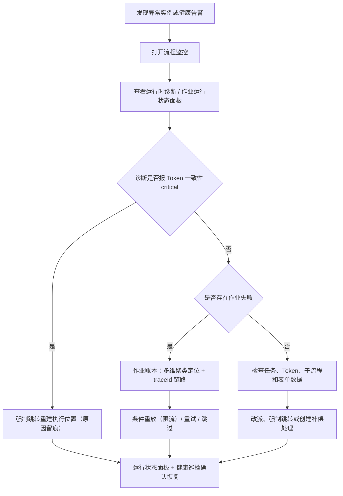

# 流程监控与分析

页面入口为 `工作流引擎 → 运维与集成 → 流程监控`，包含六个页签：**实例监控、任务监控、数据分析、引擎诊断、作业账本、补偿工单**。实例监控解释单次申请，任务监控查看跨实例任务，数据分析汇总效率与负载；后台执行和健康恢复各有独立说明。

| 页签 / 入口 | 说明 |
| --- | --- |
| 实例监控 | 实例查询、详情、执行路径诊断与管理员干预 |
| [任务监控](./task-monitor.md) | 跨实例任务筛选、状态 / 时长 / 意见与催办，详情打开关联实例 |
| 数据分析 | 实例趋势、节点瓶颈、处理人负载与超时预警 |
| [引擎诊断、健康与运行配置](./engine-health.md) | 组件与队列内省、健康趋势、定向恢复；另含独立健康巡检入口 |
| [作业账本](./jobs.md) | 自动执行、逐次尝试、排队状态、失败聚类与重放 |
| [补偿工单](./compensation.md) | 反向 / 兜底动作和人工修复过程 |

## 流程监控（实例监控）

`工作流引擎 → 运维与集成 → 流程监控 → 实例监控` 提供实例维度的查询和处置能力：

| 能力 | 说明 |
| --- | --- |
| 实例列表 | 按流程、状态、发起人、时间等维度查询，支持保存视图快速切换筛选组合 |
| 实例导出 | 按当前筛选导出实例列表（单次封顶 10000 行） |
| 流程详情 | 查看实例基础信息、表单数据、当前节点和任务 |
| 运行时诊断 | 汇总节点、任务、触发器、事件派发、执行 Token、定义快照 |
| 强制跳转 | 将实例推进到指定节点（原因必填 + 终止任务清单，见下文） |
| 改派处理人 | 调整待办任务处理人；目标用户已在同节点持有待办时返回 409 |
| 批量推进卡死实例 | 对卡住实例的活动 Token 执行批量跳过并推进（原因必填） |
| 诊断包导出 | 导出实例运行快照，便于工单留档和离线分析 |

### 强制干预留痕

强制跳转与批量恢复属于改写执行位置的高危动作，统一要求留痕：

- **强制跳转**：确认框展示将被终止的活动任务清单（任务号、节点、处理人、状态），跳转原因必填（服务端 schema 同步强制）；执行后被终止任务标记 `skipped` 并写入 `[管理员强制跳转至「目标节点」] + 原因` 备注，原因同时进入操作审计。
- **批量推进卡死实例**：按定义、节点和卡住时长圈定实例，恢复原因必填，逐实例跳过活动 Token 并推进，单个失败不影响其它。

### 运行时诊断

运行时诊断抽屉包含这些视图：

| 视图 | 内容 |
| --- | --- |
| 引擎轨迹 | 实例相关的引擎事件和作业链路 |
| 节点 | 流程图节点状态、当前节点、异常节点 |
| 任务 | 全量任务、处理人、动作、耗时和状态（抄送任务显示「已抄送」） |
| 触发器 | 节点触发器派发状态、请求、响应和错误 |
| 事件派发 | 事件投递状态、订阅命中和错误 |
| 执行 Token | 并行、包容、子流程等待等执行路径状态 |
| 流程图 | 按运行状态渲染的流程定义快照 |
| 表单数据 | 实例运行时表单数据 |
| 定义快照 | 本轮提交时冻结的流程定义 |

诊断结论内置双向 Token 一致性校验：

| 规则 | 级别 | 说明 |
| --- | --- | --- |
| 运行中实例没有活动任务 | critical | `running` 但无 `pending`/`waiting` 任务，推进中断或状态未回写 |
| 运行中实例无活动执行 Token | critical | `running` 但没有任何 active Token，执行路径中断 |
| 活动任务缺少执行 Token（Task→Token） | critical | 节点存在待处理任务但没有 active Token，任务提交必然失败，需用「强制跳转」重置执行位置 |
| Token 与任务不一致（Token→Task） | warning | 节点存在 active Token 但无活动任务，可能状态漂移（parked join Token 除外） |
| 等待任务无法被唤醒（疑似死锁） | critical | 仅剩 waiting 任务且不存在外部回调、触发器、子流程或同节点 pending 等任何唤醒来源 |
| 外部审批分派失败 / 触发器执行失败 | critical | 对应作业 `failed`/`dead` |
| 事件派发失败 / 待处理 | critical / warning | outbox 作业异常或积压 |

## 数据分析

`工作流引擎 → 运维与集成 → 流程监控 → 数据分析` 提供流程效率与负载的聚合视图，可按流程定义过滤：

| 板块 | 内容 |
| --- | --- |
| 总量指标 | 各状态实例计数、已完结实例平均耗时、当前挂起任务数、近 7 天发起数 |
| 发起 / 完结趋势 | 近 14 天按日的发起与完结曲线 |
| 流程定义排行 | 实例量 Top 定义的运行中/通过/驳回分布与平均耗时 |
| 节点瓶颈 | 人工节点的平均处理时长与积压待办数，定位卡点节点 |
| 审批人工作量 | 各审批人的待办与已处理量 |
| 超时预警 | 已超时待办数、24 小时内将超时待办数，以及超时待办明细列表 |
| 异步健康 | 作业、Webhook 投递、子流程实例的状态分布速览 |

## 运维操作的边界

实例页的强制跳转、改派、取消、挂起 / 恢复、迁移与 Token 干预分别受功能权限控制，实例和任务查询同时遵守租户与数据范围。具体授权见[权限与范围控制](./permissions.md)，状态变化见[实例生命周期](./instance-lifecycle.md)。

后台执行失败先查看[作业账本](./jobs.md)，确认是等待退避、已取消、死信还是外部结果待确认。定向恢复扫描提交唤醒后，应继续核对作业尝试和实例任务，不把补投成功当成业务已成功。补偿工单的「恢复推进」消费失败节点并继续向后流转；「标记修复放行」只闭环工单，具体条件见[补偿与 Saga](./compensation.md#补偿工单与生命周期)。

## API

实例技术诊断路径相对于 `/api/workflows`，读取使用 `workflow:instance:monitor`。

| 方法 | 路径 | 说明 |
| --- | --- | --- |
| `GET` | `/instances/{id}/diagnostics` | 实例运行时诊断 |
| `GET` | `/instances/{id}/trace` | 引擎运行轨迹 |
| `GET` | `/instances/{id}/tokens` | 执行 Token 与路径 |
| `GET` | `/instances/{id}/diagnostic-bundle` | 导出诊断包 |
| `POST` | `/instances/batch-skip-stuck` | 批量推进卡死实例，原因必填 |
| `POST` | `/instances/tokens/{id}/skip` | 跳过卡死 Token |
| `POST` | `/instances/tokens/{id}/replay` | 从 Token 重放，需 `workflow:instance:cancel` |
| `POST` | `/instances/{id}/jump` | 强制跳转，需 `workflow:instance:cancel`，原因必填 |

引擎内省、恢复扫描、作业处理与补偿接口分别见[引擎诊断、健康与运行配置](./engine-health.md#api-与权限)、[作业执行与恢复](./jobs.md#api-与权限)和[补偿与 Saga](./compensation.md)。

## 排查顺序

```mermaid
flowchart TD
  A["发现异常实例或健康告警"] --> B["打开流程监控"]
  B --> C["查看运行时诊断 / 作业运行状态面板"]
  C --> D{"诊断是否报 Token 一致性 critical"}
  D -- "是" --> J["强制跳转重建执行位置（原因留痕）"]
  D -- "否" --> E{"是否存在作业失败"}
  E -- "是" --> F["作业账本：多维聚类定位 + traceId 链路"]
  F --> G["条件重放（限流）/ 重试 / 跳过"]
  E -- "否" --> H["检查任务、Token、子流程和表单数据"]
  H --> I["改派、强制跳转或创建补偿处理"]
  J --> K["运行状态面板 + 健康巡检确认恢复"]
  G --> K
  I --> K
```
