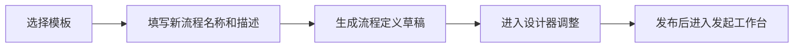

# 流程模板

流程模板用于沉淀可复用的流程结构和表单结构。管理员可以在流程定义中把成熟配置另存为模板，也可以在模板库中维护通用模板，再从模板生成新的草稿流程。

## 模板内容

模板保存以下信息：

| 字段 | 说明 |
| --- | --- |
| 模板名称 | 模板在列表和选择弹窗中的展示名 |
| 模板编码 | 可选的唯一标识 |
| 描述 | 说明适用场景 |
| 分类 | 用于模板列表筛选和流程定义创建时的归类 |
| 图标 / 颜色 | 模板卡片展示样式 |
| 流程结构 | 设计器中的节点、分支、条件和节点配置 |
| 表单结构 | 可视化表单字段、校验、布局和联动配置 |
| 排序 | 模板列表展示顺序 |
| 内置标记 | 内置模板可编辑，但不允许删除 |

模板本身不是可运行流程。只有从模板创建流程定义并发布后，用户才能在发起工作台使用。

## 入口

| 入口 | 能力 |
| --- | --- |
| `工作流引擎 → 流程管理 → 流程模板` | 查看、搜索、编辑、删除模板，从模板新建流程 |
| `工作流引擎 → 流程管理 → 流程定义` | 打开模板选择弹窗，从模板创建草稿流程 |
| 流程定义操作 | 将已有流程定义另存为模板 |

## 从模板创建流程

从模板创建流程时，系统复制模板中的流程结构 `flowData`，生成一条新的流程定义草稿；若模板包含表单结构，则同时在表单库创建一个名为「模板名+表单」的新表单并绑定到新流程。创建时可填写新流程的名称、描述和分类，创建完成后直接进入设计器继续调整、体检和发布。

模板不会绑定运行实例。实例运行使用流程定义发布时的快照，后续修改模板不会影响已经创建的流程定义或运行中的流程实例。

## 另存为模板

流程定义可以另存为模板，用于把已经验证过的设计沉淀到模板库。另存内容包括流程结构和表单结构，快照复制后独立维护。

仅**表单库设计器**（`designer`）类型的流程支持另存为模板；自定义业务表单或业务系统主导的流程请使用「复制流程」或「导出 / 导入」复用。

适合以下场景：

| 场景 | 示例 |
| --- | --- |
| 固定审批模型 | 请假、报销、合同审批、采购申请 |
| 多业务复用 | 不同部门使用相同节点结构，只调整发起范围和审批人 |
| 复杂流程沉淀 | 包含分支、触发器、子流程、外部审批的流程 |
| 标准化交付 | 给新租户或新组织快速生成标准流程 |

## 签名演示模板

| 模板 | 表单字段 | 审批节点 |
| --- | --- | --- |
| 个人签名复用审批示例 | 必填签名，可本次手写或使用个人模板 | 发起人自己审批，允许复用；可创建两条待办验证批量 |
| 本次手写签名审批示例 | 必填签名，要求本次重写 | 发起人自己审批，要求本次重写，不接受批量同意 |

从模板创建流程并发布后再发起申请。先在个人中心保存自己的签名，分别验证复用和强制手写；保存申请草稿后重开，已保存签名应回显。完成审批后更换/删除个人模板，旧记录与打印仍应展示原签名。种子不会给真实账号预置签名图像。

业务系统主导示例中，「请假审批」的管理员节点允许复用个人签名，「CMS 内容审核」的主编节点要求本次手写；两者都显式允许发起人自己处理，方便使用管理员演示时验证签名步骤。

## 维护建议

- 模板名称写业务场景，流程定义名称写具体落地场景。
- 把通用字段放在模板表单中，把具体业务字段留给新流程调整。
- 模板中可以保留节点 `key`，便于事件订阅、外部回调和监控诊断继续使用稳定标识。
- 修改内置模板适合更新默认配置；删除模板只适合自建模板。
